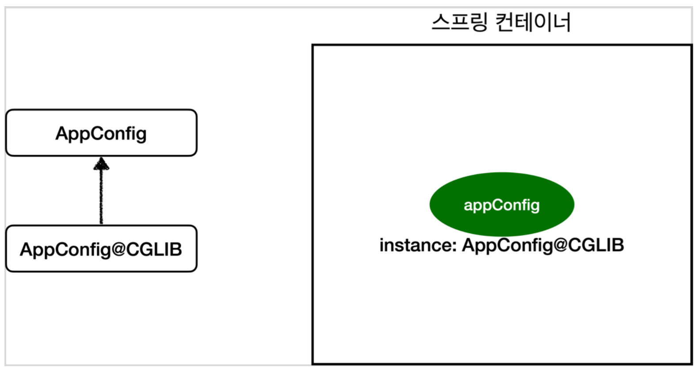

### # @Configuration과 바이트코드 조작의 마법
* @Configuration 사용 시 'CGLIB' 라는 바이트코드 조작 라이브러리를 사용하여 클래스 구성한다.
* 때문에 여러 곳에서 특정 Bean의 객체 생성을 유도하더라도 싱글톤이 보장되도록 해준다.




```java
@Configuration
public class AppConfig {

  @Bean
  public MemberService memberService() {
    System.out.println("call AppConfig.memberService");
    return new MemberServiceImpl(memberRepository());
  }

  @Bean
  public OrderService orderService() {
    System.out.println("call AppConfig.orderService");
    return new OrderServiceImpl(memberRepository());
  }
 
  @Bean
  public MemberRepository memberRepository() {
    System.out.println("call AppConfig.memberRepository");
    return new MemoryMemberRepository();
  }
}

```

* 출력결과
```
call AppConfig.memberService
call AppConfig.memberRepository
call AppConfig.orderService
```

<hr>

#### # AppConfig@CGLIB 예상 코드
```java
@Bean
public DataService dataService() {
  if(dataService 가 이미 스프링 컨테이너에 등록되어 있으면)
    return 스프링 컨테이너에서 찾아서 변환;
  else {
    기존 로직을 호출하여 dataService를 생성하고 스프링 컨테이너에 등록
    return 반환
  }
}
```

<hr>

* @Configuration 삭제 시 출력결과는
```
call AppConfig.memberService
call AppConfig.memberRepository
call AppConfig.orderService
call AppConfig.memberRepository
call AppConfig.memberRepository
```
