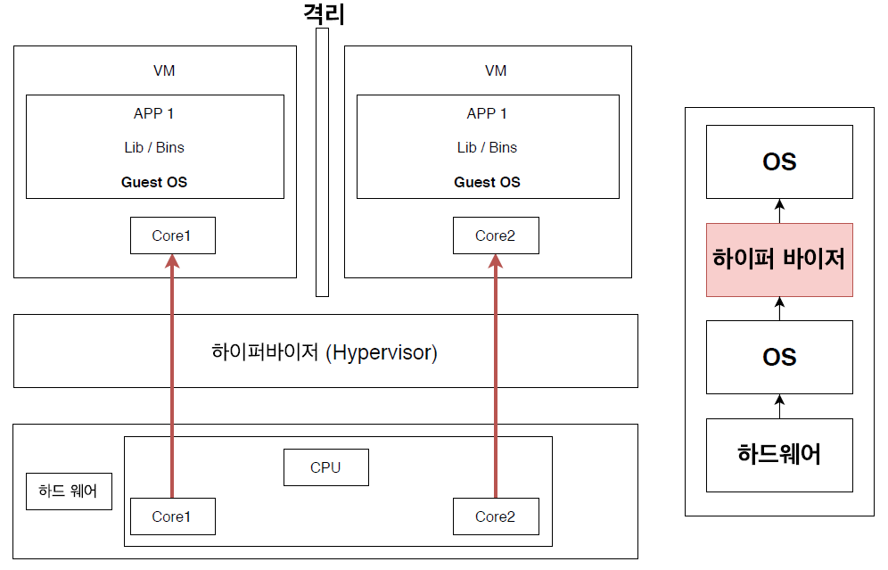
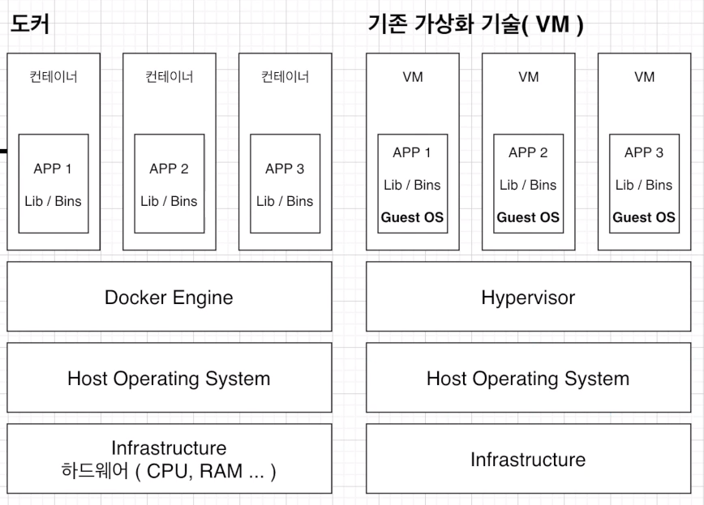
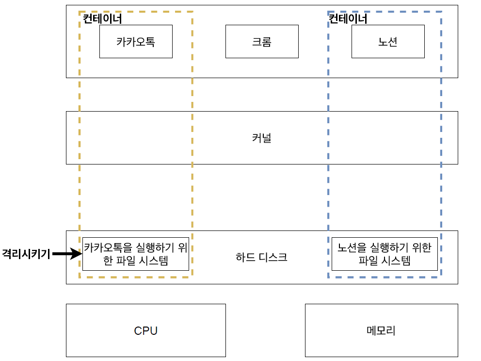

### #. 하이퍼바이저 기반의 VM 구조
- 하이퍼바이저에 의해 구동되는 VM은 각 VM마다 독립된 가상 하드웨어 자원을 할당받는다.
- 논리적으로 분리 되어 있어 한 VM에 오류가 발생해도 다른 VM으로 퍼지지 않는다는 장점이 있다.

 

### #. 도커 VS 기존 가상화 기술(VM)
#### #1. 공통점
- 도커 컨테이너와 가상 머신은 기본 하드웨어에서 격리된 환경 내에서 애플리케이션을 배치하는 방법

#### #2. 차이점
- vm과 비교했을 때 컨테이너는 하이퍼바이저와 게스트 OS가 필요하지 않으므로 더 가볍다.
##### #2.1. 도커 컨테이너에서 돌아가는 애플리케이션은
- 컨테이너가 제공하는 격리 기능 내무에 샌드박스가 있지만, 여전히 같은 호스트의 다른 컨테이너와 동일한 커널을 공유한다.
- 컨테이너가 전체 OS를 내장할 필요가 없는 결과, 매우 가볍고 일반적으로 약 5-100MB 이다.

##### #2.2. 가상머신
- VM 내부에서 실행되는 모든 것은 호스트 운영체제 또는 하이퍼바이저와 독립되어 있다.
- 게스트 OS를 부팅하여 어플리케이션을 실행하기 때문에 무겁다.

 

### #. 도커
- 카카오톡 컨테이너와 노션 컨테이너는 커널을 공유하고 있다.
- 각 컨테이너는 실행 프로그램 및 필요한 양만큼의 리소스에 대해 격리가 되어 있다.

 

### #.도커 컨테이너를 격리시키는 방법
- 컨테이너와 호스트에서 실행되는 다른 프로세스 사이에 벽을 만드는 리눅스 커널 기능인 Cgroup과 네임스페이스를 사용

