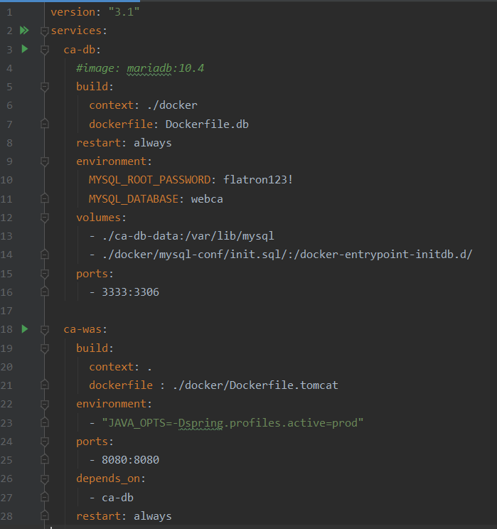

### Docker-Compose
- Define and run multi-container application with Docker.
- 여러 개의 컨테이너를 동작시키기 위해 도커 어플리케이션을 정의하고 실행하는 도구

### docker-compose.yml
- 컨테이너 실행에 사용되는 옵션과 컨테이너 간 의존성을 모두 docker-compose.yml 파일에 적어두고, docker-compose 명령어를 사용하여 컨테이너를 실행 및 관리



#### version
- docker-compose.yml 파일의 첫 줄에는 파일 규격 버전을 적는다. 
- 파일의 규격에 따라 지원하는 옵션이 달라진다. [참고]( https://docs.docker.com/compose/compose-file/compose-versioning)

```
1| version: "3.1"
```

#### services
- 실행하려는 컨테이너들을 정의

```
 2| services:
 3|   ca-db:
       ...
18|  ca-was:
       ...
```

#### image
- 베이스 이미지를 지정

```
4| image: mariadb:10.4
```

#### build
- 도커파일을 이용하여 베이스 이미지 지정
- 도커 파일의 경로나 이름이 다르면 아래와 같이 지정

```
5| build:
6|   context: ./docker
7|   dockerfile: Dockerfile.db
``` 

#### restart
- 재시작 옵션

```
8| restart: always

# no : 
    container를 재시작 시키지 않는다. (default)  
# on-failure[:max-retries] :
    container가 정상적으로 종료되지 않은 경우(exit code가 0이 아님)에만 재시작 시킨다. 
    max-retries도 함께 주면 재시작 최대 시도횟수를 지정할 수 있고, 테스트 서버 등과 같은 리모트에 설정하면 좋을 것 같다.  
# always : 
    container를 항상 재시작시킨다. 
    exit code 상관 없이 항상 재시작 된다.
# unless-stopped : 
    container를 stop시키기 전 까지 항상 재시작 시킨다.
```  

#### environment
- docker run 명령어의 --env, -e 옵션과 동일, 환경변수

```
 9| environment:
10|   MYSQL_ROOT_PASSWORD: flatron123!
11|   MYSQL_DATABASE: webca
```

#### volumes
- DB의 데이터를 로컬에 저장
- sql을 /docker-entrypoint-initdb.d/ 에 저장하면 DB가 start 될 때 sql 문을 순차적으로 실행한다

```
12| volumes:
13|   - ./ca-db-data:/var/lib/mysql
14|   - ./docker/mysql-conf/init.sql/:/docker-entrypoint-initdb.d/
```

#### ports
- HOST:CONTAINER 형식으로 호스트로 들어온 포트를 해당 컨테이너의 포트로 포워딩

```
15| ports:
16|   - 3333:3306
```

#### depends_on
- 서비스 간 의존 관계를 지정
- 명시된 컨테이너가 먼저 생성되고 실행

```
26| depends_on:
27|   - ca-db
```
