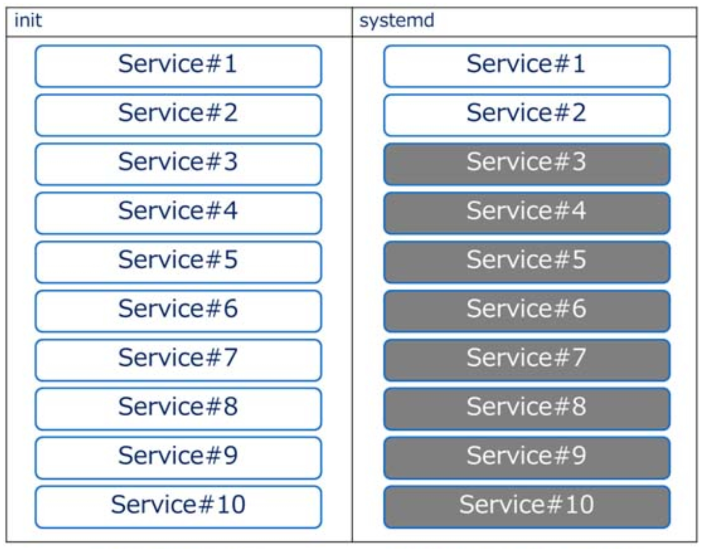
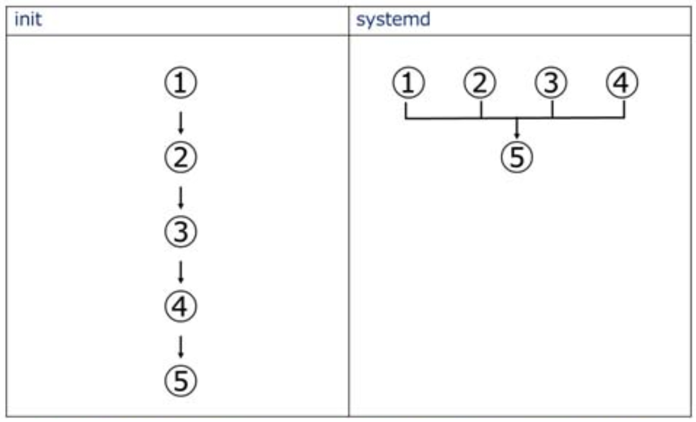

이번에 서비스 등록할때 "/etc/init.d, /usr/lib/systemd/system 디렉토리 밑에 모두 서비스 스크립트를 생성해야하나?" 라는 의문점이 생겨 두개의 차이를 찾아보게 되었다.  
결론은 systemd 로만 등록하였다. 

### #. 차이점
- [왜 init이 systemd로 바뀌어야 하는가](https://www.tecmint.com/systemd-replaces-init-in-linux/)
- init의 한계를 극복하기 위해 만들어진 새로운 시스템 관리 아키텍처로 systemd 가 나옴
- To start less  
    -- init : boot 시 많은 서비스를 실행  
    -- systemd : boot 시 필요한 최소한의 서비스를 실행, 필요시 서비스 실행  


<br>

- And to start more in parallel  
    -- init : 1 부터 5의 처리를 순서대로 진행  
    -- systemd : 각 처리에는 의존관계가 정의되어 있고, 병렬로 실행하여 시간 단축  


<br>

### #. 명령어 비교
- 자동시작 등록/해제

```
# init
$ chkconfig [service명] on|off

# systemd
$ systemctl enable|disable [service명]
```

- 유효/무효 확인

```
# init
$ chkconfig [service명] --list

# systemd
$ systemctl is-enabled [service명]
```

- 실행/종료/상태확인

```
# init
$ /etc/init.d/[service명] start/stop/status

# systemd
$ systemctl start|stop|status [service명]
```

- 강제종료

```
# init
$ /etc/init.d/[service명] status (pid 확인 후)
$ kill [PID]

# systemd
$ systemctl kill [service명]
```

<br>

### #. 기타 systemd 명령어
```
# 유효화 되어 있는 Unit 표시
$ systemctl list-units

# 설치되어 있는 Unit 표시
#   enable : 자동 시작 설정 활성화
#   disable : 자동 시작 설정 비활성화
#   static : 단독으로 자동 기동 할 수 없음
$ systemctl list-unit-files
```
