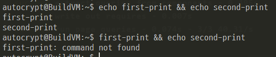
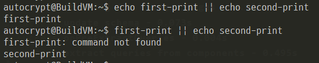
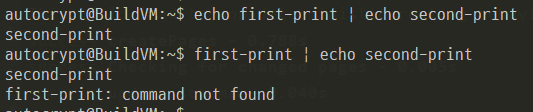
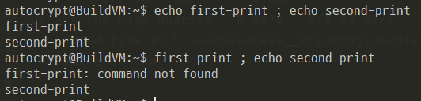

 ■ Double Ampersand (&&) 
- 첫번째 명령이 정상 종료 했을 경우 두번째 명령 수행

 ■ Double Vertical Bar (||) 
- 첫번째 명령이 에러 일 경우 두번째 명령어 수행

■ Pipe (|)
- 첫번째 명령어 결과를 사용하여 두번째 명령어 수행

■ Semicolon (;)
- 한 라인에서 여러 명령어를 수행할때 사용
- 순차적으로 수행하며, 오류가 발생하더라도 다음 명령어는 계속 수행된다.

