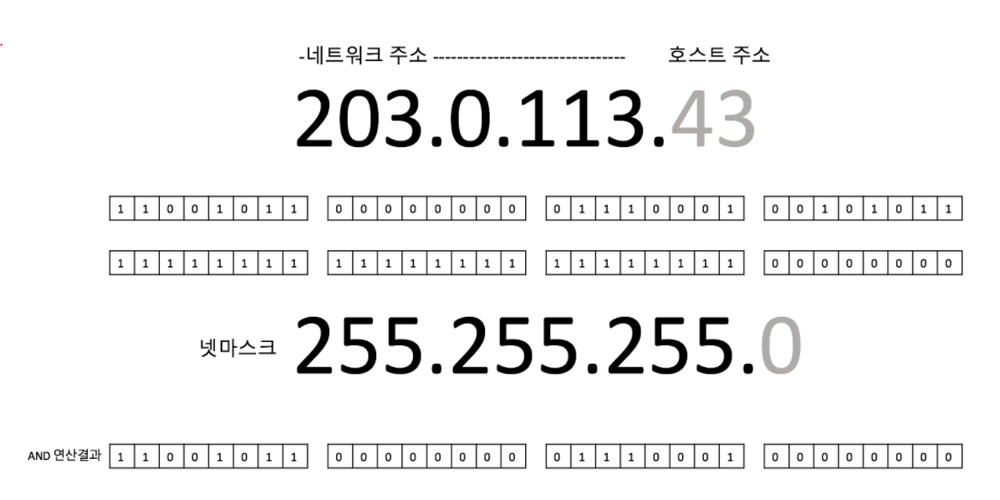
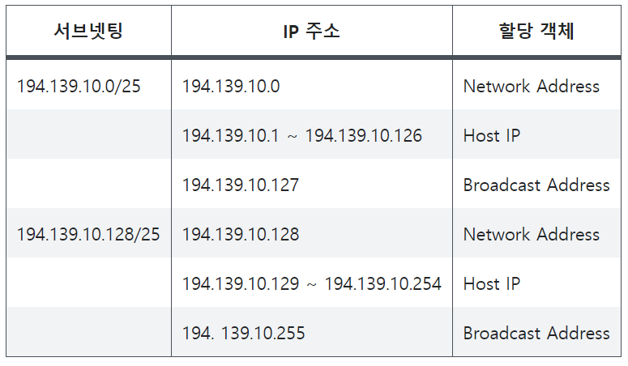

<span class="title__sub1"> # 넷마스크 (netMask) </span>
- 네트워크 주소 부분의 비트를 1로 치환한 것이 넷마스크이다.
- IP 주소와 넷마스크를 AND연산을 하면 네트워크 주소를 얻을수 있다.




<span class="title__sub1"> # 서브넷 마스크(subnet mask) </span>
- CIDR 이후(현재) subnet mask만 쓰고 있기 때문에 넷마스크와 서브넷마스크를 딱히 구분하진 않는다.
- IP주소 뒤에 붙은 /24 같은 것들은 서브넷 마스크의 bit 수를 의미한다.

```
192.168.0.3/24
IP주소       : 192.168.0.3 
서브넷 마스크 : 255.255.255.0
2진수        : 11111111.11111111.11111111.00000000
256개의 호스트 주소를 사용할 수 있다.

192.168.0.3/25
IP주소       : 192.168.0.3 
서브넷 마스크 : 255.255.255.128
2진수        : 11111111.11111111.11111111.10000000
128개의 호스트 주소를 사용할 수 있다.

192.168.0.3/26
IP주소       : 192.168.0.3 
서브넷 마스크 : 255.255.255.192
2진수        : 11111111.11111111.11111111.11000000
64개의 호스트 주소를 사용할 수 있다.

192.168.0.3/23
IP주소       : 192.168.0.3 
서브넷 마스크 : 255.255.254.0
2진수        : 11111111.11111111.11111110.00000000
512개의 호스트 주소를 사용할 수 있다.
```

<span class="title__sub1"> # 브로드 캐스트(broad cast) </span>
- 특정 네트워크에 속하는 모든 호스트들이 갖게 되는 주소. 
- 네트워크에 있는 클라이언트 모두에게 데이터를 보내기 위함.
- 해당 네트워크에 속하는 모든 IP 주소 가운데 맨 마지막 IP주소
- 계산방법 : 서브넷 마스크의 '0'인 부분을 모두 1로 바꾼다.

<br>


