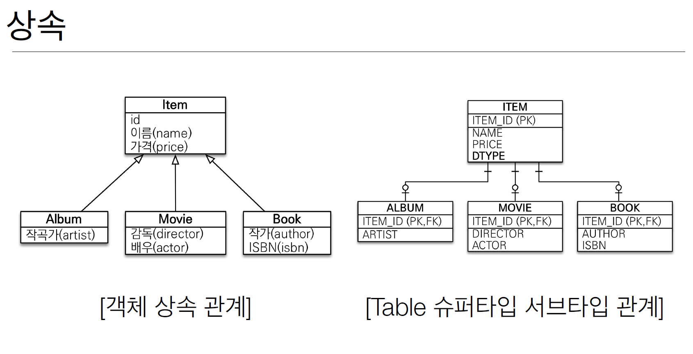

 # SQL 중심적인 개발의 문제점 
- SQL 중심적인 개발을 진행해오고 있다.  
- 객체를 DB에 넣기 위해 SQL 의존적인 개  발을 할 수 밖에 없다.
- CRUD SQL 개발에 대해 무한반복 작업을 한다.

패러다임 불일치
- 객채와 관계형 데이터베이스의 차이

1. 상속
2. 연관관계
3. 데이터 타입
4. 데이터 식별 방법

- - 객체 모델링 Album 저장 방법
1) 객체분해
2) 각 객체 저장
    2.1) insert into item...
    2.2) insert into album..  

- Album 조회 방법
1) 각각의 테이블에 따른 Join SQL 작성
2) 각각 객체 생성 및 매핑
3) ...복잡

그래서 DB에 저장할 객체에는 상속 관계를 안쓴다.
객체답게 모델링을 할수록 매핑만 늘어난다.

- 자바 컬렉션에 저장/조회 하면?
list.add(album);
Album album = list.get(albumId);
Item item = list.get(albumId);

