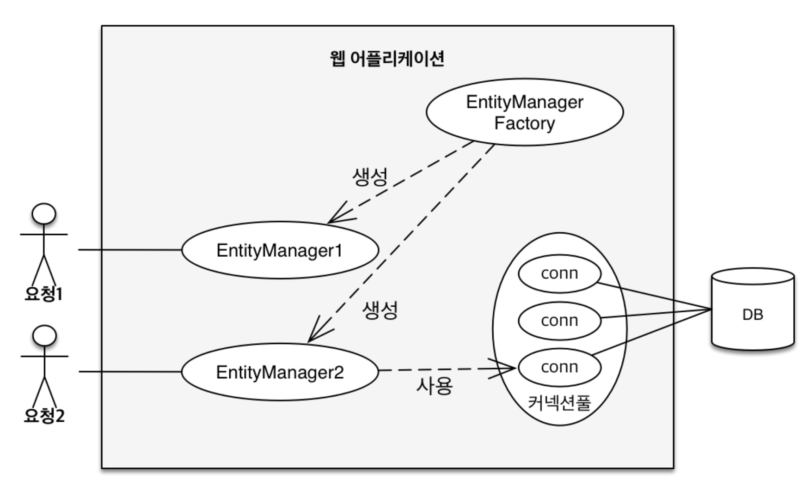
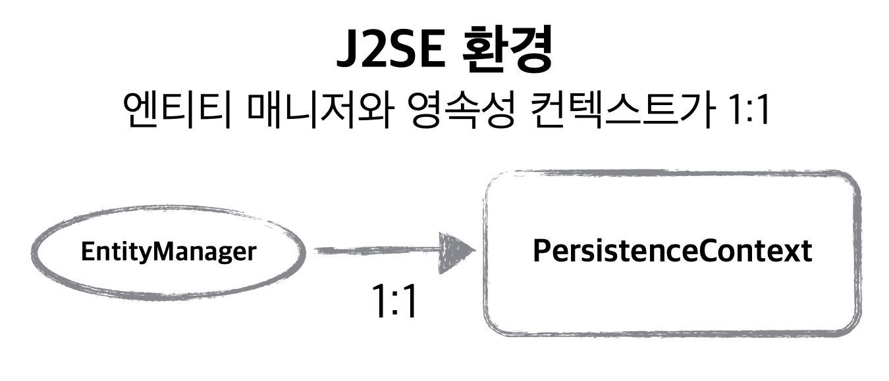
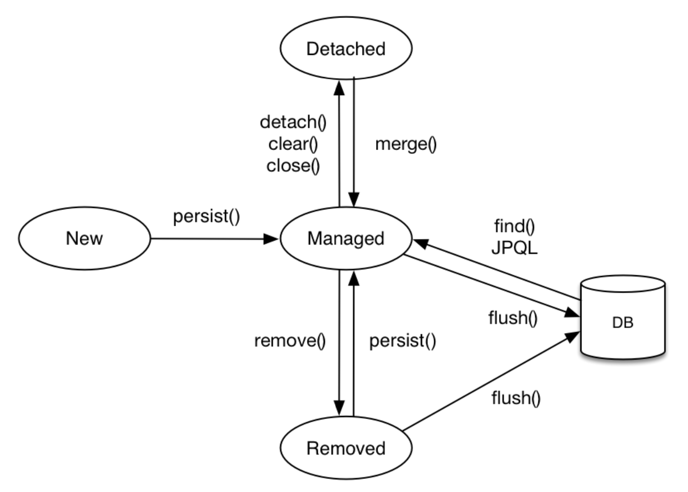
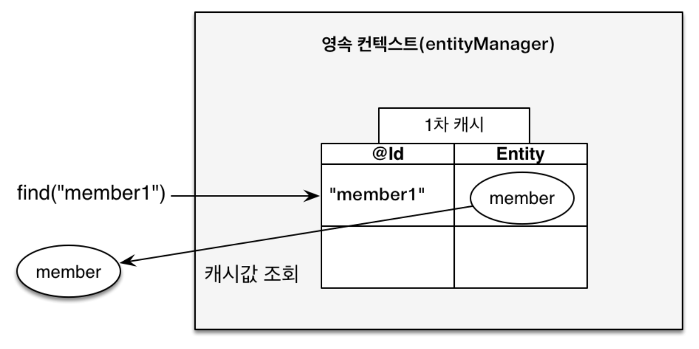
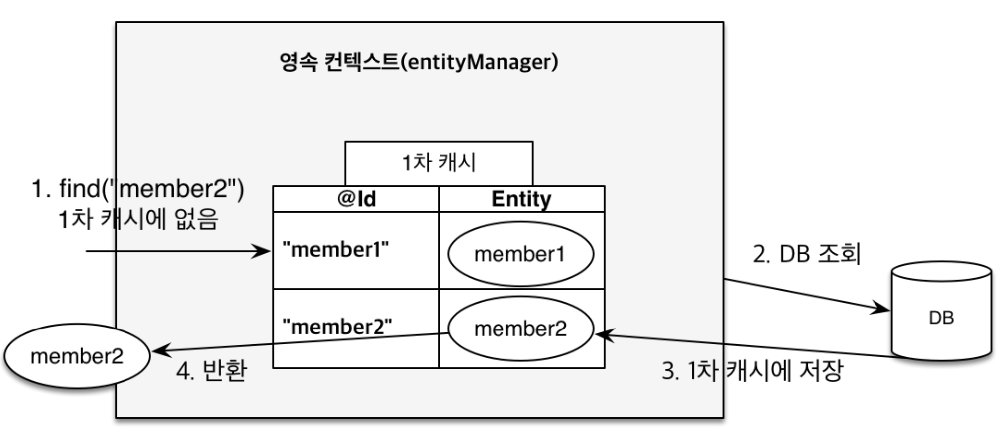
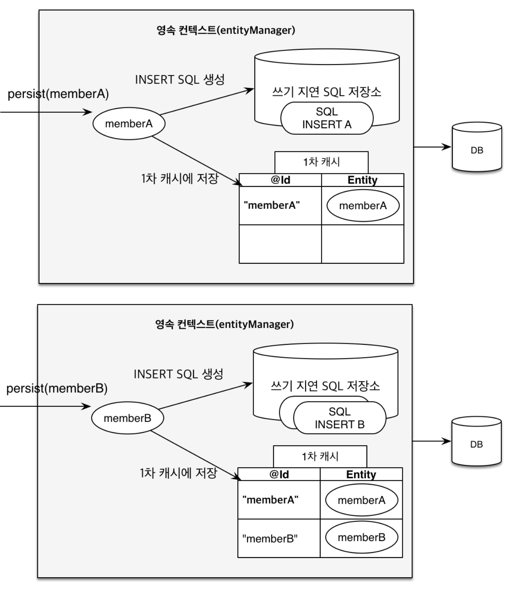
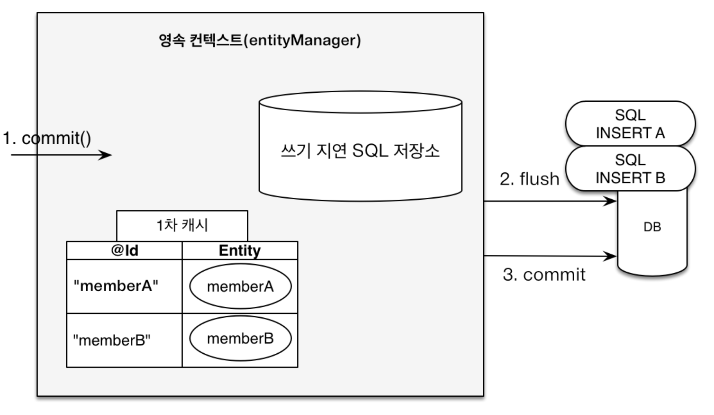
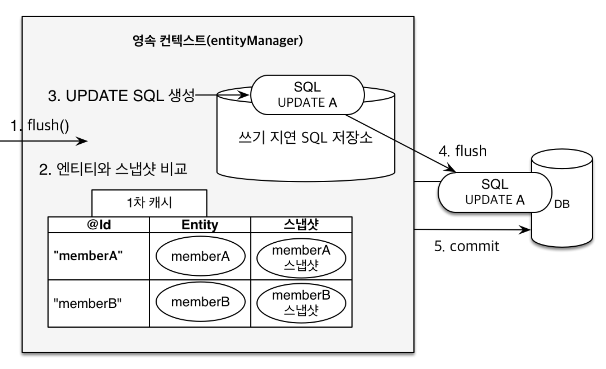

<span class="title__sub1"> # </span>

<span class="title__sub1"> #JPA에서 가장 중요한 2가지 </span>
- 객체와 관계형 데이터베이스 매핑
- 영속 컨텍스트 (매커니즘)


<span class="title__sub1"> #Entity Manager Factory 와 Entity Manager </span>
- Factory에서 Entity Manager 생성
- Manager에서 DB Connection을 사용




<span class="title__sub1"> # 영속성 컨텍스트 </span>
- 엔티티를 영구저장하는 환경이라는 뜻
- 논리적인 개념
- 엔티티 매니저를 통해 영속성 컨텍스트에 접근



<span class="title__sub1"> # 엔티티의 생명주기 </span>
- 비영속 (new/transient)
    -- 영속성 컨텍스트와 전혀 관계가 없는 새로운 상태
- 영속 (managed)
    -- 영속성 컨텍스트에 관리되는 상태
- 준영속 (detached)
    -- 영속성 컨텍스트에 저장되었다가 분리된 상태
- 삭제 (removed)
    -- 삭제된 상태
  


```java
// 비영속
Member member = new Member();
member.setId(100L);
member.setUserName("member1");

//영속
entityManager.persist(member);

//회원 엔티티를 영속성 컨텍스트에서 분리, 준영속 상태
entityManager.detach(member);

//객체를 삭제한 상태(DB에서 삭제)
entityManager.remove(member);
```


<span class="title__sub1"> # 영속성 컨텍스트의 이점 </span>
- 1차 캐시
    - 1차 캐시는 한 트랜젝션에서만 허용된다.
    - 성능보다는 매커니즘에 이점에 있다.
    - 1차 캐시에서 조회
    
    - 데이터베이스에서 조회
       
- 동일성 보장

```java
Member a = entityManager.find(Member.class, "member1");
Member b = entityManager.find(Member.class, "member1");

System.out.println(a == b); // 동일성 비교 true

```

- 트랜잭션을 지원하는 쓰기 지연 (transactional write-behind)
  
```java
EntityManager entityManager = entityManagerFactory.createEntityManager();
EntityTransaction transaction = entityManager.getTransaction();

//엔티티 매니저는 데이터 변경 시 트랜잭션을 시작해야 한다.
transaction.begin();

entityManager.persist(memberA);
entityManager.persist(memberB);
//여기까지 INSERT SQL을 데이터베이스에 보내지 않는다.

//커밋하는 순간 데이터베이스에 INSERT SQL을 보낸다.
transaction.commit();
```




- 변경 감지 (Dirty Checking)

```java
EntityManager entityManager = entityManagerFactory.createEntityManager();
EntityTransaction transaction = entityManager.getTransaction();

//영속 엔티티 조회
Member memberA = entityManager.find(Member.class, "memberA");

//영속 엔티티 데이터 수정
memberA.setUsername("hi");
memberA.setAge(10);

//커밋하는 순간 데이터베이스에 UPDATE SQL을 보낸다.
transaction.commit();

```



- 지연 로딩 (Lazy Loading)  
    -- 추후 정리

<span class="title__sub1"> # 플러시 </span>
- 영속성 컨텍스트의 변경 내용을 데이터베이스에 반
- 플러시가 발생되면 1차 캐시에 있는 정보가 사라지는게 아니라 쓰기 지연 SQL 저장소에 있는 SQL이 실행된다.
- JPQL을 사용하면 자동으로 flush가 날라가고 해당 쿼리가 실행된다.
- 트랜잭션이라는 작업 단위가 중요! (커밋 직전에만 동기화 하면 된다.)

- JPA는 내부적으로 리플케이션 등을 쓰기 때문에 동적으로 생성할 수 있어야 한다.
- 따라서 기본 생성자가 필요하다. public 일 필요는 없다.


<br>
