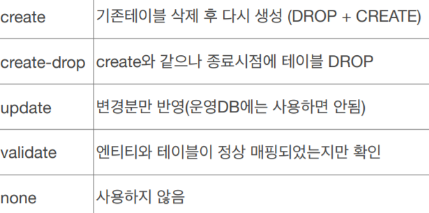
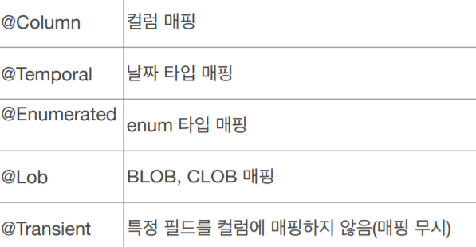
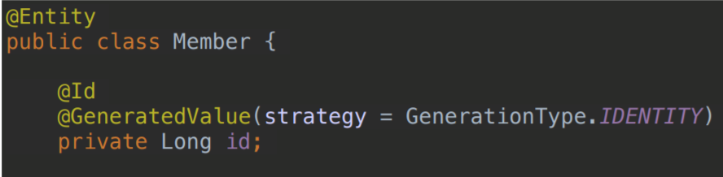
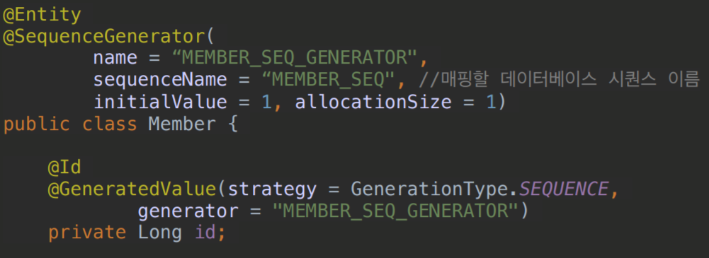
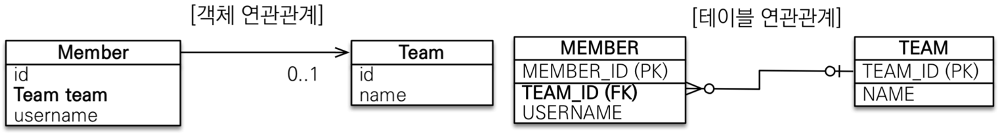
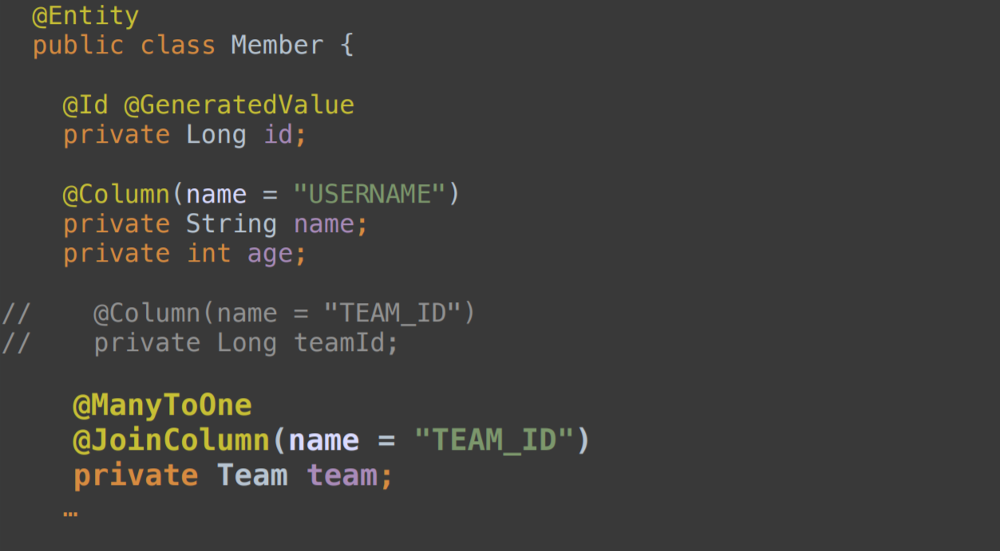
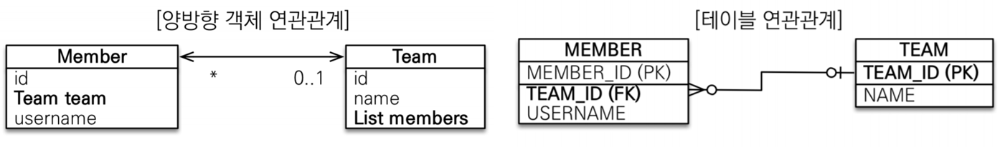
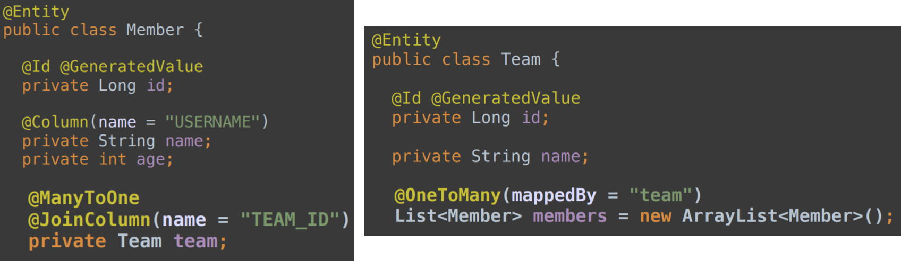
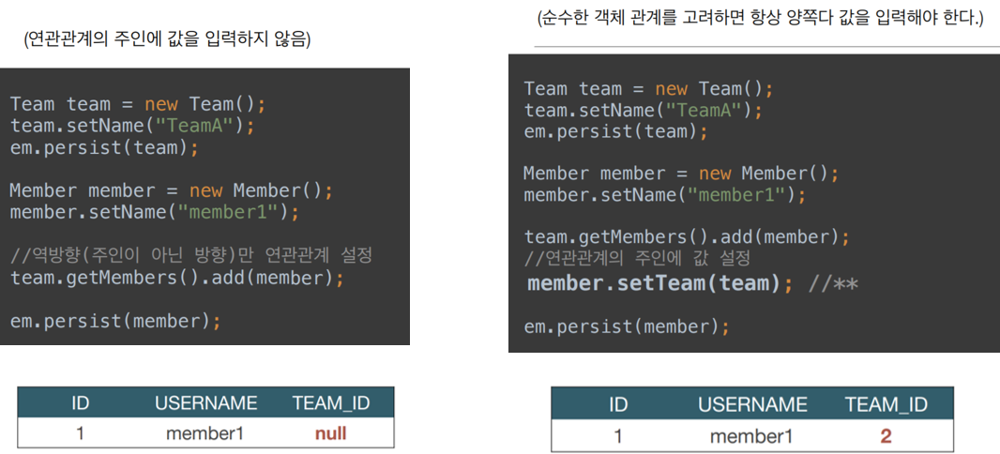

<span class="title__sub1">@Entity</span>
- JPA는 내부적으로 replication 등을 쓰기 때문에 동적으로 생성할 수 있어야 한다.
- 따라서 기본 생성자가 필요하다. (public 또는 protected)


<span class="title__sub1"> 데이터베이스 스키마 자동 생성</span>
- DDL을 애플리케이션 실행 시점에 자동 생성
- 데이터베이스 방언을 활용해서 데이터베이스에 맞는 적절한 DDL 생성
- 운영 장비에는 절대 create, create-drop, update 사용하면 안됨.
- 스테이징과 운영 서버는 validate 또는 none 사용
```
hibernate.hbm2ddl.auto=create
```



<span class="title__sub1"> 매핑 어노테이션 정리</span>
- Date 클래스 사용시 만 @Temporal 사용, 
- LocalData, LocalDateTime을 사용할때는 생략
- @Transient 는 주로 메모리상에서만 임시로 보관하고 싶을 때 사용



<span class="title__sub1"> 기본 키 매핑</span>
<span class="title__sub2"> 기본 키 매핑 어노테이션 </span>
- @Id 
- @GeneratedValue (전략은 AUTO가 기본)

<span class="title__sub2"> 전략 종류 </span>
- IDENTITY : 데이터베이스에 위임, MYSQL  
- SEQUENCE : 데이터베이스 시퀀스 오브젝트 사용, ORACLE  
    -- @SequenceGenerator 필요
- TABLE : 키 생성용 테이블 사용, 모든 DB에서 사용, 잘 사용하지 않음  
    -- @TableGenerator 필요
- AUTO : 방언에 따라 자동 지정, 기본 값

<span class="title__sub3"> IDENTITY 전략 특징 </span>
- 주로 MySQL, PostgreSQL, SQL Server, DB2에서 사용 (auto_increment)


<span class="title__sub3"> SEQUENCE 전략 특징 </span>
- 주로 Oracle, PostgreSQL, DB2, H2 에서 사용 (auto_increment)
- INSERT SQL 실행 후에 id 값을 알 수 있으므로 <span class="text-mark__red">해당 전략에서는 persist(add) 시점에 즉시 SQL이 수행</span> 



<span class="title__sub1"> 연관관계 매핑</span>
<span class="title__sub2"> 1) 단방향 연관관계 </span>


- Member 와 Team 의 관계는 n:1
- <span class="text-mark__red">Member(n)에 Team(1)에 대한 FK가 들어간다.</span>



<br/>

<span class="title__sub2"> 2) 양방향 연관관계와 연관관계의 주인 </span>

 

- 연관관계의 주인은 외래키의 위치를 기준으로 정해야함
- 주인이 아닌쪽은 읽기 전용
- 주인이 아니면 mappedBy 속성으로 주인 지정
- 여기서는 Member.team 이 연관관계의 주인이 된다.



<br/>

<span class="title__sub2"> 2) 양방향 연관관계 주의 </span>

- 순수 객체 상태를 고려해야 상항 양쪽에 값을 설정


- 연관관계 편의 메소드를 생성하자

```java
@OneToMany(mappedBy = "member")
private List<Member> memberList = new ArrayList<>();

public void addMember(Member member) {
    // 양반향 연관관계 매핑
    this.memberList.add(member);
    member.updateTeam(this);
}
```

- 양방향 매핑시에 무한 루프를 조심하자  
    -- ex) toString(), lombok, JSON 생성 라이브러리
