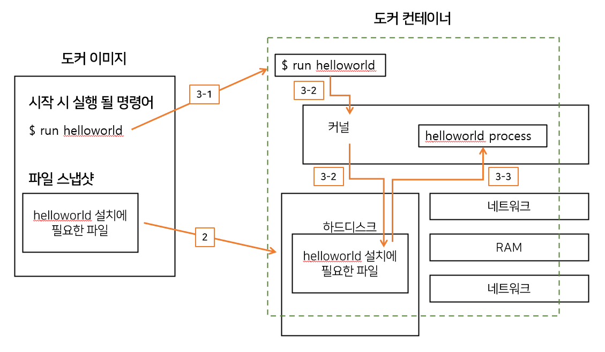

### 컨테이너 이미지
- 이미지는 응용 프로그램을 실행하는데 필요한 모든 것을 포함하고 있다.  
 \- 1. 컨테이너가 시작 될 때 실팽되는 명령어  
 \- 2. 파일 스냅샷 (디렉토리나 파일을 복사 한 것)  


### 이미지로 컨테이너 만드는 순서
#### #1. Docker 클라이언트에 docker run <이미지> 입력
```
$ docker run helloworld
```

#### #2. 도커 이미지에 있는 파일 스냅샷을 컨테이너 하드 디스크에 옮겨 준다
#### #3. 이미지에서 가지고 있는 명령어 (컨테이너가 실행될때 사용될 명령어)를 이용하여 앱 실행
 - 3.1. 명렁어 실행 
 - 3.2. 커널을 통해 앱 시작 
 - 3.3. 프로세스 작동
 
 
