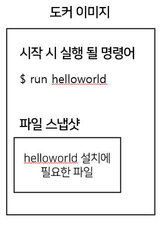
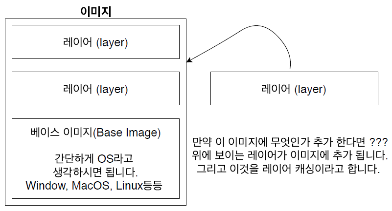
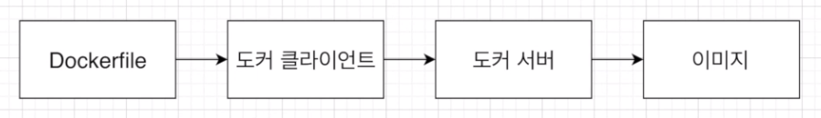
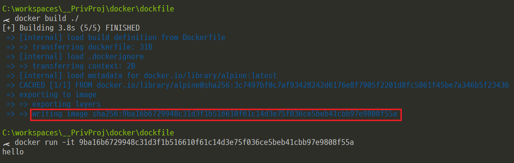

## #. 도커 파일(Docker file)이란?
- 도커 이미지를 만들기 위한 설정 파일이며, 컨테이너가 어떻게 행동해야 하는지에 대한 설정들을 정의해 주는 곳

<br>

## #. 도커 파일 만드는 순서
1. 베이스 이미지를 명시해준다. (파일 스냅샷에 해당)
2. 추가적으로 필요한 파일을 다운 받기 위한 몇가지 명령어를 명시 (파일 스냅샷에 해당)
3. 컨테이너 시작시 실행 될 명령어를 명시 (시작시 실행 될 명령어에 해당)



### #. 베이스 이미지란?
- 도커 이미지는 여러개의 레이어로 구성되어 있다.
- 그 중에서 베이스 이미지는 이 이미지의 기반이 되는 부분이다.
- 레이어는 중간 단계의 이미지라고 생각하면 된다.



<br>

## #. 도커 파일로 이미지 생성


### #1. 도커 파일 생성
- 기본적 토대 

```
# 베이스 이미지를 명시
# 태그를 안붙이면 자동적으로 가장 최신것으로 다운
FROM <이미지이름>:<태그>

# 도커이미지가 생성되기 전에 수행할 쉘 명령어
RUN <command>

# 컨테이너 시작시 실행 될 파일 또는 명령어
CMD ["excutable"]
```

### #2. 도커 파일 빌드
- build 명령어 : 해당 디렉토리 내에서 명시된 도커파일을 찾아 도커 클라이언트에 전달



- 도커 이미지에 이름 부여 (-t : tagging)
```cmd
$ docker build -t <나의 도커 아이디>/<저장소/프로젝트>:<버전> ./
```


    
