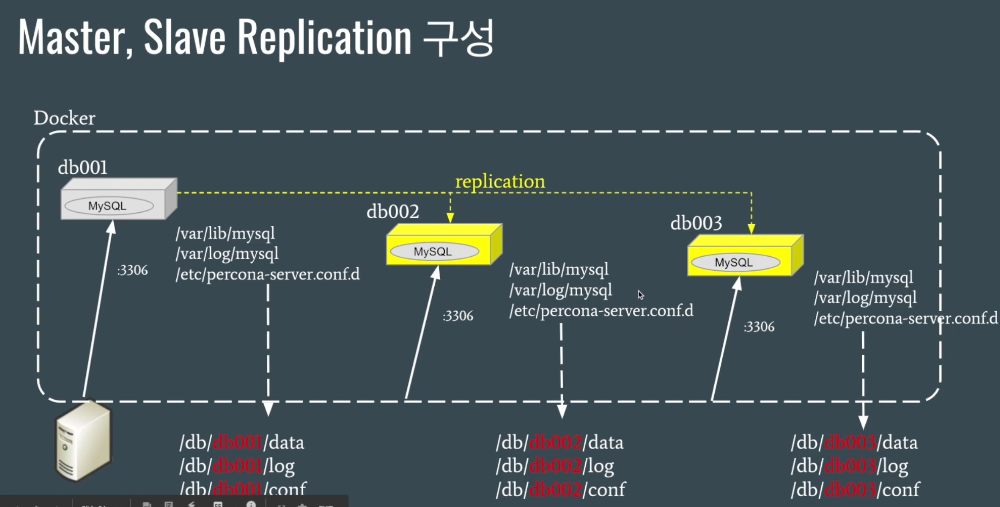

<span class="title__sub1"> # Summary </span>
- Docker 환경에서 MySQL Master-Replication 구성
- Orchestrator를 이용한 HA 구성
- ProxySQL을 이용한 Proxy Layer 구성
- Prometheus와 Grafana를 이용한 모니터링 구성
- Docker compose를 통한 일괄 서비스 배포
- Swarm Mode를 통한 확장 가능한 구성


   
<span class="title__sub1"> # Master, Slave Replication 구성 </span>



<span class="title__sub2"> Volume 디렉토리 생성 </span>

```cmd
mkdir -p /db/db001/data /db/db002/data /db/db/003/data \
mkdir -p /db/db001/log /db/db002/log /db/db003/log \
mkdir -p /db/db001/conf /db/db002/conf /db/db003/conf

chmod 777 -R /db
```

<span class="title__sub2"> my.cnf 설정 </span>
 - my.cnf 의 permission은 644로 수정

<span class="title__sub3"> 1. db001 설정 </span>
- master 설정

```shell
#my.cnf
[mysqld]
log_bin                     = mysql-bin
binlog_format               = ROW
gtid_mode                   = ON
enforce-gtid-consistency    = true
server-id                   = 100
log_slave_updates
datadir                     = /var/lib/mysql
socket                      = /var/lib/mysql/mysql.sock

# Disabling symbolic-links is recommended to prevent assorted security risks
symbolic-links              = 0

log-error                   = /var/log/mysql/mysqld.log
pid-file                    = /var/run/mysqld/mysqld.pid

report_host                 = db001

[mysqld_safe]
pid-file                    = /var/run/mysqld/mysqld.pid
socket                      = /var/lib/mysql/mysql.sock
nice                        = 0
```

<span class="title__sub3"> 2. db002 설정 </span>
- slave 설정, read_only 값 추가
- server-id, report_host 유일값으로 수정

```shell
#my.cnf
[mysqld]
log_bin                     = mysql-bin
binlog_format               = ROW
gtid_mode                   = ON
enforce-gtid-consistency    = true
server-id                   = 200 
log_slave_updates
datadir                     = /var/lib/mysql
socket                      = /var/lib/mysql/mysql.sock
read_only

# Disabling symbolic-links is recommended to prevent assorted security risks
symbolic-links              = 0

log-error                   = /var/log/mysql/mysqld.log
pid-file                    = /var/run/mysqld/mysqld.pid

report_host                 = db002

[mysqld_safe]
pid-file                    = /var/run/mysqld/mysqld.pid
socket                      = /var/lib/mysql/mysql.sock
nice                        = 0
```

### db003 설정
- slave 설정, read_only 값 추가
- server-id, report_host 유일값으로 수정

```shell
#my.cnf
[mysqld]
log_bin                     = mysql-bin
binlog_format               = ROW
gtid_mode                   = ON
enforce-gtid-consistency    = true
server-id                   = 300
log_slave_updates
datadir                     = /var/lib/mysql
socket                      = /var/lib/mysql/mysql.sock
read_only

# Disabling symbolic-links is recommended to prevent assorted security risks
symbolic-links              = 0

log-error                   = /var/log/mysql/mysqld.log
pid-file                    = /var/run/mysqld/mysqld.pid

report_host                 = db003

[mysqld_safe]
pid-file                    = /var/run/mysqld/mysqld.pid
socket                      = /var/lib/mysql/mysql.sock
nice                        = 0
```


## Container 생성
## Bridge Network 구성
- container 의 network alias를 사용하기 위해 bridge network를 구성한다.
- container가 재시작되어 Ip가 변경되더라도 문제가 발생하지 않는다.

```shell
docker network create --driver bridge db-bridge
```

### Master Container 생성
```shell
docker run -i -t --name db001 -p 13306:3306 \
--net db-bridge --net-alias=db001 \
-v /db/db001/data:/var/lib/mysql \
-v /db/db001/log:/var/log/mysql \
-v /db/db001/conf:/etc/percona-server.conf.d \
-e MYSQL_ROOT_PASSWORD="root" -d percona:5.7.30
```

### Slave Containers 생성
```shell
docker run -i -t --name db002 -p 13307:3306 \
--net db-bridge --net-alias=db001 \
-v /db/db002/data:/var/lib/mysql \
-v /db/db002/log:/var/log/mysql \
-v /db/db002/conf:/etc/percona-server.conf.d \
-e MYSQL_ROOT_PASSWORD="root" -d percona:5.7.30

docker run -i -t --name db003 -p 13308:3306 \
--net db-bridge --net-alias=db001 \
-v /db/db003/data:/var/lib/mysql \
-v /db/db003/log:/var/log/mysql \
-v /db/db003/conf:/etc/percona-server.conf.d \
-e MYSQL_ROOT_PASSWORD="root" -d percona:5.7.30
```

### Container 생성 확인
```shell
docker ps --format "table {{.ID}}\t{{.Names}}\t{{.Status}}"
```

## Replication 설정

### Replication user 생성(db001)
```shell
docker exec -it -uroot db001 bash
mysql -uroot -p

mysql> create user 'repl'@'%' identified by 'repl';
mysql> grant replication slave on *.* to 'repl'@'%';
```

### Replication 설정(db002, db003)
```shell
docker exec -it -uroot db002 bash
mysql -uroot -p
mysql> change master to master_host='db001', \
        master_user='repl', master_password='repl', \
        master_auto_position=1;
mysql> start slave;
mysql> show status\G
```


# Orchestrator를 이용한 HA 구성
- master 가 장애가 났을 경우, 자동으로 failover가 되도록 구성

## Orchestrator Container 실행
```shell
docker run -i -t --name orchestroator -h orchestrator \
--net db-bridge --net-alias=orchestrator
-p 13000:3000 -d openarkcode/orchestrator:latest
```

## Orchestrator를 위한 mysql user 생성
- orchestroator 를 위한 mysql user를 생성하는데, 
- db container의 IP대역 확인하여 user의 host로 사용한다.

```shell
docker inspect --format '{{.NetworkSettings.Networks.db-bridge.IPAddress}}' db001

172.18.0.2
```

- db001에서 mysql user생성

```shell
docker exec -it -uroot db001 /bin/bash
mysql -uroot -p

mysql> create user orc_client_user@'172.%' identified by 'orc_client_password';
mysql> grant super, process, replication slave, reload on *.* to orc_client_user@'172.%';
mysql> grant select on mysql.slave_master_info to orc_client_user@'172.%';
```

## HA 구성
- http://{docker_host_ip}:13000/web/clusters 접속
- Clusters > Discover 에서 instance 생성

```
db001, 3306 입력 후 submit
```

- Cluster > Dashboard 에서 확인


## Auto FailOver를 위한 Orchestrator의 설정 변경
```shell
docker exec -it orchestrator bash
cd vi /etc/orchestrator.conf.json

  "RecoverMasterClusterFilters": [ "*" ],
  ...
  "PromotionIgnoreHostnameFilters": [ "db003" ], //db003 은 승격되지 않는다.
```

- orchestrator 재시작

```shell
docker restart orchestrator
```


# ProxySQL을 이용한 Proxy Layer 구성

## ProxySQL Container 실행
```shell
mkdir -p /db/proxysql/data /db/proxysql/conf
chmod 777 /db/proxysql /db/proxysql/data /db/proxysql/conf
```

### conf 파일 생성
- conf 디렉토리에 proxysql.cnf 파일 생성
- 파일 permission 은 644
 
```shell
#proxysql.cnf

```

### Container 실행
```shell
docker run -i -t --name proxysql -h proxysql \
--net db-bridge --net-alias=proxysql \
-p 16032:6032 -p 16033:6033
-v /db/proxysql/data:/var/lib/proxysql \
-v /db/proxysql/conf/proxysql.cnf:/etc/proxysql.cnf \
-d proxysql/proxysql
```

### ProxySQL Admin 접속
```shell
mysql -h127.0.0.1 -p16032 -uradmin -pradmin --prompt "ProxySQL Admin>"
```

### 테스트 환경 구성
- 테스트 데이터베이스 생성
- 어플리케이션에서 사용한 유저 생성
- proxysql용 모니터링 user 생성

```shell
docker exec -it -uroot db001 bash
mysql -uroot -p

mysql> create database testdb default character set utf8;
mysql> create user appuser@'%' identified by 'appuser';
mysql> grant select, insert, update, delete on testdb.* to appuser@'%';
mysql> create user 'monitor'@'%' identified by 'monitor';
mysql> grant replication client on *.* to 'monitor'@'%';
mysql> flush privileges;
```

- proxysql
  - hostgroup에 db서버 정보 입력
    -- write group : 10, read group : 20
  - app user 정보 입력
  - 쿼리 룰 정보 입력

```shell
mysql -h127.0.0.1 -P16032 -uradmin -pradmin --prompt "ProxySQL Admin>"

ProxySQL Admin> insert into mysql_servers(hostgroup_id, hostname, port) values (10, 'db001', 3306);
ProxySQL Admin> insert into mysql_servers(hostgroup_id, hostname, port) values (20, 'db001', 3306);
ProxySQL Admin> insert into mysql_servers(hostgroup_id, hostname, port) values (20, 'db002', 3306);
ProxySQL Admin> insert into mysql_servers(hostgroup_id, hostname, port) values (20, 'db003', 3306);
ProxySQL Admin> insert into mysql_replication_hostgroups values (10, 20, 'read_only', '');

# app 
ProxySQL Admin> insert into mysql_users(username, password, default_hostgroup, transaction_persistent) values ('appuser', 'apppass', 10, 0)

ProxySQL Admin> insert into mysql_query_rules(rule_id, active, match_pattern, destination_hostgroup) values (1, 1, '^SELECT.*FOR UPDATE$', 10);
ProxySQL Admin> insert into mysql_query_rules(rule_id, active, match_pattern, destination_hostgroup) values (2, 1, '^SELECT', 20);


ProxySQL Admin> load mysql servers to runtime;
ProxySQL Admin> save mysql servers to disk;
```
