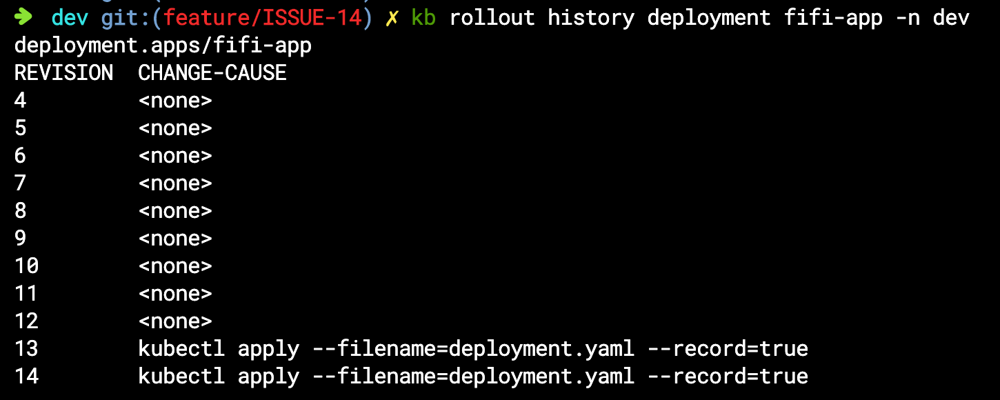

<span class="title__sub1"> ■ 오브젝트 생성/변경 </span>
<span class="title__sub2"> ■ Create </span>
* 같은 이름의 오브젝트가 존재할때 생성이 안됨

<span class="title__sub3"> 1. Yaml 파일로 생성 </span>

```shell
$ kubectl create -f [yaml 파일]
```
<br/>

<span class="title__sub3"> 2. ConfigMap 생성 </span>

```shell
# file-c.txt 라는 파일로 cm-file라는 이름의 ConfigMap 생성
$ kubectl create configmap cm-file --from-file=./file-c.txt

# key1:value1 라는 상수로 cm-file라는 이름의 ConfigMap 생성
$ kubectl create configmap cm-file --from-literal=key1=value1

# 여러 key:value로 cm-file라는 이름의 ConfigMap 생성 
$ kubectl create configmap cm-file --from-literal=key1=value1 --from-literal=key2=value2
```
<br/>

<span class="title__sub3"> 2. Secret 생성 </span>

```shell
# file-s.txt 라는 파일로 sec-file라는 이름의 Secret 생성
kubectl create secret generic sec-file --from-file=./file-s.txt

# key1:value1 라는 상수로 sec-file라는 이름의 Secret 생성
kubectl create secret generic sec-file --from-literal=key1=value1
```

<br/>


<span class="title__sub2"> ■ Apply </span>
* 기존에 같은 이름의 오브젝트가 존재할때 업데이트 됨

```shell
$ kubectl apply -f [yaml 파일]
```

<br/>

<span class="title__sub2"> ■ Create/Apply 상태 확인 </span>
* 생성/업데이트 된 오브젝트 상태 확인
* 결과(성공 또는 실패)가 나올때까지 해당 명령어는 계속 수행중 상태가 됨

```shell
$ kubectl rollout status [오브젝트]/[오브젝트명] -n [네임스페이스명]
$ kubectl rollout status deployment/fifi-app -n dev
```


<span class="title__sub1"> ■ 오브젝트 조회 </span>
<span class="title__sub2"> ■ Get </span>
<span class="title__sub3"> 1. 파드 내용 조회 </span>

```shell
# 파드리스트 조회
$ kubectl get pods -n [namespace명]

# 좀 더 많은 내용 출력
$ kubectl get pods -n [namespace명] -o wide

# 특정 파드만 조회
$ kubectl get pod [파드명]
```

<br/>

<span class="title__sub2"> ■ Describe </span>
* 상세 내용 출력

<span class="title__sub3"> 1. 파드 내용 상세 조회 </span>

```shell
$ kubectl describe pod [파드명] -n [네임스페이스명]
```

<br/>

<span class="title__sub3"> 2. 디플로이먼트 내용 상세 조회 </span>

```shell
$ kubectl describe deployment [디플로이먼트명] -n [네임스페이스명]
```

<br/>

<span class="title__sub3"> 3. namespace의 resourcequota&limitrange 상세 조회 </span>

```shell
# nm-3의 Namespace에 있는 ResourceQuota들의 상세 조회
$ kubectl describe resourcequotas --namespace=nm-3

# nm-5의 Namespace에 있는 LimitRange들의 상세 조회
$ kubectl describe limitranges --namespace=nm-5
```

<br/>


<span class="title__sub1"> ■ 오브젝트 삭제 </span>
<span class="title__sub2"> ■ Delete </span>
<span class="title__sub3"> 1. 파드 삭제 </span>

```shell
# 파일이 있을 경우 생성한 방법 그대로 삭제
$ kubectl delete -f ./pod.yaml

# Pod 이름 지정
$ kubectl delete pod pod1
```

<br/>
<span class="title__sub3"> 2. ReplicationController 삭제 </span>
연결된 pod는 지우지 않고 ReplicationController만 삭제

```shell
$ kubectl delete replicationcontrollers [ReplicationController명] --cascade=false
```

<br/>


<span class="title__sub1"> ■ 오브젝트 컨테이너 </span>
<span class="title__sub3"> ■ Exec </span>

```shell
# Container 들어가기
$ kubectl exec [파드명] -it /bin/bash

# Container가 두개 이상 있을때
$ kubectl exec [파드명] -c [컨테이너명] -it /bin/bash
```

<br/>

<span class="title__sub1"> ■ Deployment Rollback </span>
<span class="title__sub3"> 1. rollout 히스토리 확인 </span>
* deployment 생성/적용시 --record=true 옵션을 넣으면 CHANGE-CAUSE 필드에 명령어가 표시됨


```shell
$ kubectl rollout history deployment [디플로이먼트명] -n [네임스페이스명]
$ kubectl rollout history deployment deployment-1 -n dev
```

<br/>

<span class="title__sub3"> 2. 롤백 </span>

```shell
# 바로 이전 버전으로 변경
$ kubectl rollout undo deployment [디플로이먼트명] -n [네임스페이스명]
$ kubectl rollout undo deployment fifi-app -n dev

# 원하는 리비전으로 번경 (마지막 리비전이 현재 리비전)
$ kubectl rollout undo deployment [디플로이먼트명] -n [네임스페이스명] --to-revision=[리비전번호]
$ kubectl rollout undo deployment deployment-1 -n [네임스페이스명] --to-revision=2
```

<br/>

<span class="title__sub1"> ■ Label </span>
<span class="title__sub3"> 1. node에 라벨 추가/삭제 </span>

```shell
#os=centos 라벨 추가
$ kubectl label nodes [노드명] [라벨키]=[라벨벨류]
$ kubectl label nodes k8s-node1 os=centos

#라벨 삭제
$ kubectl label nodes [노드명] [라벨키]-
$ kubectl label nodes k8s-node1 os-
```
