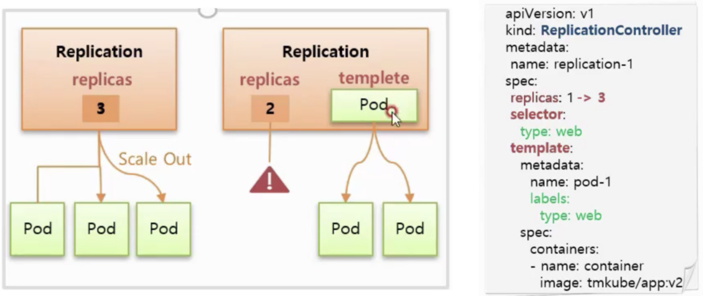

<span class="title__sub1"> 1. Controller </span>
- 서비스를 관리하고 운영하는데 도움을 준다.
- 아래 기능들을 제공한다.


<br/>

<span class="title__sub2"> 1.1 Auto Healing </span>
- 파드에 문제가 생기거나 또는 파드를 스케줄링하는 노드가 다운이 될 경우 컨트롤러가 인지하여 새로운 노드에 파드를 재생성
- 종류: 
  - ReplicationController
  - ReplicaSet
  - StatusfulSet
  - DaemonSet

<br/>

<span class="title__sub2"> 1.2 Auto Scaling </span>
- 파드의 리소스 상태가 limited 되었을 경우 컨트롤러가 인지하여 자동으로 파드를 한개 더 생성
- 부하분산 및 파드가 죽지 않도록 함
- 종류: 
  - HPA

<br/>

<span class="title__sub2"> 1.3 Software Update </span>
- 여러 파드에 대한 업그레이드를 지원한다.
- 업그레이드 도중 문제 발생시에 롤백도 지원한다.
- 종류:
  - Deployment

<br/>

<span class="title__sub2"> 1.4 Job </span>
- 일시적인 작업이 필요할 경우 파드를 생성하여 작업을 수행하고, 완료 후에는 자원을 반납한다.
- 효율적인 자원 사용이 가능
- 종류:
  - CronJob
  - Job

<br/>

<span class="title__sub1"> 2. Replication Controller/ ReplicaSet </span>
- Replication Controller는 deprecated 되었고, 대체로 ReplicaSet을 사용한다.
- 둘다 template, replicas 기능을 가지고 있다.
- ReplicaSet에는 selector 기능이 추가되었다.

<br/>

<span class="title__sub2"> 2.1. Template  </span>

- 컨트롤러와 파드는 label과 selector로 연결이 된다. (서비스와 동일)
- 컨트롤러를 만들때 template에 파드 내용을 저장하고, 컨트롤러에서 파드를 재생성 할 경우 해당 template 내용을 참고한다.
- 파드의 버전을 업데이트 하는 방법
  - 먼저 template의 파드 내용을 업데이트 한 후, 
  - 기존에 연결되어 있는 파드를 다운
  - 업데이트된 template로 파드 재생성 

<br/>

<span class="title__sub2"> 2.2. Replicas  </span>

- replicas 만큼 파드가 관리된다.
- pod를 따로 정의하지 않고 ReplicationController만 정의하게 되면, 정의된 template 내용으로 replica 개수 만큼 파드를 자동 생성해준다

<br/>

<span class="title__sub2"> 2.3. Selector </span>

- Replication Controller의 경우 label 이 동일할 경우만 연결이 된다.
  - label의 key와 value 중 하나라도 값이 다를 경우 연결하지 않는다
- ReplicaSet의 경우 matchLabels 와 matchExpressions 을 제공한다.

<br/>

<span class="title__sub3"> 2.3.1 Match Labels </span>

- Replication Controller 의 selector 와 같이 label이 동일할 경우 연결을 한다.

<br/>

<span class="title__sub3"> 2.3.2 Match Expressions </span>

- label의 key와 value를 좀 더 상세하게 컨트롤할 수 있다.
- operator에는 Exists, DoesNotExist, In, NotIn 이 존재한다.
- 잘 사용하지 않는다.

<br/>

<span class="title__sub2"> 2.4. ReplicationController에서 ReplicaSet으로 변경방법 </span>  
1. 아래 명령어로 연결된 pod는 지우지 않고 ReplicationController만 삭제
```shell
$ kubectl delete replicationcontrollers replication1 --cascade=false
```
2. pod가 지워지지 않았는지 확인

3. ReplicaSet 생성
```yaml
apiVersion: apps/v1
kind: ReplicaSet
metadata:
  name: replica2
spec:
  replicas: 2
  selector:
    matchLabels:
      cascade: "false"
  template:
    metadata:
      labels:
        cascade: "false"
    spec: #아래 스펙내용은 기존 ReplicationController 와 동일하게
      containers:
      - name: container
        image: kubetm/app:v1
```

<br/>

<span class="title__sub2"> 2.5. ReplicaSet 샘플 </span>

```yaml
apiVersion: apps/v1
kind: ReplicaSet
metadata:
  name: replica1
spec:
  replicas: 2 #파드개수를 replicas 만큼 유지를 시킨다.
  selector:
    matchLabels:
      type: web #동일한 라벨링 된 파드와 연결이 된다.
      ver: v1 #만약 template 아래 labels에 존재하지 않는 라벨을 사용할 경우 에러 발생(ex. ver: v3)
  template:
    metadata:
      name: pod1 #ReplicaSet이 해당 템플릿으로 Pod를 생성하면 "pod1"로 파드명이 만들어지지 않고 임의의 파드명으로 생성된다.
      labels:
        type: web
        ver: v1
        ver: v2
    spec:
      containers:
      - name: container
        image: kubetm/app:v1
      terminationGracePeriodSeconds: 0
```

```yaml
apiVersion: apps/v1
kind: ReplicaSet
metadata:
  name: replica1
spec:
  replicas: 1
  selector: 
    #matchLabels, matchExpressions 두 조건 모두 들어갈 수 있다. or 조건이다. (matchLabels or matchExpressions)
    #template 아래 labels에 존재하는 라벨만 사용가능
    matchLabels: 
      type: web
      ver: v1
    matchExpressions:
    - {key: type, operator: In, values: [web]}
    - {key: ver, operator: Exists}
  template:
    metadata:
      labels:
        type: web
        ver: v1
        location: dev
    spec:
      containers:
      - name: container
        image: kubetm/app:v1
      terminationGracePeriodSeconds: 0
```

<br/>

<span class="title__sub1"> 3. Deployment  </span>

- ReplicaSet 기능을 포함하며 배포/ 버전업데이트에 도움이 되는 컨트롤러
- Deployment에 RelicaSet에 대한 정보를 같이 기입한다
- Deployment를 적용하면 ReplicaSet을 생성 하게되고, 이 ReplicaSet이 replica 개수만큼 파드를 만들게 된다.

<br/>

<span class="title__sub2"> 3.1. ReCreate </span>

- v1의 파드를 모두 삭제시킨 후 v2의 파드를 실행
- 다운타임이 발생
- 별도의 자원 사용량이 필요없음
- 상세플로우  
  1.기존 ReplicaSet의 replica를 0으로 변경   
  2.기존 파드 삭제   
  3.(다운타임 발생)  
  4.새 ReplicaSet 생성   
  5.파드생성  
  6.서비스와 연결됨  

Recreate Deployment 리소스파일
```yaml
apiVersion: apps/v1
kind: Deployment
metadata:
  name: deployment-1
spec:
  selector:
    matchLabels:
      type: app
  replicas: 2
  strategy:
    type: Recreate #type 설정
  revisionHistoryLimit: 1 #삭제하지 않고 유지 할 ReplicaSet 개수, 기본값은 10
  template:
    metadata:
      labels:
        type: app
    spec:
      containers:
      - name: container
        image: kubetm/app:v1
      terminationGracePeriodSeconds: 10
```

<br/>

<span class="title__sub2"> 3.2. Rolling Update </span>


- v1 파드가 그대로 유지되면서 v2의 파드를 하나 생성
- v2의 파드가 제대로 생성이 되었으면 v1의 파드를 하나 삭제
- 그 후 다시 v1 파드 삭제, v2 파드 생성 행위를 replica 개수 만큼 반복
- 하나 추가 생성된 파드만큼의 자원 사용량이 늘어남
- 다운타임이 발생하지 않음
- 상세플로우  
  1.Deployment의 template 변경  
  2.새 ReplicaSet 생성 (새로운 template 적용)     
  3.새 ReplicaSet의 replicas를 1로 하여 v2 파드 생성  
  4.v2 파드가 서비스와 연결됨  
  5.기존 ReplicaSet의 replicas 개수를 하나 줄여 v1 파드 하나 삭제
  6.새 ReplicaSet의 replicas 개수를 하나 늘려 v2 파드 생성 후 서비스와 연결
  7.v1 파드의 개수가 0이 될때까지 5-6반복
- 어떻게 새로 생성된 파드들은 새로 생성된 ReplicaSet을 구별하나?
  - Deployment는 여러 ReplicaSet을 만들고, 각각의 ReplicaSet은 자신의 파드를 구별하기 위해 추가적인 라벨과 셀렉터를 붙인다.

RollingUpdate Deployment 리소스파일
```yaml
apiVersion: apps/v1
kind: Deployment
metadata:
  name: deployment-2
spec:
  selector:
    matchLabels:
      type: app2
  replicas: 2
  strategy:
    type: RollingUpdate #type 설정
  minReadySeconds: 10
  template:
    metadata:
      labels:
        type: app2
    spec:
      containers:
      - name: container
        image: kubetm/app:v1
      terminationGracePeriodSeconds: 0
```
<br/>

<span class="title__sub2"> 3.3. Blue/Green </span>

- 다양한 방법으로 Blue/Green 배포를 할 수 있음(deployment 자체로 제공하진 않음)
- v1 파드를 그대로 유지하면서 v2의 파드를 replica 개수만큼 생성  
- 서비스의 label을 v2로 변경
- 문제 발생시 다시 서비스의 label을 v1으로 변경 (문제발생시 서비스의 라벨만 변경하면 되니 롤백이 쉬움)
- 문제가 없을 경우 기존 v1 파드 삭제
- 순간적으로 변경이 되기 때문에 다운타임이 발생하지 않음
- 자원 사용량은 기존의 2배가 필요
- 상세플로우  
  1.새로운 template 및 라벨이 적용된 새 ReplicaSet 생성
  2.새 ReplicaSet에 의해 v2 파드가 생성됨   
  3.서비스에 적용된 라벨을 새로운 파드의 라벨로 변경  
  4.문제가 없을 경우 기존 v1 파드 및 ReplicaSet 삭제
- 어떻게 새로 생성된 파드들은 새로 생성된 ReplicaSet을 구별하나?
  - Deployment는 여러 ReplicaSet을 만들고, 각각의 ReplicaSet은 자신의 파드를 구별하기 위해 추가적인 라벨과 셀렉터를 붙인다.

Blue/Green ReplicaSet 리소스파일
```yaml
apiVersion: apps/v1
kind: ReplicaSet
metadata:
  name: replica1  # -> replica2로 변경하여 배포 (새로운 ReplicaSet 생성됨)
spec:
  replicas: 2
  selector:
    matchLabels:
      ver: v1 # -> v2로 변경하여 배포
  template:
    metadata:
      name: pod1
      labels:
        ver: v1  # -> v2로 변경하여 배포
    spec:
      containers:
      - name: container
        image: kubetm/app:v1  # -> 업데이트할 이미지로 변경하여 배포
      terminationGracePeriodSeconds: 0
```

Blue/Green Service 리소스파일
```yaml
apiVersion: v1
kind: Service
metadata:
  name: svc-3
spec:
  selector:
    ver: v1 # -> v2로 변경하여 배포 (새로운 파드로 연결)
  ports:
  - port: 8080
    protocol: TCP
    targetPort: 8080
```
<br/>

<span class="title__sub2"> 3.4 Canary </span>

- 불특정 다수 테스트
  - v1 파드를 그대로 유지하면서 v2 파드를 생성하는데, v2 파드도 기존 서비스와 연결되도록 라벨링
  - 그럼 서비스로 들어오는 일부의 트레픽은 v2 파드로 보내어 테스트 진행
  - 문제 발생시 v2 파드의 컨트롤러의 replica를 0으로 변경
  - 문제가 없을 경우 v2파드의 개수를 늘리고, v1파드의 개수를 줄여가며 배포 진행 (불특정 다수 테스트)  

- 특정 타겟 테스트
  - 각 버전별로 서비스를 생성후 Ingress Controller를 이용하여 유입되는 트레픽을 url로 나누어 테스트
  - 문제가 없을 경우 v2 파드의 개수를 늘리고 url 원복하여 배포
  - 자원 사용량은 종료시키는 v1과 새로 생성하는 v2 파드 개수에 따라 늘어남

<br/>

<span class="title__sub1"> 4. DaemonSet  </span>

- ReplicaSet과 다르게 노드의 자원상태와 상관없이 모든 노드에 파드가 한개씩 생긴다.
- 한 노드에 1개 이상의 DamonSet 파드를 띄울 수는 없지만, nodeSelector를 이용하여 제외할 노드를 선택할 수 있다.
- hostPort를 사용하면 (service의 노드포트 설정) + (externalTrafficPolicy: Local) 옵션을 준 것과 동일하다.
  - externalTrafficPolicy: Local 옵션은 요청한 NodeIP에 있는 Pod로 트래픽을 전달한다.
- 모니터링, 로그수집 등 모든 노드에 들어가야하는 서비스들을 구성할때 사용.

```yaml
apiVersion: apps/v1
kind: DaemonSet
metadata:
  name: daemonset-2
spec:
  selector:
    matchLabels:
      type: app
  template:
    metadata:
      labels:
        type: app
    spec:
      nodeSelector: #node를 선택할 수 있다.
        os: centos
      containers:
      - name: container
        image: kubetm/app
        ports:
        - containerPort: 8080
          hostPort: 18080 #hostPort 옵션 적₩
```

<br/>

<span class="title__sub1"> 5. Job </span>

- 어떤 컨트롤러를 사용했냐에 따라 파드의 lifecycle이 달라진다.

<br/>

<span class="title__sub2"> 5.1. Pod </span>
- 컨트롤러를 사용하지 않고 파드로만 띄웠을 경우, 노드 또는 파드 장애시에 복구가 되지 않는다.

<br/>

<span class="title__sub2"> 5.2. ReplicaSet </span>
- 노드 또는 파드 장애시에 파드를 새로 생성한다. (Recreate)
- 파드가 일을 하지 않을 경우에 파드를 재시작해준다. (Restart)
- 지속적인 서비스가 요구될때 사용

```
Recreate vs Restart 
- Recreate는 파드를 재생성하여 IP나 파드명이 변경이 된다. 
- Restart는 파드를 재생성하지 않고 안의 컨테이너만 재시작한다.
```

<br/>

<span class="title__sub2"> 5.3. Job </span>
- 프로세스가 일을 하지 않을 경우 파드를 종료시킨다. (Finish)
- 이때 종료는 파드 삭제가 아닌 자원을 사용하지 않는 상태를 의미한다.

```yaml
apiVersion: batch/v1
kind: Job
metadata:
  name: job-2
spec:
  completions: 6
  parallelism: 2
  activeDeadlineSeconds: 30
  template:
    spec:
      restartPolicy: Never
      containers:
      - name: container
        image: kubetm/init
        command: ["sh", "-c", "echo 'job start';sleep 20; echo 'job end'"]
      terminationGracePeriodSeconds: 0
```

<br/>

<span class="title__sub1"> 5. CronJob </span>
- 주기적인 시간에 따라 Job을 생성하는 컨트롤러
- 대체로 Job은 CronJob으로 특정시간에만 작동하도록 사용한다.

```yaml
#v1.22
apiVersion: batch/v1
kind: CronJob
metadata:
  name: cron-job
spec:
  schedule: "*/1 * * * *"
  jobTemplate:
    spec:
      template:
        spec:
          restartPolicy: Never
          containers:
          - name: container
            image: kubetm/init
            command: ["sh", "-c", "echo 'job start';sleep 20; echo 'job end'"]
          terminationGracePeriodSeconds: 0

---
#v1.15
apiVersion: batch/v1beta1
kind: CronJob
metadata:
  name: cron-job-2
spec:
  schedule: "20,21,22 * * * *"
  concurrencyPolicy: Replace
  jobTemplate:
    spec:
      template:
        spec:
          restartPolicy: Never
          containers:
            - name: container
              image: kubetm/init
              command: ["sh", "-c", "echo 'job start';sleep 140; echo 'job end'"]
          terminationGracePeriodSeconds: 0
```
