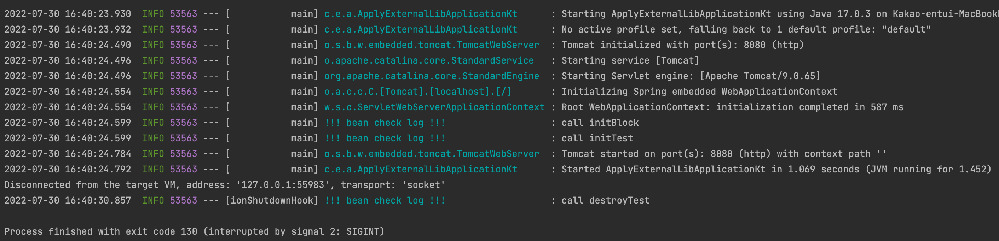
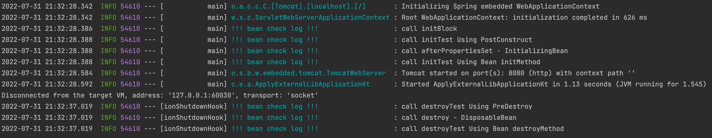

## 1. **InitializingBean, DisposableBean** 인터페이스

- 이 인터페이스는 **스프링 전용 인터페이스**이다. 해당 코드가 스프링 전용 인터페이스에 의존한다.
- 초기화, 소멸 메소드의 이름을 변경할 수 없다.
- 코드를 수정할 수 없는 외부 라이브러리에 적용할 수 없다.
- 현재는 이보다 더 좋은 방법이 있기 때문에 거의 사용 되지 않는다.

```java
class BeanTest : **InitializingBean, DisposableBean** {

    init {
        println("call initBlock")
    }

    fun initTest() {
        println("call initTest")
    }

    fun destroyTest() {
        println("call destroyTest")
    }

    // 의존관계 주입이 끝나면 호출
    **override fun afterPropertiesSet**() {
        initTest()
    }

		// 스프링 컨테이너 종료시 호출
    **override fun destroy**() {
        destroyTest()
    }
}
```



<br/>

## 2. initMethod, destroyMethod

- 빈을 생성하기 위한 @Bean 어노테이션에 initMethod와 destroyMethod를 사용하여 지정
- 스프링 빈이 스프링 코드에 의존하지 않는다.
- 메소드의 이름을 자유롭게 변경할 수 있으며, 코드에 접근할 수 없는 외부 라이브러리에도 초기화, 종료 메소드를 적용할 수 있다.

```java
@Configuration
class WebConfig {

    **@Bean(initMethod = "initTest", destroyMethod = "destroyTest")**
    fun getBeanTest(): BeanTest {
        return BeanTest()
    }
}

class BeanTest {
    private val logger = LoggerFactory.getLogger("!!! bean check log !!!")

    init {
        logger.info("call initBlock")
    }

    fun initTest() {
        logger.info("call initTest")
    }

    fun destroyTest() {
        logger.info("call destroyTest")
    }
}
```

### 2.2. 종료 메소드 추론

- 또한 destroyMethod에는 inferred라는 추론 기능이 추가되어 있다.
- 일반적으로 종료 메소드의 이름으로 close 또는 shutdown을 많이 이용하기 때문에, close 또는 shutdown 함수가 존재하면 이를 소멸자 메소드로 인식하여 호출한다.
- 이러한 추론 기능을 사용하고 싶지 않으면 destroyMethod="" 처럼 destroyMethod를 공백으로 지정하면 된다.

```java
@Configuration
class WebConfig {

    @Bean(initMethod = "initTest")
    fun getBeanTest(): BeanTest {
        return BeanTest()
    }
}

class BeanTest {
    private val logger = LoggerFactory.getLogger("!!! bean check log !!!")

    init {
        logger.info("call initBlock")
    }

    fun initTest() {
        logger.info("call initTest")
    }

    **fun close() { // 스프링 컨테이너 종료시 호출됨
        logger.info("call destroyTest")
    }**
}
```

<br/>

## 3. PostConstruct, PreDestroy

- 최신 스프링에서 가장 권장하는 방법이다.
- 애노테이션 하나만 붙이면 되므로 매우 편리하다.
- 패키지를 확인해보면 javax.annotation.PostConstruct이다.스프링에 종속적인 기술이 아니라 JSR-250이라는 자바 표준이므로 스프링이 아닌 다른 컨테이너에서도 동작한다,.
- 컴포넌트 스캔과 잘 어울린다.
- 외부 라이브러리에는 적용하지 못하기 때문에 외부 라이브러리를 초기화, 종료해야 한다면 @Bean 기능을 사용하면 된다.

```java
@Configuration
class WebConfig {

    @Bean()
    fun getBeanTest(): BeanTest {
        return BeanTest()
    }
}

class BeanTest {
    private val logger = LoggerFactory.getLogger("!!! bean check log !!!")

    init {
        logger.info("call initBlock")
    }

    **@PostConstruct**
    fun initTest() {
        logger.info("call initTest")
    }

    **@PreDestroy**
    fun destroyTest() {
        logger.info("call destroyTest")
    }
}
```

<br/>

## 4. 정리

보통은 @PostConstruct, @PreDestroy 을 사용하는걸 권장하지만, 외부 라이브러리 초기화/ 소멸시 처리해야 할 과정이 있다면, @Bean 의 InitMethod, destroyMethod를 사용하면 된다.

### 4.1. 만약 **SIGKILL 시그널(**kill -9 {PID})**로 종료가 되었다면**,

- **SIGKILL**은 프로세스를 즉시 종료 시킨다. 해당 시그널을 받으면 프로세스가 종료되기 전에 수행되어야 하는 종료 절차를 실행하지 않고 즉시 종료하므로 graceful shutdown을 위해서라면 해당 시그널을 통해 프로세스를 종료시키는 것은 피해야한다.

### 4.2. 호출 순서는?

- **init** : @PostConstruct → InitializingBean 인터페이스 → @Bean initMethod
- **destroy** : @PreDestroy → DisposableBean 인터페이스 → @Bean destroyMethod

