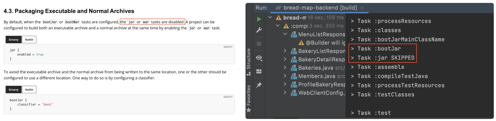
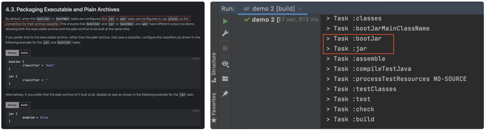
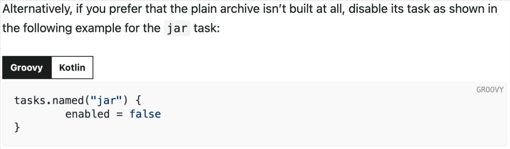

 

최근에 빌드를 하면 jar 파일이 두개가 생성이 되는걸 확인하게 되었고, 해당 부분이 궁금해서 찾아봤다.

## ✔️ 왜 2개가 생성이 될까?

- springboot 2.5 이후 부터는 빌드시 jar 파일이 2개 생긴다.

- springboot 2.4.11 document 를 보면, `jar or war tasks are disabled` 이기 때문에 jar task 가 기본적으로 스킵이다.

- springboot 2.5.0 이후부터는 bootJar, bootWar 수행시에 `jar or war task are configured to use plain` 이기 때문에 plain 이라는 이름으로 jar 파일이 한개 더 생긴다.

- 즉, 스프링부트의 버전에 따른 gradle 플러그인의 packageing 기본 설정 차이가 있기 때문이다.

 

## ✔️ executable jar, plain jar 의 차이가 뭐지?

- plain jar 파일의 경우 어플리케이션 실행에 필요한 모든 의존성을 포함하지 않고 소스코드의 클래스파일과 리소스 파일만 포함한다.
- executable jar 파일의 경우 실행에 필요한 모든 의존성을 함께 빌드한다. 따라서 해당 파일은 `java -jar` 명령어를 통해 실행이 가능하다.

 

## ✔️ plain jar 를 생성하지 않는 방법은?

- jar task 를 수행하지 않으면 된다.

