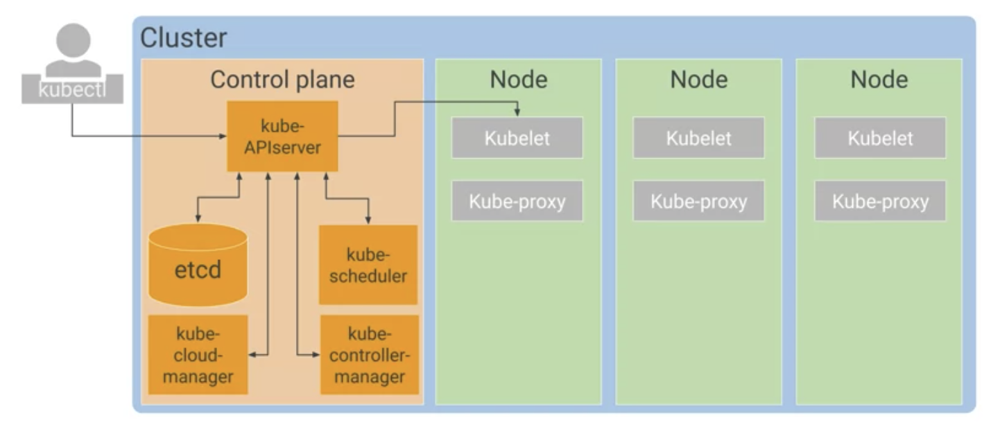
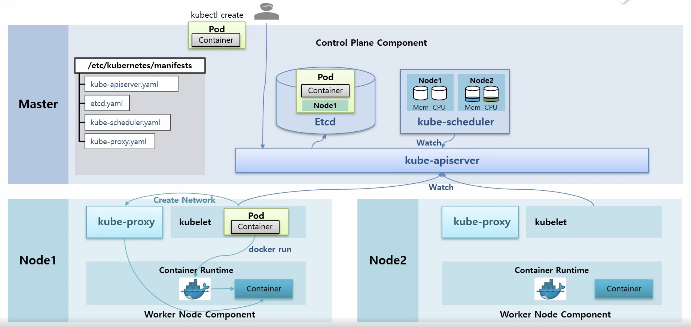
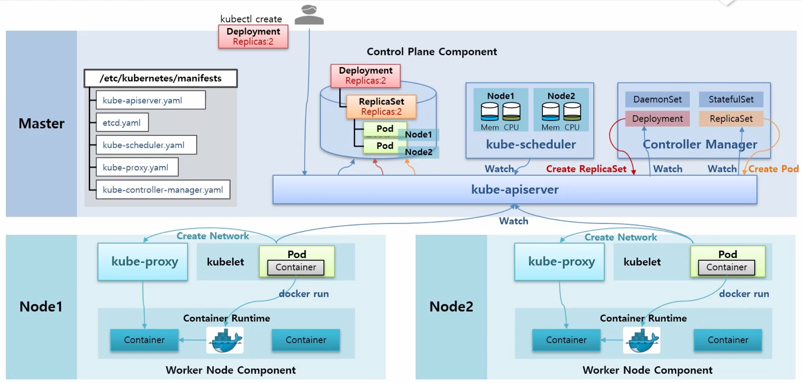

# ✔️ Kubernetes Concepts

- K8S가 관리하는 각 항목은 객체로 표시되며 이러한 객체의 속성과 상태를 확인하고 변경할 수 있다.
- Kubernetes는 ‘watch loop’를 사용하여 관리되고 있는 객체에 대해 원하는 상태를 지정할 수 있고, Kubernetes는 객체를 해당 상태로 전환&유지한다.

---

# ✔️ 제어 영역 Kubernetes 구성요소

- 제어 영역의 역할은 전체 클러스터를 조정하는 것이다.

## 1. kube API Server

- 사용자가 직접 상호작용하는 단일 구성요소
- kubectl 명령어와 통신하는 서버
- kubeconfig 값으로 수신된 요청을 인증하고 요청의 승인 여부와 유효성을 확인하며 허용 제어를 관리

## 2. etcd

- 클러스터의 데이터베이스
- 클러스터의 상태를 저장하는 역할을 한다.
- 여기에는 모든 클러스터의 구성 데이터와 많은 동적 정보(클러스터의 일부인 노드, 실행해야 하는 Pod, 실행 위치)가 포함된다.
- 사용자는 etcd와 직접 상호작용하지 않는다.

## 3. kube-scheduler

- Pod의 요구사항을 평가하고 가장 적합한 노드를 선택하는 역할을 한다.
- 노드의 자원 사용량을 모니터링 하기때문에 적합한 노드 선택이 가능
- kube-apiserver를 통해 etcd에 Pod생성 요청이 있는지 감시한다. (Watch 기능)
- 노드를 선택하는 방법
    1. 노드에 아직 할당되지 않은 Pod 객체 발견 
    2. 모든 노드의 리소스를 확인하여 적합한 노드를 선택 
    3. 해당 노드의 이름을 Pod 객체에 작성
    4. 시스템의 또 다른 구성요소가 Pod를 시작

## 4. kube-controller-manager

- 컨트롤러 오브젝트들의 요구사항을 수행
- 클러스터의 현재 상태가 원하는 상태와 일치하지 않을 때마다 kube-controller-manager는 원하는 상태를 달성하기 위해 변경을 시도
- 컨트롤러 종류
    - ReplicaSet, Deployment, DaemonSet, Job, CronJob

## 5. Kubelet

- 각 워커 노드에서 클러스터 에이전트 역할을 한다.
- kube-apiserver 에 watch 를 걸어 자신의 노드이름이 붙은 Pod 생성 및 변경 요청에 대해 수행한다.
- Kubelet은 컨테이너 런타임을 사용하여 Pod의 컨테이너를 실행하고 Pod의 수명 주기를 모니터링하고 kube-apiserver에 다시 보고한다.

## 6. kube-proxy

- 클러스터에서 Pod 간 네트워크 생성 및 연결을 유지
- DaemonSet으로 설치된다.

---

# ✔️ Pod 생성 플로우

1. 사용자가 Pod 생성 요청 → kube-apiserver 로 명령어 전달
2. kube-apiserver는 etcd에 해당 Pod 정보를 저장
3. kube-scheduler는 kube-apiserver를 통해 etcd에 새로 들어온 Pod 생성 요청을 체크하고, 노드들의 자원상태를 확인하여 적합한 노드를 선택 후 해당 Pod에 노드명 기재
4. 모든 노드의 kublet이 kube-apiserver 를 watch 하고 있다가 자신의 노드명이 붙은 Pod 생성 이벤트가 발생하면 해당 정보를 가져온다.
5. kublet은 Container Runtime에게 해당 파드 생성 및 컨테이너 실행 요청을 함
6. 그리고 kublet은 kube-proxy에게 네트워크 생성 요청을 하게되고, kube-proxy는 새로 생성된 컨테이너가 네트워크 통신이 되도록 도와줌

---

# ✔️ Deployment 생성 플로우

- Controller Manager Pod 내에 여러 컨트롤러들에 대한 기능들이 각각의 스레드 형태로 돌아가고 있다.
1. 사용자가 Deployment 생성 요청 → kube-apiserver로 명령어 전달
2. kube-apiserver는 etcd에 해당 Deployment에 대한 정보를 저장
3. Controller Manager Pod 내의 Deployment 스레드가 이를 감지하여 ReplicaSet 생성을 요청한다.
4. Controller Manager Pod 내의 ReplicaSet 스레드가 이를 감지하여 replica 개수만큼 Pod 생성 요청을 한다.
5. 이후에 파드 생성 플로우로 진행한다.

