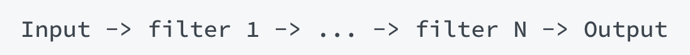
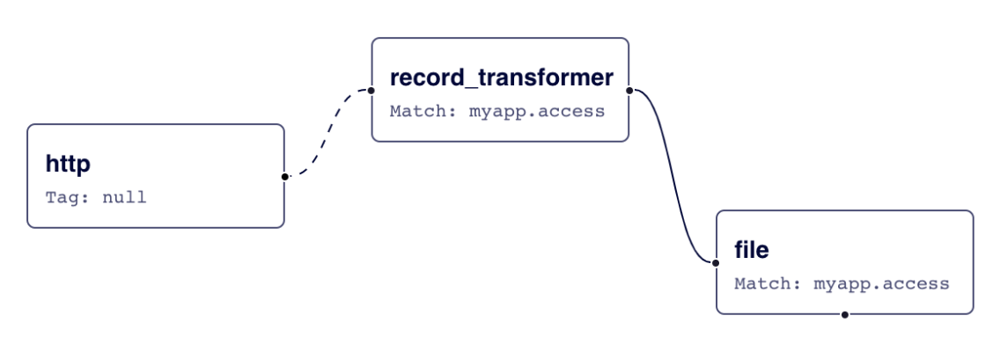
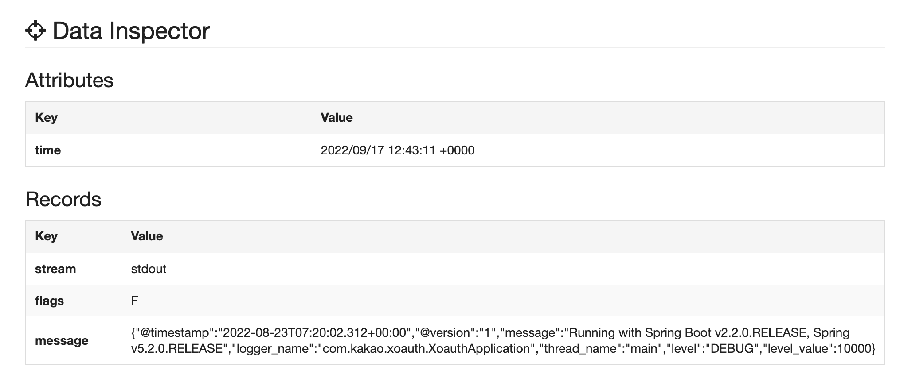
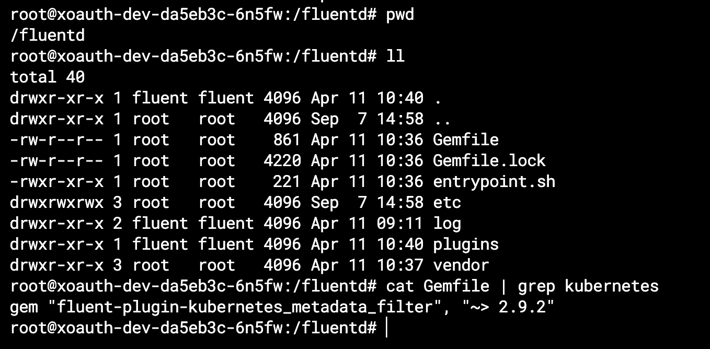
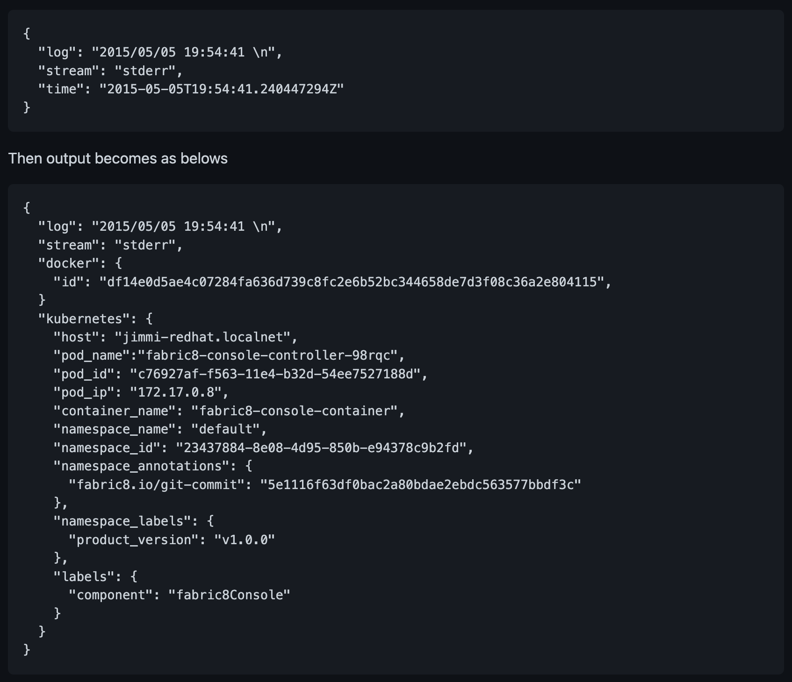
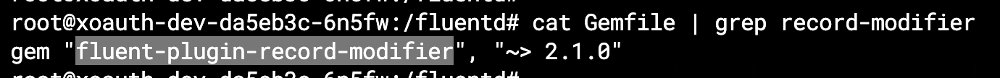
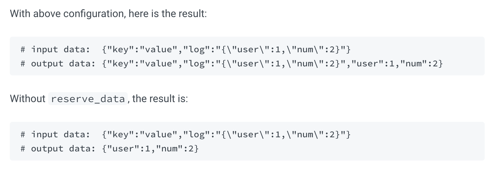
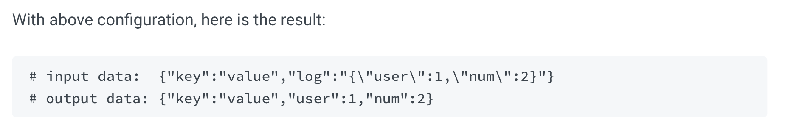
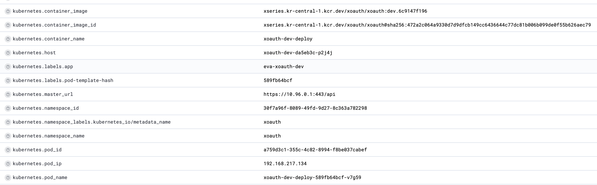

# ✔️ 먼저 알아두면 좋은 내용
## 1. common plugin parameters
- builtin plugin parameter 의 경우 prefix로 `@` 가 붙는다

**1.1. `@type`**
- specifies the plugin type

**1.2. `@id`**
- specifies the plugin id.
- `in_monitor_agent` uses this value for`plugin_id` field
- 버퍼, 스토리지, 로깅 및 기타 목적을 위한 경로로 사용됨

**1.3. `@label`**

- specifies the label symbol. See[label](https://www.notion.so/configuration/config-file#5.-group-filter-and-output-the-label-directive)section.

**1.4. `@log_level`** 

- specifies per plugin log level. See [Per Plugin Log](https://www.notion.so/deployment/logging#per-plugin-log) section.

자세한 내용은 아래 참고

[Config: Common Parameters](https://docs.fluentd.org/configuration/plugin-common-parameters#parameters-for-all-the-plugins)

<br/>

## 2. wildcards, expansions and other tips

- `match` , `filter` 태그에서 사용한다.

**2.1. `*`** 

- single tag 와 매치
- `a.*` 의 경우 `a.b` 와 매치, `a` 또는 `a.b.c` 와는 매치 안됨

**2.2. `**`**

- zero or more tag 와 매치
- `a.**` 의 경우 `a`, `a.b`, `a.b.c` 와 모두 매치

**2.3. 그외**

- 그외 regex, 값 매치 등은 아래에서 확인
    
    [Config File Syntax](https://docs.fluentd.org/configuration/config-file#wildcards-expansions-and-other-tips)
    

<br/>

## **3. Embedding Ruby Expressions**

- fluentd 1.4.0 부터 `#{...}` 표현식에 루비 코드를 넣을 수 있다.

```bash
<match "app.#{ENV['FLUENTD_TAG']}">
  @type stdout
</match>
```

---

# ✔️ Directive

## 1. source

- input 에 대한 지시어
- 사용할 input plugin에 대한 값이 `@type` 으로 명시가 되야한다.

```bash
# Receive events from 24224/tcp
# This is used by log forwarding and the fluent-cat command
<source>
  @type forward
  port 24224
</source>

# http://<ip>:9880/myapp.access?json={"event":"data"}
<source>
  @type http
  port 9880
</source>
```

## 2. match

- output plugin 으로 동작하며, 명시된 태그에 대해서만 output destination으로 보내진다.

```bash
# Receive events from 24224/tcp
# This is used by log forwarding and the fluent-cat command
<source>
  @type forward
  port 24224
</source>

# http://<ip>:9880/myapp.access?json={"event":"data"}
<source>
  @type http
  port 9880
</source>

# Match events tagged with "myapp.access" and
# store them to /var/log/fluent/access.%Y-%m-%d
# Of course, you can control how you partition your data
# with the time_slice_format option.
<match myapp.access>
  @type file
  path /var/log/fluent/access
</match>
```

## 3. filter

- match 와 동일한 syntax를 가지고 있고, 로그 필터에 대한 지시어이다.
- event flow 는 아래와 같다.



```bash
# http://this.host:9880/myapp.access?json={"event":"data"}
<source>
  @type http
  port 9880
</source>

<filter myapp.access>
  @type record_transformer
  <record>
    host_param "#{Socket.gethostname}"
  </record>
</filter>

<match myapp.access>
  @type file
  path /var/log/fluent/access
</match>
```

**✔️ 위 예제 동작 플로우**

- input 으로 tag: myapp.access, data: {”event”: “data”} 이벤트를 받고,
- 첫번째 filter인 record_transformer 는 `“host_param”` 필드를 이벤트에 추가한다.
- 그럼 `{"event":"data","host_param":"webserver1"}` 값이 ouput plugin 으로 보내져 파일로 출력하게 된다.



---

# ✔️ 서비스에 설정한 fluentd daemonset config 설정 분석

- 전체 설정 내용
    
    ```bash
    data:
      fluent.conf: |
        <system>
          workers 1
          @log_level info
        </system>
        @include input-kubernetes.conf
        @include filter-kubernetes.conf
        <match **>
          @type copy
          <store>
            @type                         kafka2
            @id                           out_kafka
            brokers                       logis-kafka.dev.kakaoi.io:9092
            max_send_retries              10
            required_acks                 1
    
            default_topic                 xoauth-dev
        
            exception_backup              false
            compression_codec             gzip
        
            <format>
              @type                       json
            </format>
    
            <buffer topic,tag>
              @type                       file
              path                        /var/log/td-agent/buffer/td
              flush_interval              5s
              chunk_limit_size            16M
              queue_limit_length          32
              retry_forever               true
            </buffer>
          </store>
        </match>
    
      input-kubernetes.conf: |
        # Prevent fluentd from handling records containing its own logs. Otherwise
        # it can lead to an infinite loop, when error in sending one message generates
        # another message which also fails to be sent and so on.
        <match fluent.**>
          @type                           null
        </match>
        <source>
          @type                           tail
          @id                             in_tail_container_logs
          path                            /var/log/containers/xoauth*.log
          pos_file                        /var/log/fluentd-containers.log.pos
          tag                             kubernetes.*
          read_from_head                  "#{ENV['FLUENTD_INPUT_READ_FROM_HEAD'] || 'false'}"
          limit_recently_modified         "#{ENV['LIMIT_RECENTLY_MODIFIED'] || '120m'}"
          rotate_wait                     0
          enable_stat_watcher             false
          <parse>
            @type                         regexp
            expression                    /^(?<time>[^ ]+) (?<stream>stdout|stderr) (?<flags>[^ ]+) (?<message>.*)$/
          </parse>
        </source>
    
      filter-kubernetes.conf: |
        <filter kubernetes.**>
          @type                           kubernetes_metadata
          @id                             filter_kube_metadata
        </filter>
        <filter kubernetes.**>
          @type                           record_modifier
          tag                             ${record.dig("kubernetes", "container_name").gsub('-', '.')}
          <record>
            @timestamp                    ${(Time.at(time) + (60*60*9)).strftime('%Y-%m-%dT%H:%M:%S.%L+09:00')}
            cluster_name                  "xoauth-dev"
            hostname                      "#{ENV['K8S_NODE_NAME']}"
            container_image               ${record.dig("kubernetes", "container_image")}
            pod_name                      ${record.dig("kubernetes", "pod_name")}
          </record>
        </filter>
        <filter kubernetes.**>
          @type                           parser
          key_name                        message
          reserve_data                    true
          remove_key_name_field           true
          <parse>
            @type                         json
          </parse>
        </filter>
        <filter kubernetes.**>
          @type                           record_transformer
          remove_keys                     $.kubernetes
        </filter>
    ```
    

## 1. Input에 대한 설정

```bash
input-kubernetes.conf: |
    <match fluent.**>
      @type                           null
    </match>
    <source>
      @type                           tail
      @id                             in_tail_container_logs
      path                            /var/log/containers/xoauth*.log
      pos_file                        /var/log/fluentd-containers.log.pos
      tag                             kubernetes.*
      read_from_head                  "#{ENV['FLUENTD_INPUT_READ_FROM_HEAD'] || 'false'}"
      limit_recently_modified         "#{ENV['LIMIT_RECENTLY_MODIFIED'] || '120m'}"
      rotate_wait                     0
      enable_stat_watcher             false
      <parse>
        @type                         regexp
        expression                    /^(?<time>[^ ]+) (?<stream>stdout|stderr) (?<flags>[^ ]+) (?<message>.*)$/
      </parse>
    </source>
```

### 1.1. 로그 input

- /var/log/containers/xoauth*.log 파일을 타겟으로 tail 을 사용하여 input을 수행한다.
- 해당 이벤트에 kubernetes.* 태그를 붙인다.

```bash
<source>
  @type                           tail
  @id                             in_tail_container_logs
  path                            /var/log/containers/xoauth*.log
  pos_file                        /var/log/fluentd-containers.log.pos
  tag                             kubernetes.*
  read_from_head                  "#{ENV['FLUENTD_INPUT_READ_FROM_HEAD'] || 'false'}"
  limit_recently_modified         "#{ENV['LIMIT_RECENTLY_MODIFIED'] || '120m'}"
  rotate_wait                     0
  enable_stat_watcher             false
  <parse>
    @type                         regexp
    expression                    /^(?<time>[^ ]+) (?<stream>stdout|stderr) (?<flags>[^ ]+) (?<message>.*)$/
  </parse>
</source>
```

- 실제 들어온 이벤트의 레코드 데이터는 아래와 같다 (/var/log/containers/xoauth*.log 파일 포맷)

```bash
2022-08-23T16:20:02.313036458+09:00 stdout F {"@timestamp":"2022-08-23T07:20:02.312+00:00","@version":"1","message":"Running with Spring Boot v2.2.0.RELEASE, Spring v5.2.0.RELEASE","logger_name":"com.kakao.xoauth.XoauthApplication","thread_name":"main","level":"DEBUG","level_value":10000}
```

- `<parse>` 의 regexp 를 통해 아래와 같이 파싱이 된다.
    - regexp 의 결과값을 확인할 수 있는 사이트 : [http://fluentular.herokuapp.com](http://fluentular.herokuapp.com/)



### 1.2. fluentd 로그 제거

- fluentd.** tag로 들어온 이벤트는 모두 버린다.

```bash
<match fluent.**>
  @type                           null
</match>
```

<br/>

## 2. Filter에 대한 설정

**✔️ 전체 코드**

```bash
filter-kubernetes.conf: |
    <filter kubernetes.**>
      @type                           kubernetes_metadata
      @id                             filter_kube_metadata
    </filter>
    <filter kubernetes.**>
      @type                           record_modifier
      tag                             ${record.dig("kubernetes", "container_name").gsub('-', '.')}
      <record>
        @timestamp                    ${(Time.at(time) + (60*60*9)).strftime('%Y-%m-%dT%H:%M:%S.%L+09:00')}
        cluster_name                  "xoauth-dev"
        hostname                      "#{ENV['K8S_NODE_NAME']}"
        container_image               ${record.dig("kubernetes", "container_image")}
        pod_name                      ${record.dig("kubernetes", "pod_name")}
      </record>
    </filter>
    <filter kubernetes.**>
      @type                           parser
      key_name                        message
      reserve_data                    true
      remove_key_name_field           true
      <parse>
        @type                         json
      </parse>
    </filter>
    <filter kubernetes.**>
      @type                           record_transformer
      remove_keys                     $.kubernetes
    </filter>
```

### 2.1. K8S Metadata 정보 포함시키기

- `kubernetes_metadata` 타입의 필터로 인해 해당 로그 레코드를 내보낸 컨테이너에 대한 기본 메타데이터(hostname, pod_name, container_name 등) 가 해당 레코드에 포함된다.
- 해당 필터는 fluend 에 내장된 플러그인은 아니고, `fluent-plugin-kubernetes_metadata_filter` 를 설치해야 사용할 수 있다. (https://github.com/fabric8io/fluent-plugin-kubernetes_metadata_filter)

```bash
<filter kubernetes.**>
  @type                           kubernetes_metadata
  @id                             filter_kube_metadata
</filter>
```

**✔️ fluent-plugin-kubernetes_metadata_filter 설치는 언제?**

- daemonset으로 설치된 fluentd pod 에서 Gemfile을 확인해보니 해당 플러그인이 포함되어 있었다.



✔️ **input/output 에 대한 예제**



### 2.2. 이벤트 레코드에 필드 추가하기

- record_modifier 타입의 필터를 사용하여 필드를 추가/수정 할 수 있다.
- 추가/수정되는 필드는 `<record>` 내에 정의 해주면 된다.
- 기본 내장된 플러그인은 아니며, `fluent-plugin-record-modifier` 플러그인을 설치해줘야 한다. (https://github.com/repeatedly/fluent-plugin-record-modifier)

```bash
<filter kubernetes.**>
  @type                           record_modifier
  tag                             ${record.dig("kubernetes", "container_name").gsub('-', '.')}
  <record>
    @timestamp                    ${(Time.at(time) + (60*60*9)).strftime('%Y-%m-%dT%H:%M:%S.%L+09:00')}
    cluster_name                  "xoauth-dev"
    hostname                      "#{ENV['K8S_NODE_NAME']}"
    container_image               ${record.dig("kubernetes", "container_image")}
    pod_name                      ${record.dig("kubernetes", "pod_name")}
  </record>
</filter>
```

**✔️ fluent-plugin-record-modifier 설치는 언제?**

- 위 k8s metadata 필터와 동일하게 daemonset pod 의 Gemfile 에 명시가 되어있다.



**✔️ record_transformer 와의 차이점은?**

- 속도가 더 빠르다고 한다. 그외의 내용은 깃헙을 참고한다.

### 2.3. 서비스 Application에서 출력한 로그 파싱

- `parser` 타입의 필터는 key_name에 명시된 필드를 파싱하고 이벤트 레코드를 파싱된 결과로 변경한다.
- 위 input의 `<source>` 태그에서 message 키에 매핑된 application 로그를 파싱한다.

```bash
<filter kubernetes.**>
  @type                           parser
  key_name                        message
  reserve_data                    true
  remove_key_name_field           true
  <parse>
    @type                         json
  </parse>
</filter>
```

**✔️ reserve_data**

- 파싱된 결과에서 원래 key-value 쌍을 유지한다.

```bash
<filter foo.bar>
  @type parser
  key_name log
  reserve_data true
  <parse>
    @type json
  </parse>
</filter>
```



**✔️ remove_key_name_field**

- 파싱에 성공하면 key_name에 해당하는 필드를 지운다.

```bash
<filter foo.bar>
  @type parser
  key_name log
  reserve_data true
  remove_key_name_field true
  <parse>
    @type json
  </parse>
</filter>
```



### 2.4. 불필요한 K8S Metadata 정보 제거

- 위 record_modifier filter에서 필요한 kubernetes 메타 정보만 새로 추가했으므로, kubernetes_metadata filter에서 추가한 메타정보를 모두 삭제한다.

```bash
<filter kubernetes.**>
  @type                           record_transformer
  remove_keys                     $.kubernetes
</filter>
```

- 위 필터를 추가하지 않으면 불필요한 kubernetes 메타정보들이 표시된다.
- 따라서 kubernetes_metadata filter 에서 생성된 메타정보 중, 필요한 정보만 새로운 key로 이벤트 레코드에 추가해주는것이 좋다.



<br/>

## 3. Output에 대한 설정

```bash
<match **>
  @type copy
  <store>
    @type                         kafka2
    @id                           out_kafka
    brokers                       logis-kafka.dev.kakaoi.io:9092
    max_send_retries              10
    required_acks                 1

    default_topic                 xoauth-dev

    exception_backup              false
    compression_codec             gzip

    <format>
      @type                       json
    </format>

    <buffer topic,tag>
      @type                       file
      path                        /var/log/td-agent/buffer/td
      flush_interval              5s
      chunk_limit_size            16M
      queue_limit_length          32
      retry_forever               true
    </buffer>
  </store>
</match>
```