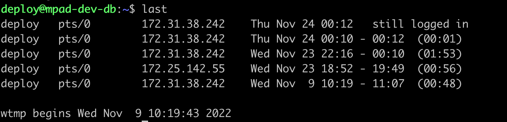

**목차**

이번에 업무 관련 검증을 받게 되면서 서버의 접속 로그를 신경쓸일이 생겼다.  
접속로그는 /var/log/wtmp 에 기록이 된다고 하는데, tail, vi 등으로는 볼 수가 없었고, 찾아보니 last 명령어를 사용해야한다고 한다.

## ✔️ 리눅스 접속 로그 확인

- last 명령어를 사용한다.
- 해당 명령어를 이용하여 /var/log/wtmp 에 기록된 내용을 보여준다.

```bash
$ last
```



<br/>

## ✔️ 특정 계정 접속 확인

```bash
$ last root
```

<br/>

## ✔️ 특정 시간 이전 접속 확인

```bash
# 시간 포맷: YYYYMMDDHHMMSS
$ last -t 202211242359
```

<br/>

## ✔️ 연도 정보 같이 확인

```bash
$ last -F
```

<br/>

## ✔️ 이번달 기록만 나올 경우

- /var/log/wtmp 파일이 logrotate에 의해 순환될 경우 이번달만 나올 수 있다.
- 과거 기록을 보려면 rotate 된 파일을 지정해주면 된다.

```bash
$ last -f /var/log/wtmp.1
```

<br/>
<br/>

참고)  
[리눅스 접속기록 확인 last](https://zetawiki.com/wiki/%EB%A6%AC%EB%88%85%EC%8A%A4_%EC%A0%91%EC%86%8D%EA%B8%B0%EB%A1%9D_%ED%99%95%EC%9D%B8_last)