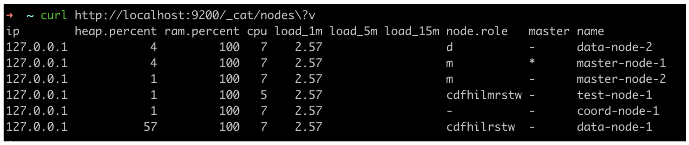

사내 스터디로 ES 책을 보고있는데, 문득 내가 사용하고 있는 ES 들의 role 구성이 궁금했고,  
생각보다 node 들의 role 이 많아서 정리하려고 한다.


### **📢 환경**
* ElasticSearch 7.17.8

<br/>

## ✔️ 노드 role 확인

노드 정보 확인 API 를 사용하면 노드의 role 을 확인할 수 있다.



여기서 node.role 필드 값에 대한 정의는 아래와 같다.

---

## ✔️ 노드 role 정의

### m (master-eligible node)

- 마스터, 마스터 후보 노드

```
# elasticsearch.yaml

node.roles: ["master"]
```

### v (voting-only node)

- 마스터 노드 선출을 위한 투표에는 참여하지만, 마스터 역할은 수행하지 않는 마스터 후보 노드
- 마스터 노드에만 해당 role을 줄 수 있다.
- 만약 장애로 마스터 노드가 3개에서 1개로 줄어 최소 마스터 노드의 수를 충족하지 못할 경우 클러스터 전체 장애로 이어지는데, 이를 방지하기 위해 낮은 스펙을 가진 voting_only 마스터 노드를 더 추가하여 마스터 후보 노드 수를 높이는 것도 괜찮을 듯 싶다.

```
# elasticsearch.yaml
node.roles: ["master", "voting_only"]
```


### d (data node)

- 데이터 CRUD, 인덱싱, 검색 및 집계를 처리
- multi-tier architecture 에서 사용할 수 있는 특수 데이터 역할이 있다.

```
# elasticsearch.yaml

node.roles: [ "data"]
```

### s (data content node)

- contents 를 저장하는 노드로, product catalog or article archive 와 같은 데이터를 CRUD, 검색 및 집계 처리

```
# elasticsearch.yaml

node.roles: [ "data_content"]
```

### h (data hot node)

- 자주 업데이트되는 시계열 데이터를 저장하는데 사용
- 검색 및 인덱싱이 모두 빨라야하므로 많은 CPU, RAM 및 빠른 storage를 사용

```
# elasticsearch.yaml

node.roles: [ "data_hot"]
```

### w (data warm node)

- 쿼리 빈도가 낮고 거의 업데이트되지 않는 시계열 데이터를 저장하는데 사용

```
# elasticsearch.yaml

node.roles: [ "data_warm"]
```

### c (data cold node)

- 더 이상 정기적으로 검색할 필요가 없는 시계열 데이터는 warm에서 cold로 이동
- 검색 성능이 우선이 아니기 때문에 일반적으로 CPU, RAM 대비 큰 storage를 사용

```
# elasticsearch.yaml

node.roles: [ "data_cold"]
```

### f (data frozen node)

- 거의 쿼리되지 않고 더이상 업데이트되지 않는 데이터는 cold에서 frozen으로 이동
- 해당 노드는 적은 비용으로 frozen 된 데이터를 운영하기 위함이다.

```
# elasticsearch.yaml

node.roles: [ "data_frozen"]
```

### i (ingest node)

- 인덱싱에 전처리가 필요한 경우 사용
- 스택 모니터링 및 수집 파이프라인에는 ingest역할이 필요

```
# elasticsearch.yaml

node.roles: [ "ingest"]
```

### (coordinating node only)

- 사용자 요청을 데이터 노드로 전달하고, 그 결과를 취합하는데 사용
- 기본적으로 모든 노드에 coordinating role을 가지고 있지만, 운영시에는 모든 사용자 요청은 coordinating only 노드로만 가도록 하여 다른 role을 가진 노드(master, data 등..)의 부하를 줄이도록 한다.

```
# elasticsearch.yaml

node.roles: []
```


### l (machine learning node)

- ES에서 제공하는 머신러닝 기능이 필요한 경우 사용

```
# elasticsearch.yaml

node.roles: ["ml"]
```

### r (remote cluster client node)

- 다른 클러스터와의 검색이나 복제 등을 수행

```
# elasticsearch.yaml

node.roles: ["remote_cluster_client"]
```

### t (transform node)

- 기존 인덱스를 변환하거나 insight 및 요약된 데이터 분석 등의 api 요청을 수행

```
# elasticsearch.yaml

node.roles: ["transform"]
```

### 모든 롤을 가진 node 설정 방법

```
# elasticsearch.yaml

# 아무런 설정을 하지 않는다. (default)
# node.roles: []
```


<br/>
<br/>

**참고)**  
[https://www.elastic.co/guide/en/elasticsearch/reference/current/modules-node.html](https://www.elastic.co/guide/en/elasticsearch/reference/current/modules-node.html)  
[https://opster.com/guides/elasticsearch/data-architecture/how-to-configure-all-elasticsearch-node-roles/#Master-node](https://opster.com/guides/elasticsearch/data-architecture/how-to-configure-all-elasticsearch-node-roles/#Master-node)  
[https://jeongxoo.tistory.com/12](https://jeongxoo.tistory.com/12)