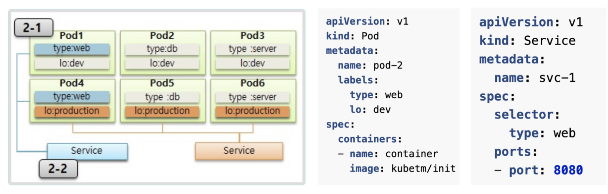

<span class="title__sub1"> 1. Pod </span>

* 한 파드내에서 같은 포트의 컨테이너를 가질 수 없다.
* 두 컨테이너 container1과 container2 는 한 호스트로 묶여 있다.
* 때문에 같은 파드의 각 컨테이너 내에서 다른 컨테이너로 접근시에 localhost 으로 접근할 수 있다.
* 파드 생성시에 고유의 아이피가 할당 된다.
* 이 아이피는 클러스터 내에서만 접근이 가능하며 외부에서는 접근이 불가능하다.
* 파드 재 생성시마다 IP가 계속 바뀐다.

```yaml
apiVersion: v1
kind: Pod
metadata:
  name: pod1
  labels:
    type: web # 서비스, 디플로이먼트 등 매핑을 위한 라벨링
spec:
  containers:
  - name: container
    image: kubetm/app:v1
    ports:
    - containerPort: 8080
  terminationGracePeriodSeconds: 0 # 파드 삭제시 기본적으로 30초 후에 삭제가 되는데, 파드를 바로 삭제하기 위한 설정 
```
<br/>

<span class="title__sub1"> 2. Label </span>

* 라벨은 파드뿐만 아니라 모든 오브젝트에 달 수 있다
* 보통은 파드에 많이 사용
* 목적에 따라 오브젝트들을 분리하고, 서비스로 연결하기 위함(묶어서 사용하기 위함)
* 라벨은 key와 value로 선언한다
* 한 파드에 여러개의 라벨을 달 수 있다.

<br/>

<span class="title__sub1"> 3. Node Schedule </span>

* 파드는 여러 노드들 중에 한 노드에 올라간다.
* 노드에 올라가는 방법으로는 2가지가 있는데, 한개는 스케줄러가가 자동으로 선택하는 방법과 직접 명시해주는 방법이 있다.
* 직접: 노드에 라벨을 달고 파드 생성시에 선택
* 자동 : 생성할 파드의 필요 리소스 사용량에 따라 노드 스케줄러가 판단하여 노드를 지정

<br/>

<span class="title__sub1"> 4. Service </span>

* 서비스도 파드와 마찬가지고 자신의 Cluster IP를 가지고 있다.
* 서비스와 연결된 파드들은 서비스의 Cluster IP를 통해서 접근이 가능하다.
* 파드는 언제든지 죽을 수 있고 재 생성이 될 수 있는 오브젝트이기 때문에 파드의 IP는 신뢰성이 떨어진다.
* 서비스는 사용자가 건들지 않으면 삭제되거나 재생성되지 않는다.
* 때문에 서비스 IP를 사용한다
* 서비스에서 파드의 접근을 도와주는 방식은 크게 3가지가 있다.

<span class="title__sub2"> 4.1. Cluster IP </span>

* 외부에서 접근이 불가능하다.
* 서비스가 트레픽은 분산시켜 Pod에 연결해준다.
* type 은 기본적으로 ClusterIP 이다.

```shell
$ curl 171.96.10.17:9000/health_check
```

<br/>

<span class="title__sub2"> 4.2. Node Port </span>

* Cluster IP의 특징을 모두 가지고 있다.
* 모든 노드에 같은 Port가 할당이 된다.
  * 주의할 점은 타겟 Pod가 있는 노드들에만 Port가 할당되는 것이 아니라 <span class="text-mark__red">모든 노드에 Port가 할당된다.</span>
* 할당된 NodeIP:Port 들이 해당 서비스로 연결이 된다.
* 외부에서 NodeIP:Port 로 접근이 가능하다.
* nodePort 값은 옵셔널이고, 생략할 경우 자동으로 할당된다.
  * Node Port의 범위 : 30000~32767
* 외부에서 Node1 IP: Port 로 접근을 했을 경우
  * Node1에 있는 Pod로 연결되지 않고,
  * 해당 서비스와 연결되어 있는 노드들 중 하나에게 트래픽을 전달한다.
  * externalTrafficPolicy: Local 옵션을 사용하면 요청한 NodeIP에 있는 Pod로 트래픽을 전달한다.
* 순서
  * <span class="text-mark__green"> External -> NodeIP:Port -> Service -> Pod </span> 

<br/>

<span class="title__sub2"> 4.3. Load Balancer </span>

* Node Port의 특징을 모두 가지고 있다.
* 로드밸런서가 트래픽을 분산시켜 연결되어 있는 노드에게 전달한다.

<br/>

<span class="title__sub2"> ■ Sample Service Yaml </span>

```yaml
apiVersion: v1
kind: Service
metadata:
  name: svc-3
spec:
  selector:             # Pod의 Label과 매칭
    app: pod
  ports:
  - port: 9000          # Service 자체 Port
    targetPort: 8080    # Pod의 Container Port
  type: ClusterIP, NodePort, LoadBalancer  # 생략시 ClusterIP
  externalTrafficPolicy: Local, Cluster    # 트래픽 분배 역할
```

<br/>

#### Referenece
Kubernetes Service
* https://kubernetes.io/docs/concepts/services-networking/service/  

Kubernetes NodePort vs LoadBalancer vs Ingress?
* https://medium.com/google-cloud/kubernetes-nodeport-vs-loadbalancer-vs-ingress-when-should-i-use-what-922f010849e0

<br/>

<span class="title__sub1"> 5. ConfigMap, Secret </span>
* image 별로 환경변수값을 정의하는것은 비효율적이므로 외부에 환경 변수를 담기위해 ConfigMap과 Secret을 사용한다.
* key와 value로 정의하여 사용 

<br/>

<span class="title__sub2"> 5.1. ConfigMap vs Secret </span>
* ConfigMap은 일반적인 값, Secret은 보안적인 값을 저장(패스워드/ 인증키)
* Secret 값을 넣을때 base64 인코딩을 해서 값을 넣어야 한다는 규칙을 가지고 있다.
* Secret 값은 파드로 주입이 될때 자동으로 base64 디코딩이 되어 컨테이너 내 환경변수에 세팅이 된다.
* 일반적인 값들은 쿠버네티스 DB에 저장이 되는데, Secret 값은 메모리에 저장이 된다. (메모리에 저장되기 때문에 보안에 유리)
* ConfigMap의 경우 key, value 값을 무한하게 넣을 수 있는데 반해, 한 Secret당 최대 1M까지만 저장이 가능하다.
* Secret은 메모리에 넣어두기 때문에 많이 만들게 되면 시스템 자원에 영향을 미치게 된다.

<br/>

<span class="title__sub2"> 5.2. 상수를 환경변수에 정의하여 사용 </span>

* 파드 생성시에 해당 파드에 정의된 ConfigMap, Secret 값을 가져와서 컨테이너 내 환경변수에 세팅을 한다.

<br/>

<span class="title__sub2"> 5.3. 파일을 환경변수에 정의하여 사용 </span>

* 파일을 통으로 ConfigMap에 넣어 사용할 수 있다.
* 파일명이 key, 파일 내용이 value가 된다.
* 명령어를 이용하여 파일을 secret으로 만들 경우, 자동으로 base64 인코딩이 되므로 2중 인코딩이 되지 않도록 주의하자.
* 파드 생성시에 해당 파드에 정의된 ConfigMap, Secret 값을 가져와서 컨테이너 내 환경변수에 세팅을 한다.

<br/>

<span class="title__sub2"> 5.3. 파일 마운트의 경우 </span>

* 원본 파일과 마운트가 되어 있으므로, <span class="text-mark__red">ConfigMap이 수정이 되면 바로 반영이 된다.</span>
* 이게 5.2과 가장 큰 차이점이다.

<br/>

<span class="title__sub1"> 6. Volume </span>
<span class="title__sub2"> 6.1. emptyDir </span>

* container 들끼리 데이터 공유를 하기 위해 volume을 사용
* 최초 해당 볼륨이 생성될때 항상 비어있기 때문에 emptyDir로 명칭한다.
* pod 안에 생성이 되기 때문에 파드 생성시에 만들어지고, 삭제시 없어짐
* 해당 볼륨에는 일시적인 사용목적에 의한 데이터를 넣는다.

<br/>

<span class="title__sub2"> 6.2. hostPath </span>

* 한 호스트 즉, 노드의 path를 볼륨으로 사용 
* pod에서 해당 노드의 path를 마운트하여 사 용하므로 pod가 삭제가 되어도 노드에 있는 데이터는 삭제되지 않는다.
* 다만 파드가 재 생성될때 다른 노드에 생성이 될 수 있으므로 기존 노드에 사용하던 볼륨을 마운트 할 수는 없다.
  * 사용자가 직접 각 노드의 볼륨들을 마운트 시키면 된다.
  * 하지만, 쿠버네티스가 하는게 아니라 사용자가 직접 작업을 하므로 실수가 발생할 수 있다.
* 파드 자신이 할당되어 있는 호스트(노드)의 데이터를 읽거나 쓸때 사용한다.
* hostPath Type
  * DirectoryOrCreate : 실제 경로가 없다면 생성
  * Directory : 실제 경로가 있어야됨
  * FileOrCreate : 실제 경로에 파일이 없다면 생성
  * File : 실제 파일이 었어야함

<br/>

<span class="title__sub2"> 6.3. PVC/PV </span>

* 파드에 영속성 있는 볼륨을 제공하기 위한 오브젝트
* 실제 필요할때 다시 공부

<br/>

<span class="title__sub1"> 7. Namespace/ ResourceQuota/ LimitRange</span>

* 클러스터에서 사용할 수 있는 리소스는 한정적이기 때문에 네이스페이스별로 리소스를 한정하여 사요하도록 하는 오브젝트
* ResourceQuota는 Namespace 뿐만 아니라 Cluster 전체에 부여할 수 있는 권한이지만, LimitRange의 경우 Namespace내에서만 사용 가능

<br/>

<span class="title__sub2"> 7.1. Namespace </span>

* 한 네임스페이스 안에서 같은 종류의 오브젝트들은 같은 이름을 가질 수 없다.
  * 에러: 파일 배포 실패 (pods "podName" already exists)
* 타 네임스페이스의 자원과 분리가 되어 관리가 된다.
  * 파드의 라벨링으로 서비스와 연결을 하는데, 서로 다른 네임스페이스에 있을 경우 연결이 되지 않는다.
* 네임스페이스 삭제시, 그 안의 자원들도 모두 삭제가 된다.
* 각 네임스페이스의 파드의 IP끼리는 기본적으로 통신은 되지만, network policy 오브젝트를 이용하여 막을 수 있다.  

<br/>

<span class="title__sub2"> 7.2. ResourceQuota </span>

* 네임스페이스의 자원한계를 설정하는 오브젝트
* 리소스쿼타가 지정된 네임스페이스에 파드를 생성할때는 꼭 스펙 명시를 해야한다.
  * 하지 않을 경우 해당 네임스페이스로 pod 생성이 되지 않는다.
  * 에러: must specify limits.memory, requests.memory
  * limitRange에 default가 설정되어 있을 경우에는 상관없다.
* 현재 namespace에 사용된 requests 를 넘는 파드 생성 요청시 오류가 난다.
* 주의할 점은 ResourceQuota 생성 전에 이미 파드가 만들어져 있으면, 해당 파드들에게는 영향이 가지 않는다
  * 따라서 ResourceQuota 생성 전에 파드들을 지우는게 안전하다.
  * 그렇지 않을 경우, ResourceQuota 설정보다 over하여 네임스페이스에 파드들이 생성된다. 
* 제한 가능한 항목
  * Compute Resource: cpu, memory, storage
  * Objects Count: Pod, Service, ConfigMap... 등 k8s 버전이 높아짐에 따라 제한할 수 있는 오브젝트가 늘어남

<br/>

<span class="title__sub2"> 7.3. LimitRange </span>

* 파드가 네임스페이스에 들어올 수 있는지 체크
* 설정값
  * min: 최소 메모리값
  * max: 해당 네임스페이스로 들어올 수 있는 파드의 최대 메모리 값  
    -> Pod1의 경우 limit memory값이 5Gi이므로 생성이 불가능한다.
  * maxLimitRequestRatio: request값과 limit값의 최대 비율  
    -> Pod2의 경우 reuqest와 limit의 비율이 3을 넘어가므로 생성이 불가능한다.
  * defaultRequest/ default: 스펙이 없는 pod가 들어올 경우 해당 값으로 세팅이 된다.  
    -> Pod3의 경우 스펙이 없으므로 default 스펙을 따라간다.
