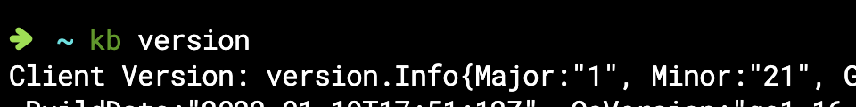
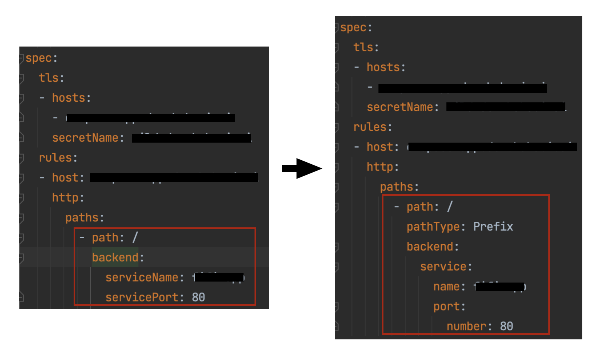

ingress 리소스파일을 kubectl로 apply 할때 아래와 같은 경고 메시지가 발생하였다.
```
Warning: extensions/v1beta1 Ingress is deprecated in v1.14+, unavailable in v1.22+; 
use networking.k8s.io/v1 Ingress
```

<br/>

ingress apiVersion 중 extensions/v1beta1 이 1.14 버전부터 deprecated 되었으니,  
<span class="text-mark__green">networking.k8s.io/v1</span> 을 사용하라는 경고였다.

쿠버네티스 버전을 확인해보니 1.21 버전으로 확인이 되었다.


<br/>

ingress apiVersion 변경 후에 다시 apply를 하니 serviceName, servicePort 필드를 해석할 수 없다는 오류가 발생하였다.  
확인해보니 정의하는 부분이 변경되어 아래와 같이 적용하였다.


