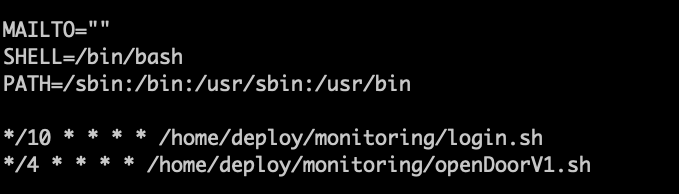

## 작업내역
- 수정 (편집기 열기)
```cmd
$ crontab -e
```

- 수정내용
    - shell 이 설정되어 있지 않을 경우, bash로 생성한 스크립트는 오류가 발생할 수 있다.



- 저장 및 종료
```cmd
^o // 저장 (control + o) 
^x // 종료 (control + x)
```

#### 참고
https://zetawiki.com/wiki/%EB%A6%AC%EB%88%85%EC%8A%A4_%EB%B0%98%EB%B3%B5_%EC%98%88%EC%95%BD%EC%9E%91%EC%97%85_cron,_crond,_crontab
