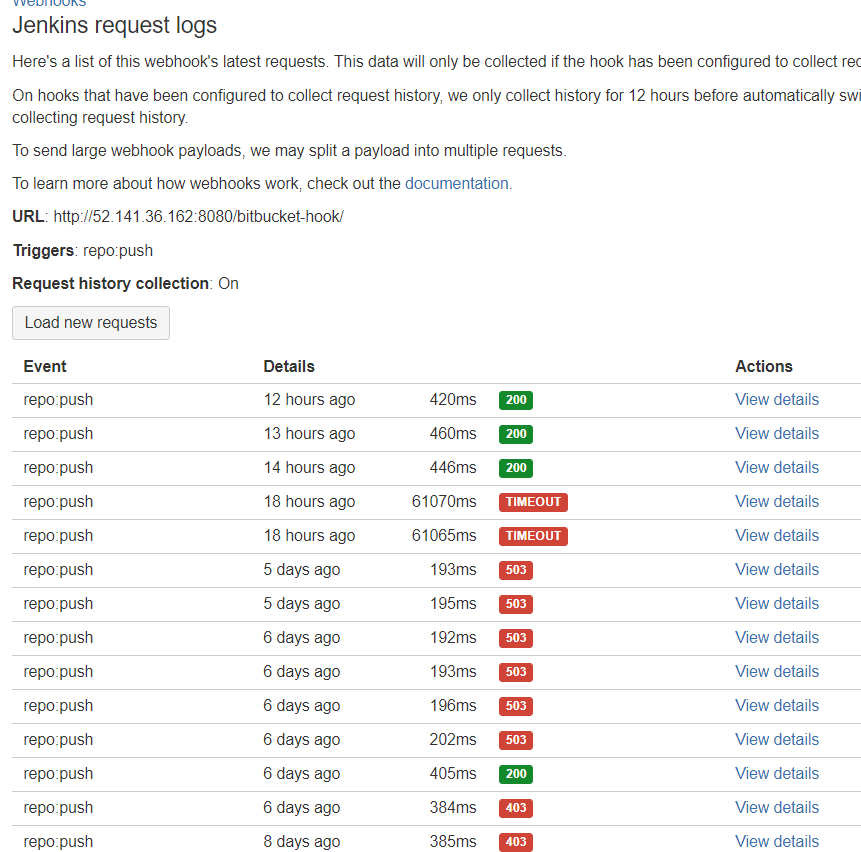

## Jenkins/Bitbucket 연동
- 이번에 JIRA를 사용하면서 Bitbucket을 사용하게 되었다.
 이에 따라 Jenkins/Github 에서 Jenkins/Bitbucket 으로 변경하는 작업을 하였다. 

### #1. Jenkins에 Bitbucket 플러그인 설치
- Jenkins 관리 -> 플러그인 관리
- Bitbucket 설치

### #2. Jenkins Item 구성
- 프로젝트 -> 구성 -> 소스 코드 관리 및 빌드 유발 수정

- Repository URL  
 -- git clone 주소 

- Credentials  
 -- Add 누른 후 bitbucket 계정 및 패스워드 입력
 

- Build 에 Execute Shell 내용 추가

### #3. Bitbucket Webhook 설정
- Repository 선택 후, Repository settings -> Webhooks 에 들어가면 webhook 설정을 할 수 있다

- Webhook 을 추가하여 아래와 같이 입력한다. 
 -- URL : http://{jenkins_host}/bitbucket-hook

- Webhook History  
-- Enable History 버튼을 클릭하면 아래 그림과 같이 해당 Webhook에 대한 History 내역을 볼 수 있다.  
-- Webhook 추가시에 URL을 bitbucket-webhook으로 잘못적어 403 에러가 계속 났었다.. 404 에러로 좀 해주지...

