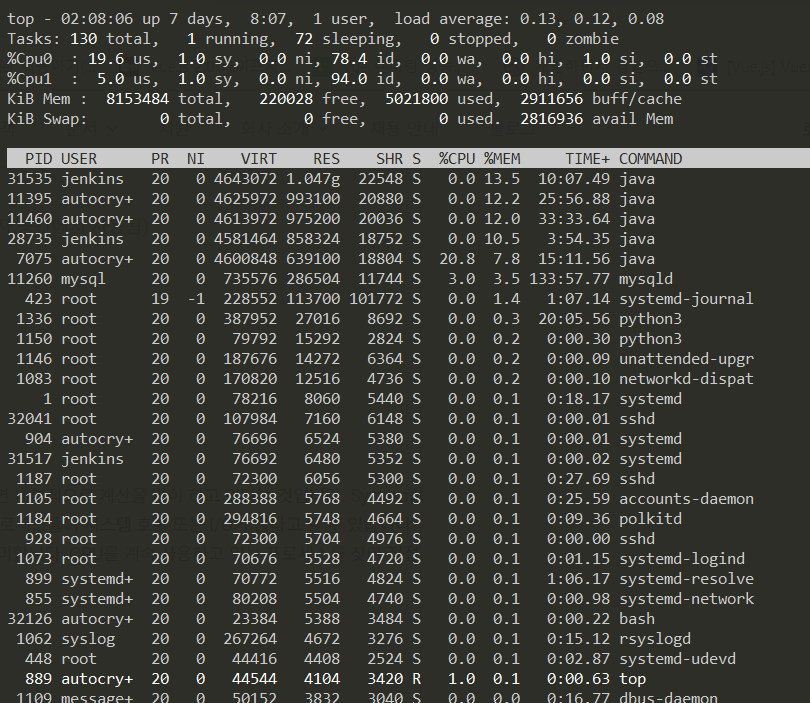
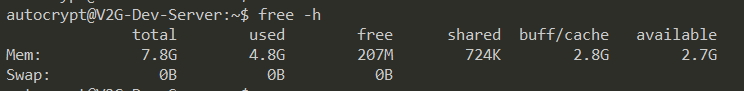
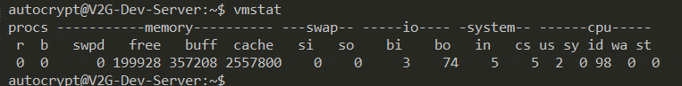
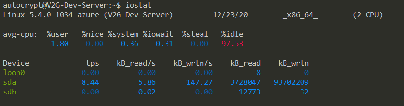
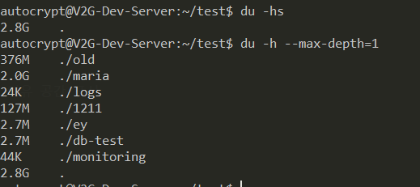

### #1. uname: 시스템과 커널의 정보
```cmd
$ uname -a
Linux V2G-Dev-Server 5.4.0-1034-azure #35~18.04.1-Ubuntu SMP Thu Dec 10 09:13:52 UTC 2020 x86_64 x86_64 x86_64 GNU/Linux

# [Linux] : 커널 명
# [V2G-Dev-Server] : 호스트 명
# [5.4.0-1034-azure] : 커널 릴리즈 정보
# [#35~18.04.1-Ubuntu SMP Thu Dec 10 09:13:52 UTC 2020] : 커널 버전
# [x86_64] : 머신 하드웨어 이름
# [x86_64] : 프로세서 종류
# [x86_64] : 하드웨어 플랫폼
# [GNU/Linux] : 운영체제
```

<br>

### #2. top: 운영체제 작업 내역 모니터링



#### #2.1. CPU
- User값이 높다면, 사용자 코드를 수행하는데 시간이 오래 걸린다면 내부적으로 계산을 많이 하고 있다는 것 
- System값이 높다면, 시스템에 의해 사용되고 있는 시간이 오래 걸린다면 프로세스들이 시스템 호출 또는 I/O가 많다고 할 수 있음 
- idle의 값이 항상 0이라면 CPU를 100% 사용하고 있다는 것을 의미

```
[us] : 사용자가 사용중인 사용률
[sy] : 시스템이 사용중인 사용률
[ni] : 프로세스 우선순위를 기반으로 사용되는 사용률(사용자 공간에서 사용됨)
[id] : 아무 일도 하지 않는 여유률
[wa] : 입출력을 기다리는 프로세스 사용률
[hi] : 하드웨어 인터럽트 사용률
[si] : 소프트웨어 인터럽트 사용률
[st] : 가상화 환경에서 손실률
```

<br>

#### #2.2. PROCESS
```
[PID] : 프로세스 ID
[USER] : 프로세스를 실행시킨 사용자 ID
[PR] : 프로세스의 우선순위
[NI] : NICE 값, 마이너스를 가지는 값이 우선순위가 높음
[VIRT] : 가상 메모리의 사용량(SWAP+RES)
[RES] : 현재 페이지가 상주하고 있는 크기
[SHR] : 가상 메모리 중 사용중인 메모리를 제외한 잔여 가상 메모리
[S] : 프로세스의 상태
[%CPU] : 프로세스가 사용하는 CPU의 사용률
[%MEM] : 프로세스가 사용하는 메모리의 사용률
[TIME+] : 프로세스가 CPU를 사용한 시간
[COMMAND] : 실행된 명령어
```

<br>

#### #2.3. 프로세스의 정렬 방법
```
[SHIFT + M] : 메모리 사용률 정렬
[SHIFT + N] : PID 기준 정렬
[SHIFT + P] : CPU 사용률 정렬
[SHIFT + T] : 실행시간 기준 정렬
[SHIFT + R] : 정렬 기준변경 (오름차순인 경우 내림차순으로, 내림차순인 경우 오름차순으로 변경)

[u] : 사용자 명 입력 시 해당 사용자의 프로세스만 표시

[1] : CPU Core 개수 만큼 표시
```

<br>

### #3. free



```
[total] : 설치된 총 메모리 크기 / 설정된 스왑 총 크기
[used] : total에서 free, buff/cache를 뺀 사용중인 메모리. / 사용중인 스왑 크기
[free] : total에서 used와 buff/cahce를 뺀 실제 사용 가능한 여유 있는 메모리량 / 사용되지 않은 스왑 크기
[shared] : tmpfs(메모리 파일 시스템), ramfs 등으로 사용되는 메모리. 여러 프로세스에서 사용할 수 있는 공유 메모리
[buffers] : 커널 버퍼로 사용중인 메모리
[cache] : 페이지 캐시와 slab으로 사용중인 메모리
[buff/cache] : 버퍼와 캐시를 더한 사용중인 메모리
[available] : swapping 없이 새로운 프로세스에서 할당 가능한 메모리의 예상 크기. (예전의 -/+ buffers/cache이 사라지고 새로 생긴 컬럼)
```
참고) https://www.whatap.io/ko/blog/37/

<br>

### #4. vmstat: 시스템 정보 모니터링
- 시스템 작업, 메모리, 페이징, 블록장치의 I/O, CPU상태 등을 확인
- vmstat [delay [count]]를 사용하면 실시간으로 상태 확인 가능



#### #4.1. procs
- [r] : CPU에서 대기중인 프로세스의 수를 의미, r의 개수가 CPU의 개수의 2배를 넘는다면 CPU의 성능을 올려줘야 함
- [b] : 인터럽트가 불가능한 sleep 상태에 있는 프로세스의 수 (I/O 처리를 하는 동안 블록 처리된 프로세스), b의 수치가 높은 경우라면 CPU가 계속 대기상태로 있다는 의미이므로 디스크 I/O를 확인해 볼 필요가 있다


<br>

### #5. iostat: CPU, 디스크 입출력 상태 모니터링
- 평균 CPU부하 와 디스크 I/O의 세부적인 내용을 확인
- iostat [delay [count]]를 사용하면 실시간으로 상태 확인 가능



#### #5.1. Device
```
[tps] : 디바이스에 초당 전송 요청 건수
[kB_read/s] : 디바이스에서 초당 읽은 데이터 블록 단위
[kB_wrtn/s] : 디바이스에서 초당 쓴 데이터 블록 단위
[kB_read] : 디바이스에서 지정한 간격 동안 읽은 블록 수
[kB_wrtn] : 디바이스에서 지정한 간격 동안 쓴 전체 블록 수
```

<br>

### #6. df: 디스크 모니터링
- 파일시스템 별 전체공간, 사용중인 공간, 여유 공간 표시

<br>

### #7. du: 디렉토리 용량 
- 특정 파일이나 디렉토리 용량 확인
- du -s [파일이나 디렉토리] 를 사용하면 해당 파일이나 디렉토리 용량 확인(-s만 적을 경우 현재 디렉토리) 



