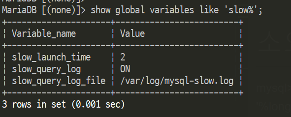
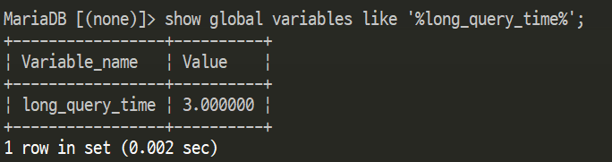
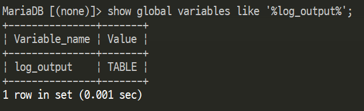
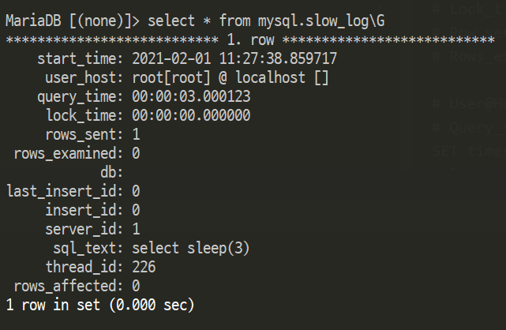

### Slow Query(슬로우쿼리)
- Slow Query(슬로우쿼리)는 지정된 시간보다 실행하는데 오래걸리는 쿼리에 대한 log
- 특정 작업이 오래 걸린다면 로그를 통해 원인을 파악이 가능

<br>

### #. 설정 확인
- slow query log 설정 상태 확인

```
# slow query 설정 정보
mysql> show global variables like 'slow%';
```


<br>

```
# 소요시간 확인
mysql> show global variables like '%long_query_time%';
```


<br>

```
# 로그파일 저장 방법 (FILE / TABLE)
mysql> show global variables like '%log_output%';
```


<br>

### #. 설정 방법

#### #1. my.cnf 파일 설정 및 재기동
- 파일 설정

```
# 3초 이상 소요된 쿼리를 테이블에 기록
[mysqld]
slow_query_log=1
long_query_time = 3

log_output = TABLE
log_slow_queries       = /var/log/mysql/mysql-slow.log
```

- 재기동

```
$ /etc/init.d/mysqld restart
```

<br>

#### #2. 쿼리문 사용 (편하다..., 재기동시 날라간다...)
```
# 해당 값(초) 이상의 로그 기록
mysql> set global long_query_time = 3;

# 슬로우쿼리 활성 여부 (0 = 비활성 / 1 = 활성)
mysql> set global slow_query_log = 1;

# 로그파일 저장 방법 변경
mysql> set global log_output = 'TABLE';
```

<br>

### #. 로그 확인
#### #. mysql.slow_log 테이블 확인
```
mysql> select sleep(3);

mysql> select * from mysql.slow_log\G
```


<br>

#### #. /var/log/mysql/mysql-slow.log 파일 확인
- 아래와 같은 형식으로 로그파일에 기록됨

```
# Query_time : 쿼리 처리시간  
# Lock_time : lock이 걸린 횟수  
# Row_sent : 조회 결과 Row 수  
# Rows_examined : 조회 대상 ROW 수  

# User@Host: DB_유저[DB_유저] @ server_hostname [서버IP]
# Query_time: 0.000599  Lock_time: 0.000163 Rows_sent: 3  Rows_examined: 86
SET timestamp=1489118717;
select count(*)
```

<br>
2021.02.01. 오늘 slow query 찾아보다가 내용이 부실해서 추가함...
