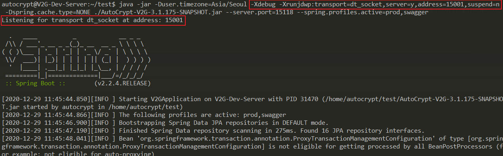
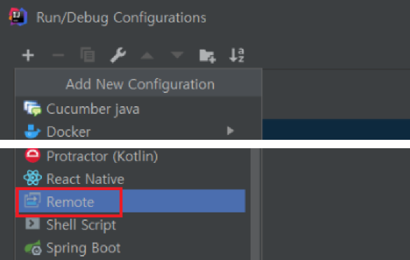
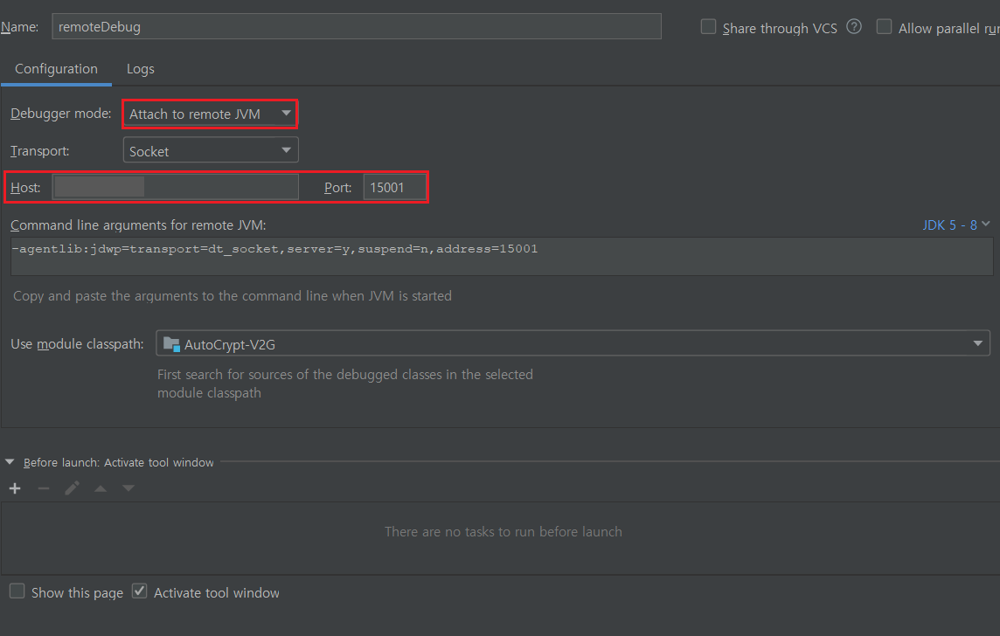
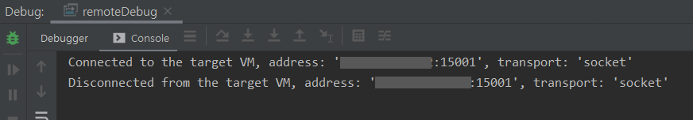

### #1. 서버 설정
- 아래 옵션을 추가한다.

```
-Xdebug -Xrunjdwp:transport=dt_socket,server=y,address=15001,suspend=n
```

- 실행 시 15001 포트로 접속하여 디버깅을 진행할 수 있다.
 


<br>

### #2. IntelliJ 설정 
- 서버와 동일한 프로젝트에서 아래와 같이 debug configuration 을 적용한다.
- Remote 선택 후



- Debugger mode 선택, Host, Port를 넣어 실행하면 



- 아래와 같이 접속 성공 시 "Connedted to the target VM" 이 뜨고, 종료 시 "Disconnected" 가 출력된다.



