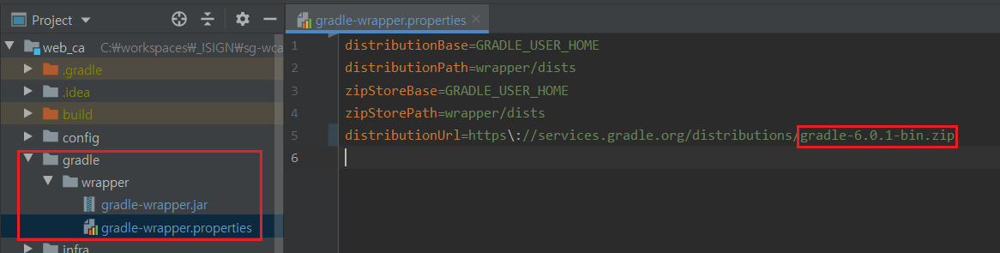

### #1. gradle version 확인
- gradle -> wrapper -> gradle-wrapper.properties 안에 해당 프로젝트의 gradle 버전이 명시되어 있다.



<br>

### #2. gradle version 변경

```cmd
// gradlew wrapper --gradle-version {변경 할 버전 정보}
$ gradlew wrapper --gradle-version 4.5.1
``` 
