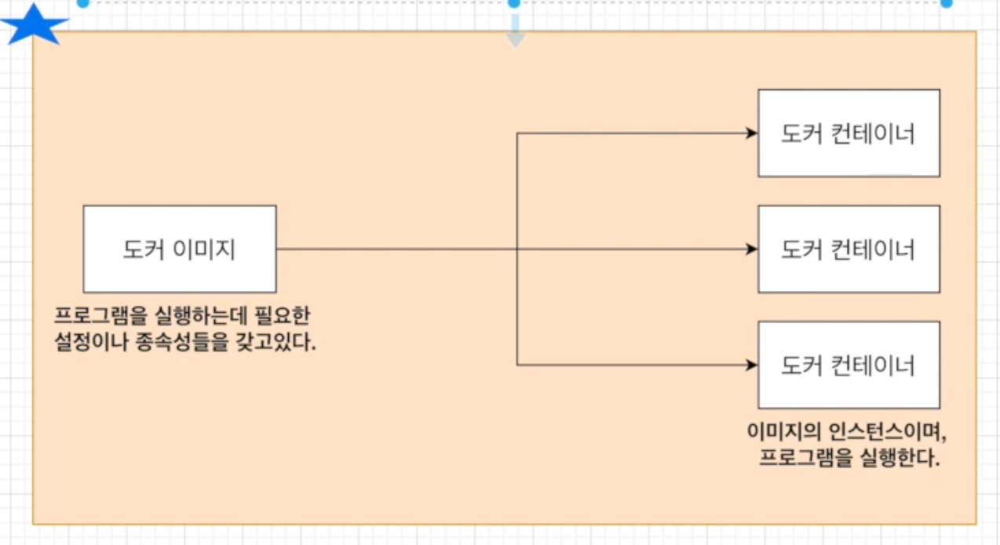

### #. 도커는 무엇인가요?
- 컨테이너를 사용하여 응용프로그램을 더 쉽게 만들고 배포하고 실행할 수 있도록 설계된 도구 이며, 컨테이너 기반의 오픈소스 가상화 플랫폼이며 생태계

### #. 컨테이너란?
- 코드와 모든 종속성을 패키지화하여 응용 프로그램이 한 컴퓨팅 환경에서 다른 컴퓨팅 환경으로 빠르고 안정적으로 실행되도록 하는 소프트웨어의 표준 단위
- 컨테이너 안에 다양한 프로그램, 실행환경을 컨테이너로 추상화하고 동일한 인터페이스를 제공하여 프로그램의 배포 및 관리를 단순하게 해준다.

### #. 컨테이너 이미지
- 코드, 런타입, 시스템 도구, 시스템 라이브러리 및 설정과 같은 응용 프로그램을 실행하는 데 필요한 모든 것을 포함하는 가볍고 독립적이며 실행 가능한 소프트웨어 패키지
- 도커 이미지는 프로그램을 실행하는데 필요한 설정이나 종속성을 갖고 있으며, 도커 이미지를 이용해서 컨테이너를 생성하며(이미지의 인스턴스) 도커 컨테이너를 이용하여 프로그램을 실행



<br>

### #. 도커 명령어 모음
#### #. 컨테이너 

```
# 동작중인 컨테이너 확인
$ docker ps

# 정지된 컨테이너 확인
$ docker ps -a

# 컨테이너 삭제
$ docker rm [컨테이너 id], [컨테이너 id] 

# 컨테이너 모두 삭제
$ docker rm `docker ps -a -q`

# 중지된 모든 컨테이너 삭제
$ docker container prune

# 실행중인 컨테이너에 명령어 전달, interactive, terminal : 명령어 실행 후 터미널 계속 유지
# docker exec {-it} <컨테이너 아이디> <명령어>

# 해당 컨테이너의 ssh 접속
$ docker exec -it <컨테이너 아이디> sh

# 실행 시 volume 잡기, 맥에선 -v $(pwd):/usr/src/app
$ docker run -p 3000:3000 -v /usr/src/app/node_modules -v %cd%:/usr/src/app [이미지 아이디]

```

#### #. 이미지
```cmd
# 이미지 확인
$ docker images
$ docker image ls

# 이미지 삭제, 강제옵션 -f
$ docker image {-f} rm [이미지id], [이미지id]
$ docker rmi {-f} [이미지id], [이미지id]

# 이름없는 모든 이미지 삭제
$ docker image prune

```

#### #. docker 리소스정리
```cmd
# 중지된 모든 컨테이너, 사용되지 않은 모든 네트워크, 하나 이상의 컨테이너에서 사용되지 않는 모든 이미지를 삭제
$ docker system prune -a

```

#### #. dockerfile 빌드
```cmd
$ docker build {-f dockerfile} {-t tag} [context 폴터위치]
```

#### #. docker compose 실행/종료
```cmd
$ docker-compose up {-d --build}
$ docker-compose down
```
