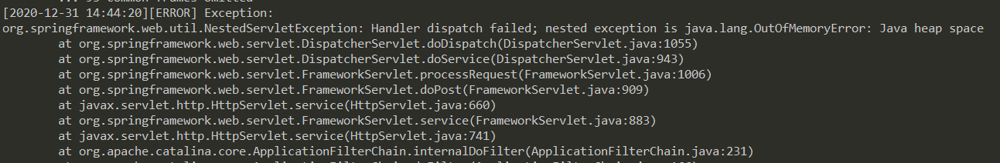
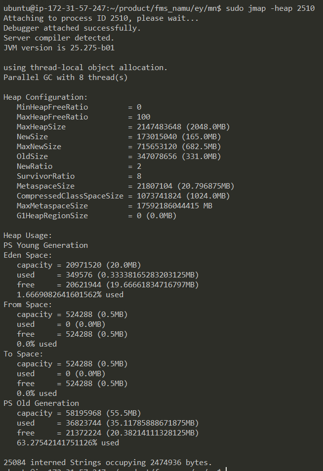
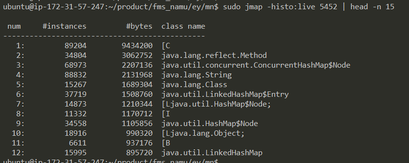
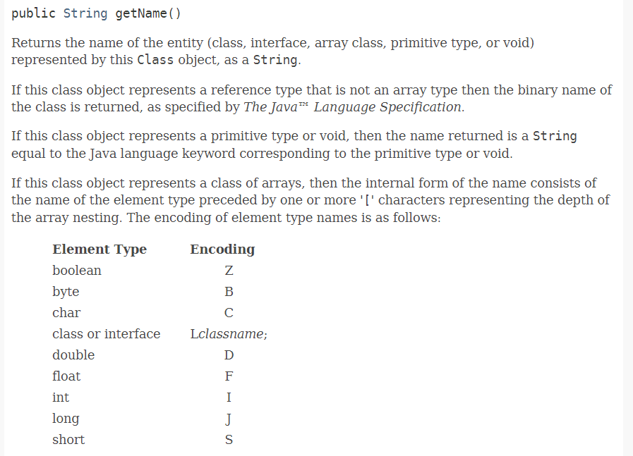

### #1. JPS
- Java Virtual Machine Process Status Tool
- JVM 프로세스 표시

```cmd
// PID, 메인 메소드의 args 표시
$ jps -m 

// PID, jvm 파라미터 표시
$ jps -v
```



<br>

### #2. JMAP
- JVM 프로세스의 메모리 맵 표시

#### #2.1. heap 메모리 사용 현황에 대한 요약 정보
```cmd
$jmap -heap <PID>
```


#### #2.2. 객체 타입 별 사용 내역 
```cmd
$jmap -histo:live <PID>
```


##### 참고) [C, [I, [B 이란?

* [L 은 class 또는 interface 즉, any non-primitives(Object)

#### #2.3. gc 대기중인 클래스 목록 확인
```cmd
$jmap -finalizerinfo <PID>
```

#### #2.4. 덤프 파일 생성
- 파일 확장자는 일반적으로 .hprof 를 사용
- 힙 메모리의 크기가 GB 단위로 크다면, 분석할 덤프 파일 크기도 GB 단위로 늘어남
```cmd
jmap -dump:[live,]format=b,file=<dump filename> <PID>
```

<br>

### #3. JHAT
- Java Heap Analyzer Tool
- 힙 메모리 분석 툴
- 입력한 포트(기본은 7000)로 덤프파일이 분석된 웹페이지가 구동
```cmd
$ jhat [-port] <dump filename>
```
