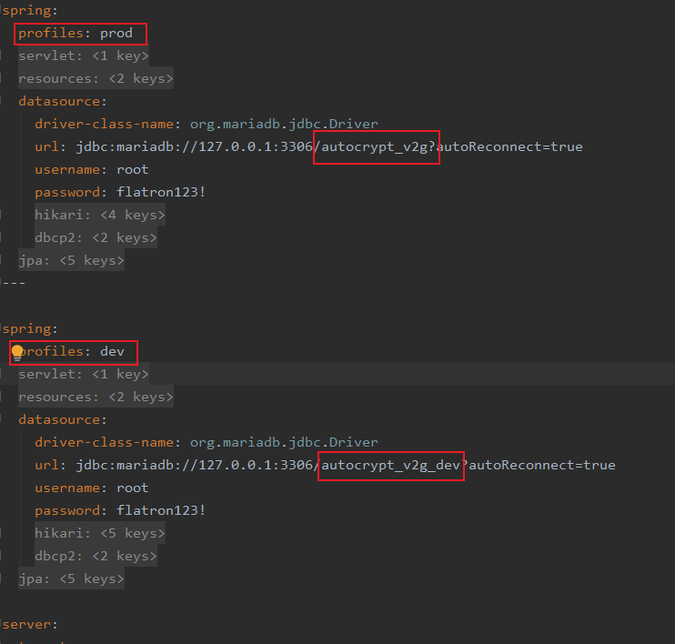
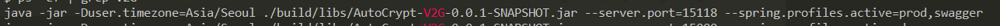
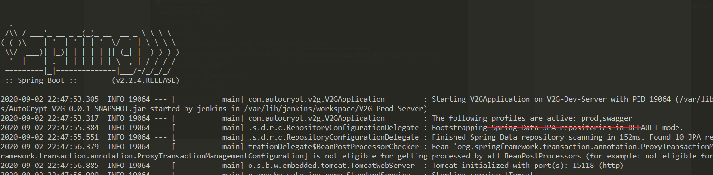

### 1. yml 설정
수정 전
```
spring:
  active: cron_alert,swagger
  servlet:
    multipart:
      max-file-size: 10MB
      max-request-size: 10MB
  resources:
    static-locations: "classpath:/static/,classpath:/public/"
    add-mappings: true
  datasource:
    driver-class-name: org.mariadb.jdbc.Driver
    url: jdbc:mariadb://127.0.0.1:3306/autocrypt_v2g?autoReconnect=true
    username: root
    password: flatron123!
    hikari:
      idle-timeout: 10000
      max-lifetime: 420000
      connection-timeout: 10000
      validation-timeout: 10000
    dbcp2:
      test-while-idle: true
      validation-query: "SELECT 1"
  jpa:
    open-in-view: false
    generate-ddl: true
    properties:
      hibernate.dialect: org.hibernate.dialect.MySQL5InnoDBDialect
    show-sql: false
    hibernate:
      ddl-auto: update
```

### 2. 수정 후


* profiles 구분자 ---   
--- 를 이용하면 profiles 을 구분할 수 있다.
맨 위에 작성된 내용이 default 가 된다.
* profile 활성화
 



