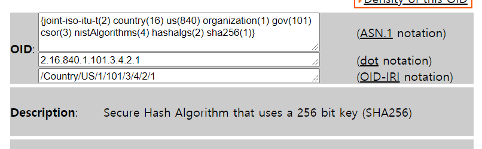

## HashAlgorithm 에 따른 OCSP Request 생성 방법

### SHA-1
- id-sha1

```java
    X509Certificate cert = PkiFactory.x509StringToClass("MIICmzCCAkGgAwIBAgIGAOjUpRAeMAoGCCqGSM49BAMCMEAxCzAJBgNVBAYTAktSMQwwCgYDVQQKDANITUMxDDAKBgNVBAsMA0hNQzEVMBMGA1UEAwwMSE1DX01PU3ViQ0EyMB4XDTIwMTEyNDEyNTk1N1oXDTIyMTEyNDE0NTk1OVowQzELMAkGA1UEBhMCS1IxDDAKBgNVBAoMA0hNQzEMMAoGA1UECwwDSE1DMRgwFgYDVQQDDA9LUkVWUDAwMDAwMDA1QVgwWTATBgcqhkjOPQIBBggqhkjOPQMBBwNCAAQaoaM2ufpGTDqLVDPOYKJYeKb65vJ36EXY/zsTh/9EYi8yzPSQTrm0blb3s74YsvZ9BUJfDdX6Hh0X5gFTrugLo4IBIjCCAR4waAYDVR0jBGEwX4AULT3vADHec7fHnQwHDR1BvaZI8dihRKRCMEAxCzAJBgNVBAYTAktSMQwwCgYDVQQKDANITUMxDDAKBgNVBAsMA0hNQzEVMBMGA1UEAwwMSE1DX01PU3ViQ0ExggEwMB0GA1UdDgQWBBSHpsbH4R8RnTS3EDJ/8lS46eBRAzAOBgNVHQ8BAf8EBAMCA+gwRQYDVR0fBD4wPDA6oDigNoY0Y249ZHBfVmZ0Y05Ec3RRd21jYXg0TkZfZ3FmUXAwLG91PUhNQyxvPUhNQyxjPUtSLmNybDA8BggrBgEFBQcBAQQwMC4wLAYIKwYBBQUHMAGGIGh0dHA6Ly8xMjcuMC4wLjE6ODA4OS9PQ1NQU2VydmVyMAoGCCqGSM49BAMCA0gAMEUCIQDa2APe7zqfBBXBUtWjhwAkxxqJNiMHdnnGWRKL3/tdMgIgDuwTB/iByJO4uf+Mx/Sfs+vs5Snhi6DQ0A4lJyQLL1E=");
    X509Certificate issuerCert = PkiFactory.x509StringToClass("MIIB0zCCAXmgAwIBAgIBMDAKBggqhkjOPQQDAjBAMQswCQYDVQQGEwJLUjEMMAoGA1UECgwDSE1DMQwwCgYDVQQLDANITUMxFTATBgNVBAMMDEhNQ19NT1N1YkNBMTAeFw0yMDExMDQxNTAwMDBaFw0yMjExMDQxNTAwMDBaMEAxCzAJBgNVBAYTAktSMQwwCgYDVQQKDANITUMxDDAKBgNVBAsMA0hNQzEVMBMGA1UEAwwMSE1DX01PU3ViQ0EyMFkwEwYHKoZIzj0CAQYIKoZIzj0DAQcDQgAEQevrFh4ZAsgrxz7mKT1igUUbiXnH5Yyj2bw7Fo07hluYWxtFQd8TYwwm5IYkudRNygj69OspvAQf0NdnonQ5BqNkMGIwDgYDVR0PAQH/BAQDAgHGMBIGA1UdEwEB/wQIMAYBAf8CAQAwPAYIKwYBBQUHAQEEMDAuMCwGCCsGAQUFBzABhiBodHRwOi8vMTI3LjAuMC4xOjgwODkvT0NTUFNlcnZlcjAKBggqhkjOPQQDAgNIADBFAiEA7EU/OnEAChywBv+1RLh3mScq6HX9pGdQJl4wAzKMFGsCIBVKjvuqiQoaabi2s+9nLsLLLXO1hEElmJc/2noaB0FH");
    X509CertificateHolder issuerCertHolder = new X509CertificateHolder(issuerCert.getEncoded());

    DigestCalculator digestCalculator = new BcDigestCalculatorProvider().get(CertificateID.HASH_SHA1);
    CertificateID id = new CertificateID(digestCalculator, issuerCertHolder, cert.getSerialNumber());

    VerifyContractByOcspReq req = new VerifyContractByOcspReq(
      emaid,
      new OcspData[]{
        OcspData.builder()
          .hashAlgorithm("SHA1")
          .issuerNameHash(Base64.toBase64String(id.getIssuerNameHash()))
          .issuerKeyHash(Base64.toBase64String(id.getIssuerKeyHash()))
          .serialNumber(id.getSerialNumber().toString())
          .build()
      });

```


### SHA-256
- id-sha256 에 대한 정의를 못찾아서 직접 OID를 넣는 방법을 택


```java
    X509Certificate cert = PkiFactory.x509StringToClass("MIICmzCCAkGgAwIBAgIGAOjUpRAeMAoGCCqGSM49BAMCMEAxCzAJBgNVBAYTAktSMQwwCgYDVQQKDANITUMxDDAKBgNVBAsMA0hNQzEVMBMGA1UEAwwMSE1DX01PU3ViQ0EyMB4XDTIwMTEyNDEyNTk1N1oXDTIyMTEyNDE0NTk1OVowQzELMAkGA1UEBhMCS1IxDDAKBgNVBAoMA0hNQzEMMAoGA1UECwwDSE1DMRgwFgYDVQQDDA9LUkVWUDAwMDAwMDA1QVgwWTATBgcqhkjOPQIBBggqhkjOPQMBBwNCAAQaoaM2ufpGTDqLVDPOYKJYeKb65vJ36EXY/zsTh/9EYi8yzPSQTrm0blb3s74YsvZ9BUJfDdX6Hh0X5gFTrugLo4IBIjCCAR4waAYDVR0jBGEwX4AULT3vADHec7fHnQwHDR1BvaZI8dihRKRCMEAxCzAJBgNVBAYTAktSMQwwCgYDVQQKDANITUMxDDAKBgNVBAsMA0hNQzEVMBMGA1UEAwwMSE1DX01PU3ViQ0ExggEwMB0GA1UdDgQWBBSHpsbH4R8RnTS3EDJ/8lS46eBRAzAOBgNVHQ8BAf8EBAMCA+gwRQYDVR0fBD4wPDA6oDigNoY0Y249ZHBfVmZ0Y05Ec3RRd21jYXg0TkZfZ3FmUXAwLG91PUhNQyxvPUhNQyxjPUtSLmNybDA8BggrBgEFBQcBAQQwMC4wLAYIKwYBBQUHMAGGIGh0dHA6Ly8xMjcuMC4wLjE6ODA4OS9PQ1NQU2VydmVyMAoGCCqGSM49BAMCA0gAMEUCIQDa2APe7zqfBBXBUtWjhwAkxxqJNiMHdnnGWRKL3/tdMgIgDuwTB/iByJO4uf+Mx/Sfs+vs5Snhi6DQ0A4lJyQLL1E=");
    X509Certificate issuerCert = PkiFactory.x509StringToClass("MIIB0zCCAXmgAwIBAgIBMDAKBggqhkjOPQQDAjBAMQswCQYDVQQGEwJLUjEMMAoGA1UECgwDSE1DMQwwCgYDVQQLDANITUMxFTATBgNVBAMMDEhNQ19NT1N1YkNBMTAeFw0yMDExMDQxNTAwMDBaFw0yMjExMDQxNTAwMDBaMEAxCzAJBgNVBAYTAktSMQwwCgYDVQQKDANITUMxDDAKBgNVBAsMA0hNQzEVMBMGA1UEAwwMSE1DX01PU3ViQ0EyMFkwEwYHKoZIzj0CAQYIKoZIzj0DAQcDQgAEQevrFh4ZAsgrxz7mKT1igUUbiXnH5Yyj2bw7Fo07hluYWxtFQd8TYwwm5IYkudRNygj69OspvAQf0NdnonQ5BqNkMGIwDgYDVR0PAQH/BAQDAgHGMBIGA1UdEwEB/wQIMAYBAf8CAQAwPAYIKwYBBQUHAQEEMDAuMCwGCCsGAQUFBzABhiBodHRwOi8vMTI3LjAuMC4xOjgwODkvT0NTUFNlcnZlcjAKBggqhkjOPQQDAgNIADBFAiEA7EU/OnEAChywBv+1RLh3mScq6HX9pGdQJl4wAzKMFGsCIBVKjvuqiQoaabi2s+9nLsLLLXO1hEElmJc/2noaB0FH");
    X509CertificateHolder issuerCertHolder = new X509CertificateHolder(issuerCert.getEncoded());

    AlgorithmIdentifier HASH_SHA256 = new AlgorithmIdentifier(new ASN1ObjectIdentifier("2.16.840.1.101.3.4.2.1"), DERNull.INSTANCE);
    DigestCalculator digestCalculator = new BcDigestCalculatorProvider().get(HASH_SHA256);

    CertificateID id = new CertificateID(digestCalculator, issuerCertHolder, cert.getSerialNumber());

    VerifyContractByOcspReq req = new VerifyContractByOcspReq(
      emaid,
      new OcspData[]{
        OcspData.builder()
          .hashAlgorithm("SHA256")
          .issuerNameHash(Base64.toBase64String(id.getIssuerNameHash()))
          .issuerKeyHash(Base64.toBase64String(id.getIssuerKeyHash()))
          .serialNumber(id.getSerialNumber().toString())
          .build()
      });
```
