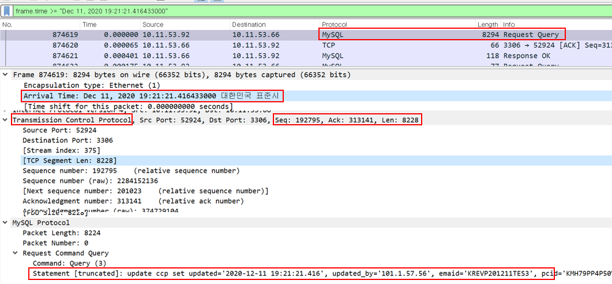
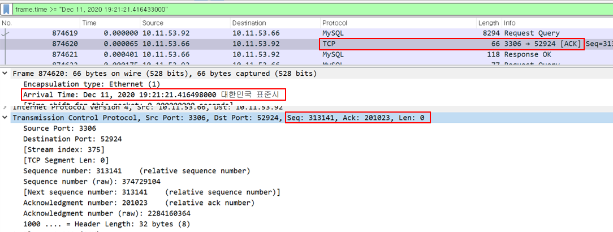
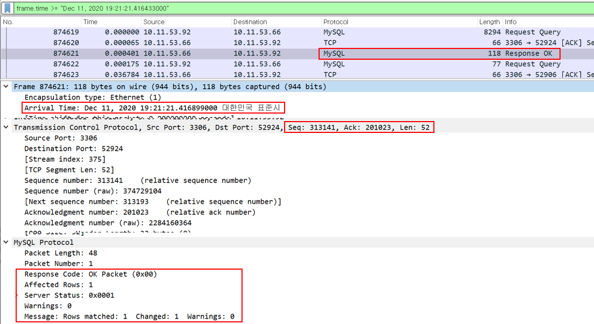
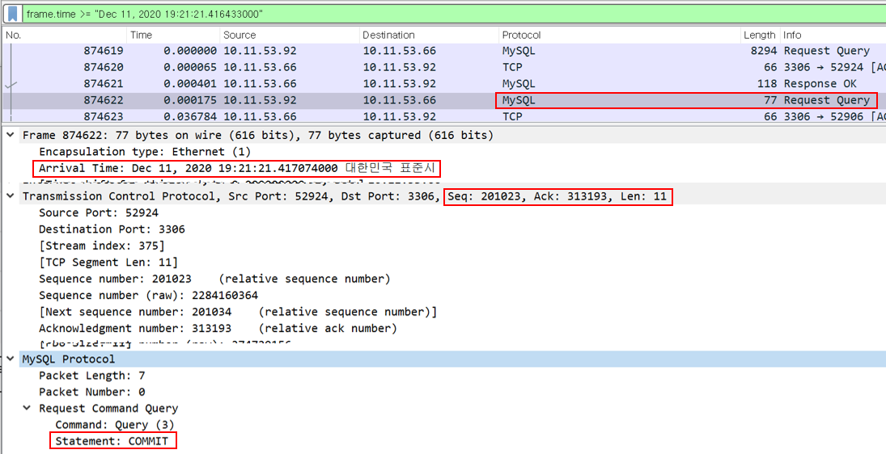
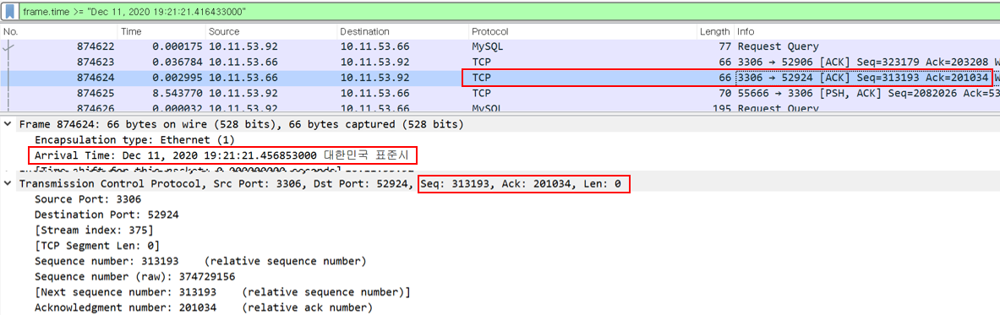
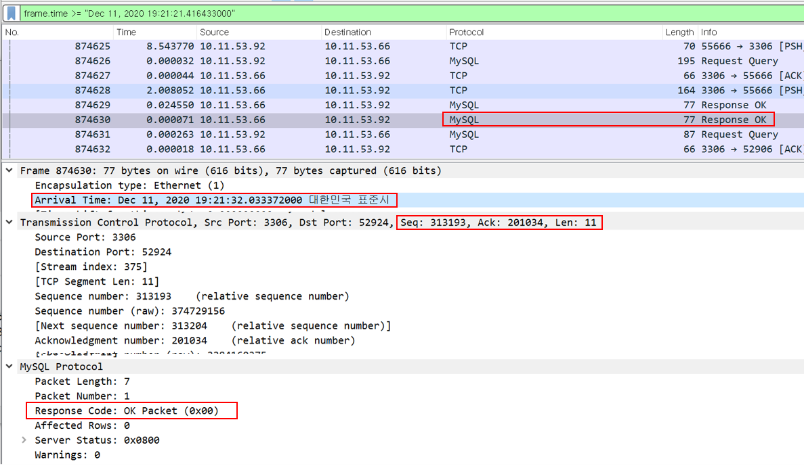

성능 테스트 중에 솔루션 내에서 DB insert/select 할 때 소요시간이 오래 걸리는 현상이 발생되었다.  
데이터가 많이 쌓인것도 아닌데..  
해당 부분이 솔루션 문제인지, 네트워크 문제인지 DB 문제인지 확인을 위해 tcpdump를 분석하였다.  

### #. 사용 툴
- WireShark

<br>

### #. tcpdump file out 명령어
- DB 서버에 tcpdump를 떠서 WAS 서버에서 오는 모든 패킷에 대해 파일로 저장하도록 함.

```shell script
$ sudo tcpdump -w host {WAS_HOST} tcpdump.pcap
```

<br>

### #. 파일 분석
##### 1. Update 쿼리 요청

```                
        RequestQuery    : Seq(192795), Len(8228), Ack(313141)   
[WAS] ---------------------------------------------------------> [DB]
 (WAS) : 쿼리 요청한다.
         내가 보냈던 총 데이터 길이(seq)는 192795였고, 지금 보내는 데이터 길이는 8228 이야. 
         그리고 너(DB)한테 받은 총 길이는 313141(ack) 이야. 
```


<br>

##### 2. Update 쿼리 요청에 대한 ACK

```
        Ack             : Seq(313141), Len(0), Ack(201023)
[WAS] <--------------------------------------------------------- [DB]  
 (DB) : 응 받았어, Ack 보낸다.
        너(WAS)한테 내가 313141 까지 보냈고, 너한테 받은 총 길이는 201023(192795+8228) 이야
```


<br>

##### 3. Update 쿼리 요청에 대한 응답

```
        Response OK     : Seq(313141), Len(52), Ack(201023)
[WAS] <--------------------------------------------------------- [DB]  
 (DB) : 요청한거 응답이야.
        너(WAS)한테 내가 313141 까지 보냈었고, 쿼리 받은거 수행한 결과야(52)
        그리고 너한테 받은 길이는 201023 야
```


<br>

##### 4. Commit 쿼리 요청

```
        RequestQuery     : Seq(201023), Len(11), Ack(313193)
[WAS] ---------------------------------------------------------> [DB]  
 (WAS) : Commit 해줘.
         너(DB)한테 내가 201023 까지 보냈고, 지금 보내는 데이터 길이는 11 이야.
         그리고 너(DB)한테 받은 총 길이는 313193(313141+52) 이야. 
```


<br>

##### 5. Commit 쿼리 요청에 대한 ACK

```
        Ack             : Seq(313193), Len(0), Ack(201034)
[WAS] <--------------------------------------------------------- [DB]  
 (DB) : 응 받았어, Ack 보낸다.
        너(WAS)한테 내가 313193 까지 보냈고, 너한테 받은 총 길이는 201034(201023+11) 이야
```


<br>

##### 6. Commit 쿼리 요청에 대한 응답

```
        Response OK     : Seq(313193), Len(11), Ack(201034)
[WAS] <--------------------------------------------------------- [DB]  
 (DB) : 요청한거 응답이야.
        너(WAS)한테 내가 313193 까지 보냈었고, 쿼리 받은거 수행한 결과야(11)
        그리고 너한테 받은 길이는 201034 야
```


<br>

### #. 파일 분석 결과
- 5번과 6번 소요시간이 약 10초 이상 딜레이된 것이 발견되었다.
- 솔루션 및 네트워크 문제는 아닌것으로 판단되어 DB 기술지원 업체에 문의하였다.
- DB 로그를 DB 테이블에 쌓고 있었다는 답변이 왔다....

<br>

##### 참고) wireShark 필터 사용 내역
- Arrival Time  
 -- frame.time <= "Dec 11, 2020 20:44:58.877172000"
 
- Sequence  
 -- tcp.seq eq 184381
 
- mysql query target table  
 -- mysql.field.org_table eq "ccp"
