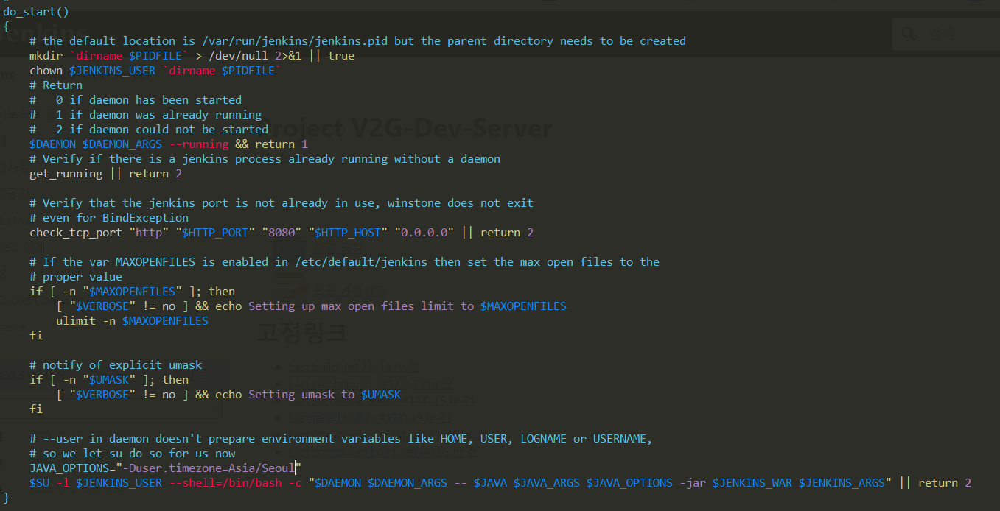
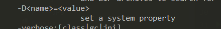

## [작업로그] Jenkins Timezone 변경

jenkins 실행 파일에 아래 option을 추가하라는 가이드가 많았다. 
```bash
JENKINS_JAVA_OPTIONS="-Dorg.apache.commons.jelly.tags.fmt.timeZone=Asia/Seoul"
```

<br>

jenkins 실행파일을 보니 java 옵션으로 줘도 괜찮겠다 싶어서 아래 처럼 진행하였다.
- 실행파일 위치 : /etc/init.d/jenkins
- do_start 함수 안에 java 명령어에 '-Duser.timezone=Asia/Seoul' 옵션 추가
- jenkins 재시작



```shell script
// jenkins 재시작
$ /etc/init.d/jenkins restart
```

##### 참고로 -D 옵션은 아래와 같다

 


#### jenkins 시스템 설정 정보 보는 방법
http://{jenkins_host}/systemInfo


