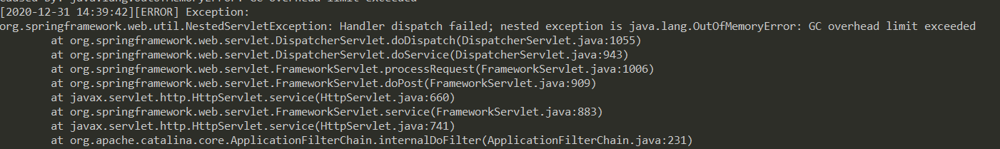
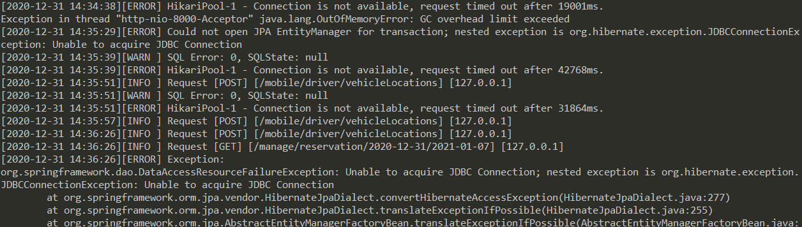
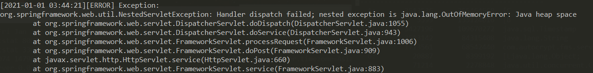
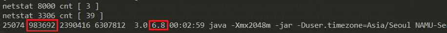
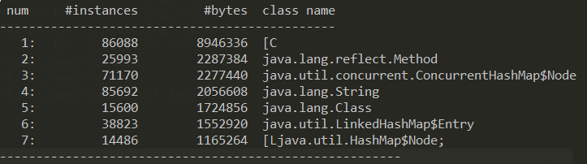
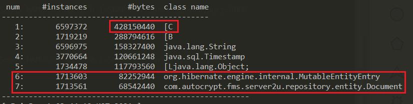
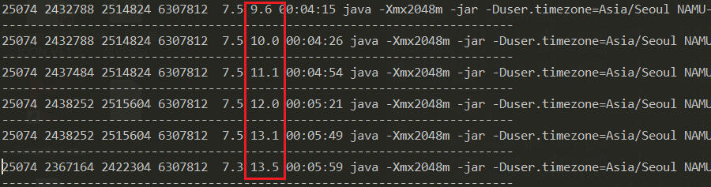

팀에서 서비스하고 있는 제품 중, 아이맘 택시 서비스에서 아래와 같은 현상이 발생 되었다.  
당시, 해당 프로세스의 메모리 사용량이 8G를 넘고 있었고(평균 1G), CPU 사용량도 90% 이상이 넘고 있었다.

- GC Overhead


- JDBC Connection Pool Error


- Java heap Out of memory


<br>

- 현재 내가 진행하고 있는 프로젝트가 아니라.. 로그만으로는 분석이 힘들어 [jvm 분석 툴](/works/posts/2020-12-31--001)을 사용하여 아래와 같이 모니터링을 하였다.

<br>

### #1. 모니터링 스크립트 만들기

#### #1.1. 사용 리소스 모니터링
- 해당 서비스의 메모리, cpu 사용률 및 부하 감지를 위한 서비스, DB 포트 연결 개수 모니터링

```shell script
#!/bin/bash

LOG=log_res_mn
while [ true ]
do

        echo `echo \[;date;echo \]` >> $LOG
        echo `echo netstat 8000 cnt \[;netstat -na | grep 8000 | wc -l;echo \];` >> $LOG
        echo `echo netstat 3306 cnt \[;netstat -na | grep 3306 | wc -l;echo \];` >> $LOG
        ps -eo pid,rss,size,vsize,pmem,pcpu,time,cmd --sort -rss | grep NAMU | head -n 1 >> $LOG
        #ps -eo pid,rss,size,vsize,pmem,pcpu,time,cmd --sort -rss | head -n 5 >> $LOG
        echo ------------------------------------------------------------------------ >> $LOG
        sleep 1;
done;
```

#### #1.2. 해당 프로세스 PID의 메모리 사용 내용 
- jmap -histo:live [PID] 명령어를 이용
- 해당 프로세스에서 사용하고 있는 클래스 별 사용 내역 (인스턴스 개수, 사용된 메모리 크기)

```shell script
#!/bin/bash

LOG=log_mn_jvm
while [ true ]
do
        PID=`sudo jps -v | grep "\-Xmx2048m" | awk '{print $1}'`
        echo `echo \[;date;echo \]` >> $LOG
        sudo jmap -histo:live $PID | head -n 10 >> $LOG
        echo ------------------------------------------------------- >> $LOG
        sleep 5;
done;
```

<br>

### #2. 모니터링 결과
** 해당 결과는 새벽에 오류 재연을 한 것이므로 오류 상황보다 CPU 점유율이 낮게 나왔다. ** 

#### #2.1. 오류 발생 전
- 기본 사용 메모리, cpu

- 인스턴스 개수


<br>

#### #2.2. 오류 발생  후
- 문제 발생 시점부터 약 20초간 확 증가된 메모리 사용량


- 해당 시점의 인스턴스 상태


<br>

- GC가 돌아 약 25초간 cpu 사용량 쭉 증가 후 약 40초간 유지
- 그 후 점차 감소


<br>

#### #2.3. 소스 검토
- 해당시간에 발생된 request url 검사 후 해당 로직 검토를 하였더니 
Document 테이블에서 가져오는 row수가 1,713,561건 인것을 발견하였다.
- 해당 비즈니스 로직에 대한 이해도가 없어 왜 이런 상황이 발생이 됐는지는 모르겠지만,
select 최대 row를 강제할 수 있는 방법을 찾아 팀 코드 컨벤션으로 정해야겠다.
- 좋은 경험 했다!!!!!!!
