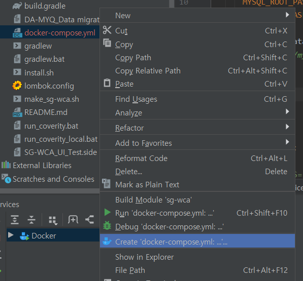
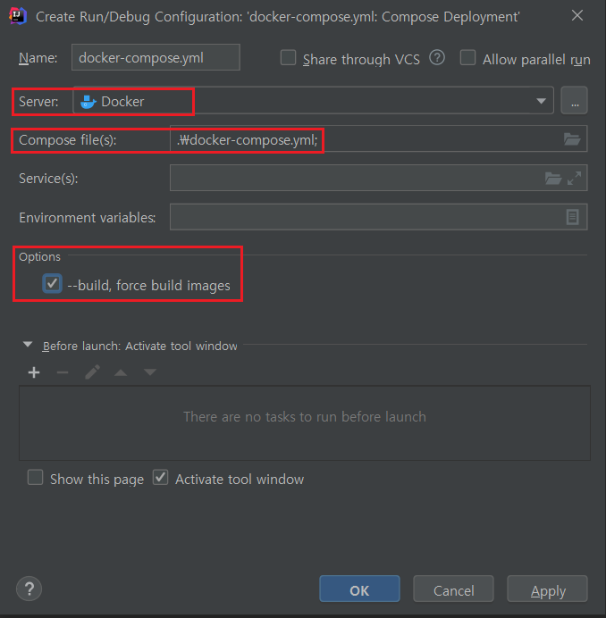
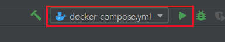
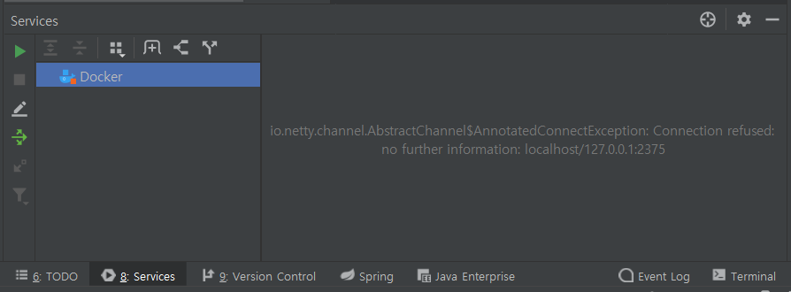
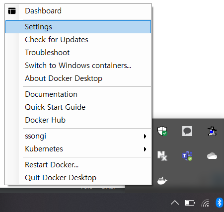
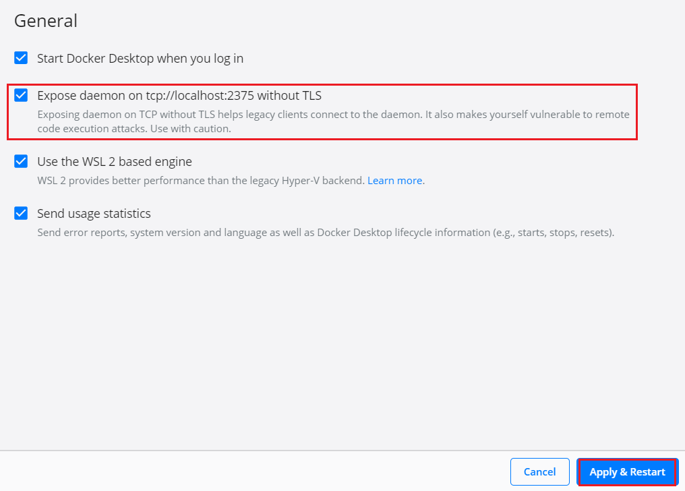

#### #.1. docker-compose.yml 우클릭 후 Create docker-compose.yml.. 선택

#### #2. configuration 설정
- server 는 디폴트로 생성
- compose 파일이 선택되어 있는지 확인
- 빌드 옵션 추가

#### #3. run

#### #4. docker daemon 설정
- 아래와 같이 connection refused 가 발생하면 4.1 로 간다

#### #4.1 docker - settings

#### #4.2. Expose daemon on... 선택 후 도커 재시작

