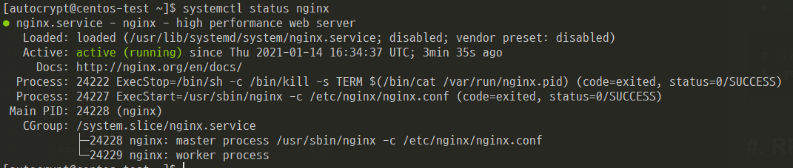

폐쇠망에서 nginx를 설치하게 되어 rpm 으로 진행하였다.(CentOS 7)

### #. RPM 다운로드
- http://nginx.org/packages

```cmd
# 금일 기준 stable version : 1.18
$ wget http://nginx.org/packages/centos/7/x86_64/RPMS/nginx-1.18.0-2.el7.ngx.x86_64.rpm
```
 
### #. RPM 설치
```cmd
$ sudo rpm -Uvh nginx-1.18.0-2.el7.ngx.x86_64.rpm
```

### #. 서비스 파일 확인
```cmd
$ll /usr/lib/systemd/system/nginx.service
```

### #. systemctl daemon 재시작
```cmd
$ systemctl daemon-reload
```

### #.정상적으로 Service가 등록되었는지 확인
```cmd
$ systemctl status nginx
```



### #. 필요시 방화벽 해제
- firewall 구동 확인

```
$ firewall-cmd --state
```

-  http, https 서비스에 대해 해제/제거

```
# 해제
$ sudo firewall-cmd --permanent --add-service=http
$ sudo firewall-cmd --permanent --add-service=https

# 제거
sudo firewall-cmd --permanent --remove-service=http
sudo firewall-cmd --permanent --remove-service=http

# --permanent : 영구적으로 실행 (default zone에 등록 : /etc/firewalld/zones/public.xml)
# --add-service : 해당 서비스를 추가
# --remove-service : 해당 서비스를 삭제
```

- 특정 port로 방화벽 해제/제거

```
# 해재
$ sudo firewall-cmd --permanent --add-port=80/tcp

# 제거
$ sudo firewall-cmd --permanent --add-remove=80/tcp
```
