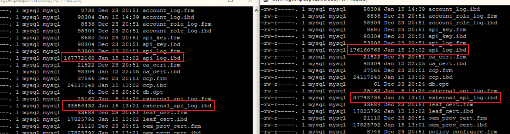
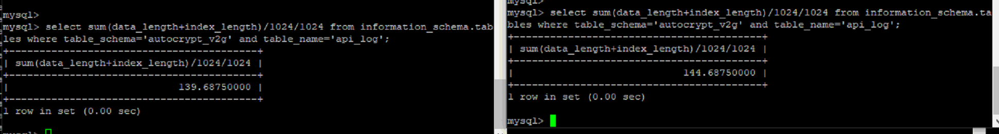
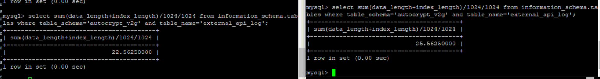
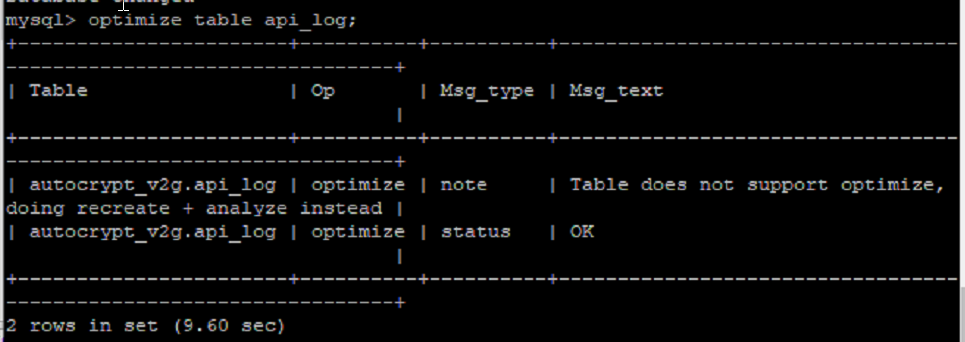
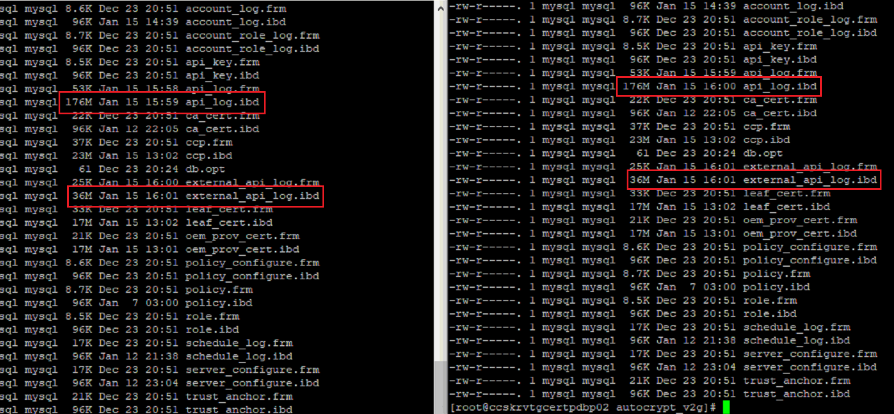

### 요청사항
- Replication 이 적용된 두 서버의 DB 의 몇몇 테이블 스페이스가 달라요. 확인 해주세요.

### 확인
- DB 데이터 파일이 존재하는 디렉토리에서 데이터파일 사이즈 확인 결과 두개의 로그파일 사이즈가 달랐다.
- ibd 파일 위치: my.cnf 파일안에 data 경로 


 
- 혹시몰라 mysql 접속 후 data+index 사이즈를 확인했지만 현상은 동일했다.





<br>

- 확인해보니 각 DB는 알아서 Optimizer 가 돌기 때문에 사이즈가 조금 씩 다를 수 있다고 전달 받았다.
- 그래서 실질 적으로 해당 테이블에 optimize 를 진행해보았다.

```
# 명령어
mysql> optimize table [테이블명] 
``` 

- 수행결과 (innoDB의 경우 아래와 같은 결과가 나옴, 오류가 아니라 수행이 완료 된 것임)

 

- 실제 ibd 사이즈도 동일해졌다.



<br>

테이블 최적화에 대한 몇 개의 글을 찾아보았다.
아래를 참고하자

- https://hyunki1019.tistory.com/52
- https://fliedcat.tistory.com/80


