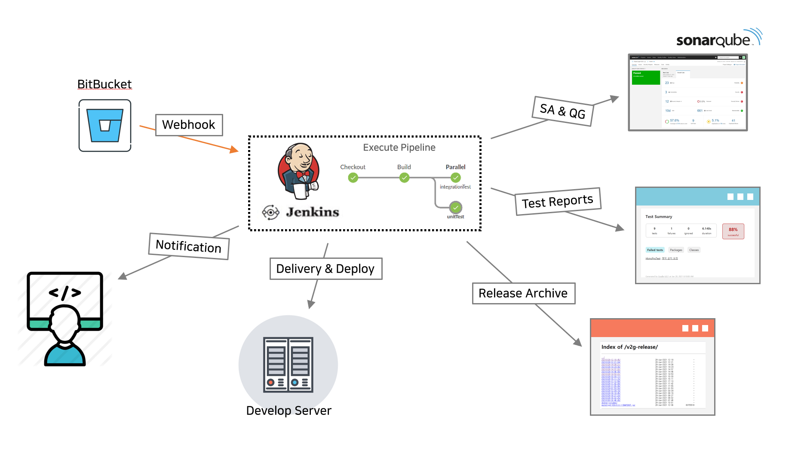

#. CI/CD 구축 사용 도구 
1. Jenkins
- CI (Continuous Integration) / CD (Continuous Deploy) 도구
- BitBucket webhook 이벤트 발생 시 test & build & deploy 를 진행
- Pipeline 기술을 이용하여 stage 정의

2. Gradle
- 빌드 툴
- Jacoco plugin / Sonarqube scanner plugin 을 사용하여 코드 분석

3. SonarQube
- Sonarqube Scanner 에게 정적 분석 관련 데이터 제공
- 정적 코드 분석 및 버그, 코드 스멜, 보안 취약점 발견 등 코드 품질에 대한 검사 및 리포팅

4. Nginx
- 테스트 결과 게시
- 릴리즈 파일 이력관리

#. CI/CD 인프라 구조 

#. 전략 & 정책 

#. 구성 시나리오 
통합 시나리오

시나리오1. Feature Branch 에서 PR 발생

 

시나리오2. Feature Branch 에서 Merge 발생

 

시나리오3. Develop Branch 에서 PR 발생

 

시나리오4. Develop Branch 에서 Merge 발생 (자동)

---

[> [작업로그] CI/CD 구축 #2 - Docker, Docker Compose 설치](https://eunyoung-autocrypt.github.io/devHistoryBlog/works/posts/2021-01-18--002)  
[> [작업로그] CI/CD 구축 #3 - BitBucket 설정 및 Jenkins 설치](https://eunyoung-autocrypt.github.io/devHistoryBlog/works/posts/2021-01-18--003)  
[> [작업로그] CI/CD 구축 #4 - Jenkins Item 등록 및 Pipeline 작성](https://eunyoung-autocrypt.github.io/devHistoryBlog/works/posts/2021-01-21--001)  
[> [작업로그] CI/CD 구축 #5 - sonarqube 설치 및 pipeline 작성](https://eunyoung-autocrypt.github.io/devHistoryBlog/works/posts/2021-01-23--002)  
