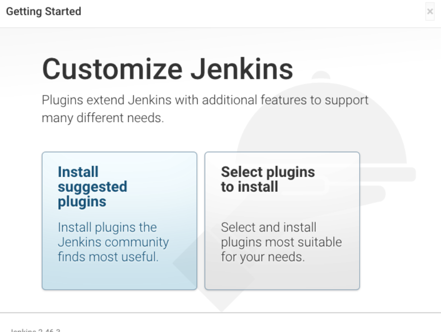

### #. BitBucket Webhook 설정
- Repository -> Pepository settings -> Webhooks -> Add Webhook
- Push Webhook 설정 (URL : http://JENKINS-HOST/generic-webhook-trigger/invoke?token=build-test-wh-push)
- token 값이 중요!


- Pull Request Webhook 설정 (URL : http://JENKINS-HOST/generic-webhook-trigger/invoke?token=build-test-wh-pr)
- 역시 token 값 중요!


<br>

### #. Jenkins 설치
- jenkins 는 docker 기반으로 설치를 진행하였다.
- 추후 테스트 도구 확장을 위해 docker-compose 파일을 생성하여 서비스 기동 시켰다.

- test-tools-docker-compose.yml

```cmd
version: "3.6"
services:
    jenkins:
        image: jenkins/jenkins
        container_name: jenkins
        ports:
            - 8080:8080
            - 50000:50000
        user: root
        volumes:
            - /docker-volumes/jenkins:/var/jenkins_home
```

- 서비스 기동
```
$ docker-compose -f test-tools-docker-compose.yml up
```

### #. Jenkins 세팅
- password 등록


- Jenkins 기본 플러그인 설치



- BitBucket 연동 관련 플러그인 설치  
 -- Generic Webhook Trigger Plugin  
 -- Bitbucket Plugin

[계속]
