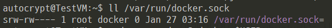

## #. Docker, Docker Compose 설치

### #1. Docker 설치

#### #1-1. Docker 설치 및 구동 확인
- docker 설치에 필요한 패키지 설치

```cmd
$ sudo apt update && sudo apt install \
    apt-transport-https \
    ca-certificates \
    curl \
    software-properties-common
```

- 도커의 공식 GPG 키와 패키지 저장소 추가

```cmd
$ curl -fsSL https://download.docker.com/linux/ubuntu/gpg | sudo apt-key add -
$ sudo add-apt-repository \
   "deb [arch=amd64] https://download.docker.com/linux/ubuntu \
   $(lsb_release -cs) \
   stable"
```

- docker ec 설치

```
$ sudo apt update && sudo apt install docker-ce
```

- docker 구동 확인

```
$ sudo systemctl status docker
```

<br>

#### #1-2. docker 명령어 실행 시 오류

- docker 설치 완료 후 명령어 실행 시 아래와 같은 permission 오류가 발생한다.


- /var/run/docker.sock 파일을 확인하면 root 사용자, docker 그룹일 경우에만 read/ write 권한이 있다.



#### #1-3. 해결방법
- 파일 권한을 666 으로 줘도 되지만, 현재 사용 계정을 docker group으로 묶는게 낫다고 판단했다.
- 만약 동일하게 permission 오류가 난다면 세션을 재시작해보자.

<br>

- 현재 사용자 docker 그룹에 추가

```
$ sudo usermod -a -G docker [현재계정]
```

- 계정이 속한 그릅 확인

```
# 현재 사용자가 속한 그룹 확인
$ groups

# [사용자 아이디]가 속한 그룹 확인
$ groups [사용자 아이디]  
```

<br>

### #2. Docker Compose 설치
- 다운로드

```
$ sudo curl -L "https://github.com/docker/compose/releases/download/1.24.0/docker-compose-$(uname -s)-$(uname -m)" -o /usr/local/bin/docker-compose
```

- 실행 권한 부여

```
$ sudo chmod +x /usr/local/bin/docker-compose
```
