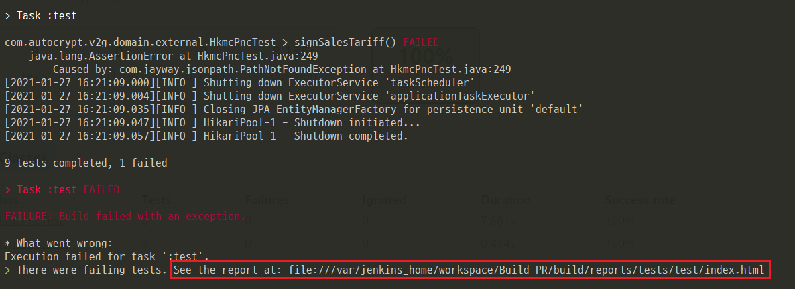
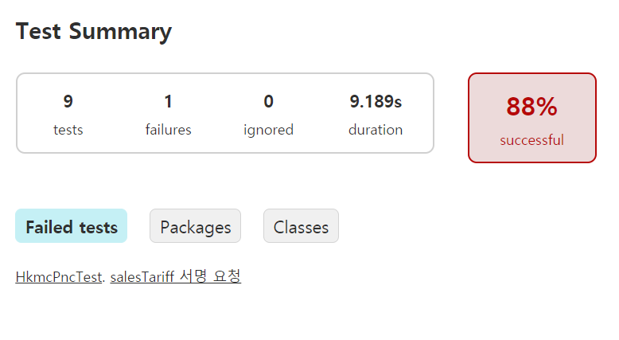
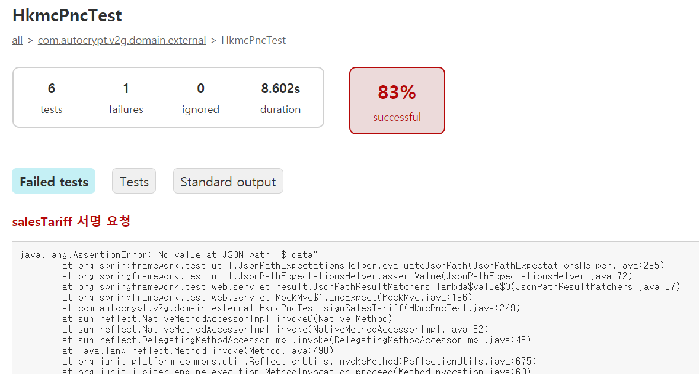
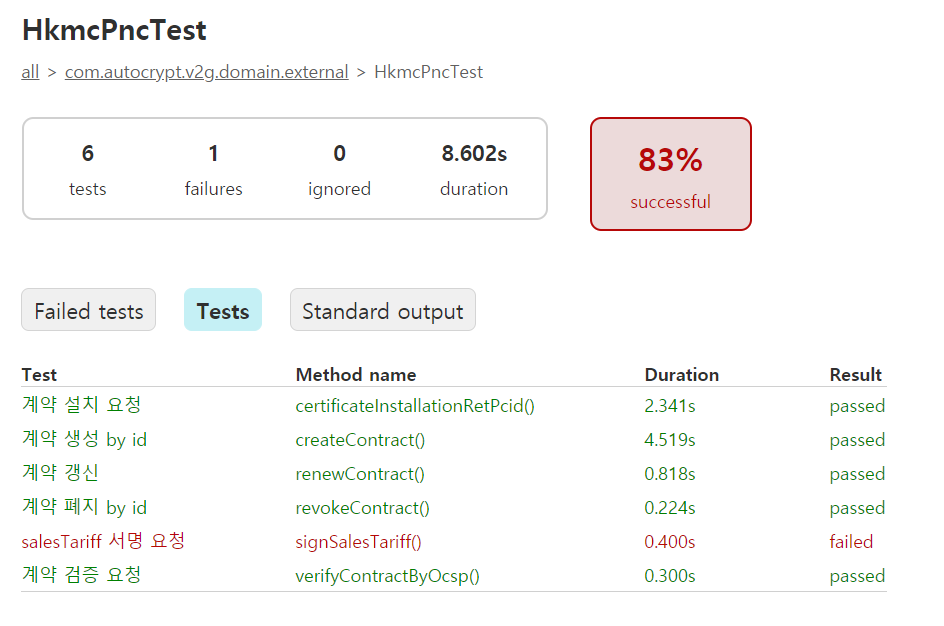
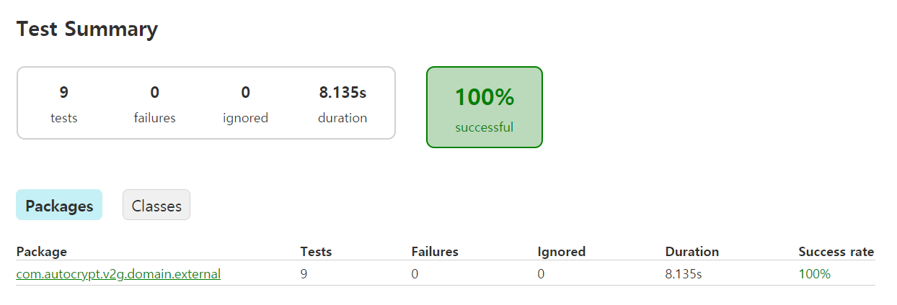
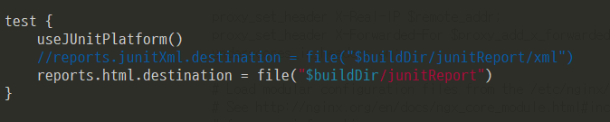

Junit 테스트를 진행하다가 Failure 케이스가 존재하는 경우 아래와 같은 로그를 보게 되었다.

 

해당 경로의 index.html 을 열어보니 아래와 같이 테스트에 대한 결과를 화면으로 출력해주고 있었다.

#### #. Test Summary

#### #.  실패된 테스트 로그

 

#### #.  테스트 클래스 별 정의된 테스트 메소드 및 성공/실패 여부

#### #. 모든 테스트 성공 시

 

이번 CI/CD 구축에서 테스트 실패시 해당 html를 제공하도록 해도 괜찮을꺼 같다.

 

#### ps. junit test reports 경로 수정 방법
- build.gradle 의 test 블록에 reports destination 지정

