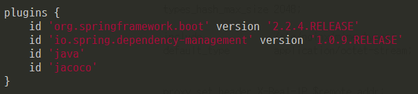
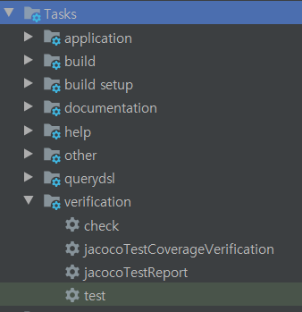
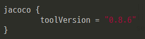
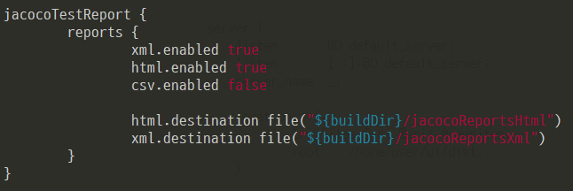
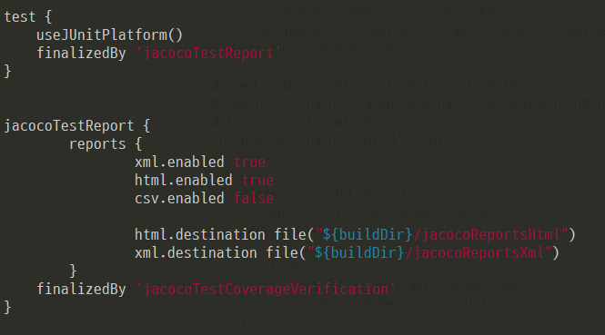
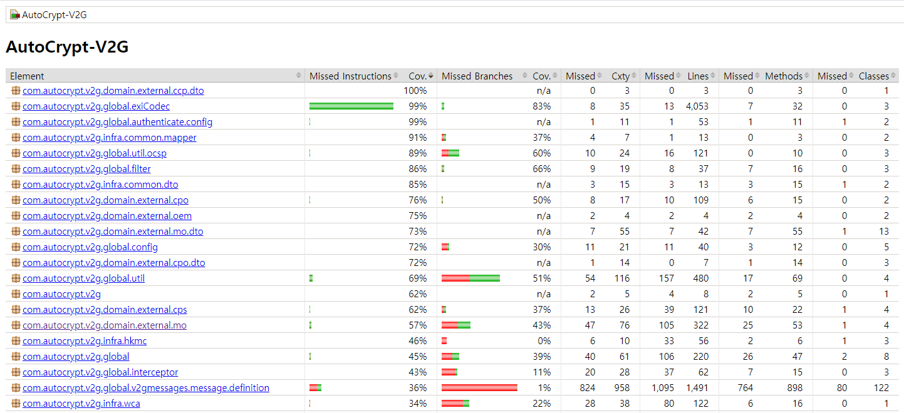
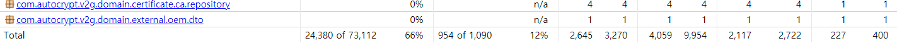

### #. Jacoco ?
- 수행되는 테스트가 작성된 코드를 얼마나 커버하는지를 체크해주는 라이브러리이다.
- 테스트코드를 돌리고 그 커버리지 결과를 눈으로 보기 좋도록 html이나 xml, csv 같은 리포트로 생성한다. 
- 테스트 결과가 내가 설정한 커버리지 기준을 만족하는지 확인하는 기능도 있다. 

### #. Jacoco 적용

### #. jacoco plugin 추가
- plugins 블록에 id 'jacoco' 를 추가하면 


<br>

- jacocoTestReport 와 jacocoTestCoverageVerification task가 gradle verification 항목에 추가된다.
- 주의 해야 할 점은 생성된 두 개의 task는 test 가 먼저 실행된 다음에 실행이 되어야 한다.



### #. jacoco version 
- toolVersion 을 다음과 같이 명시한다
- 버전 정보는 [여기](https://www.eclemma.org/jacoco/) 에서 확인한다.



### #. jacocoTestReports 설정
- jacocoReport task는 html, csv, xml 형태로 커버리지 측정 결과를 알려주는 역할을 한다.
- report 포맷 및 경로를 지정한다.



### #. jacocoTestCoverageVerification
- 커버리지 검증 수준을 정의.
- 이 부분에서 jacoco의 report 검사하여 설정한 최소 수준을 달성하지 못하면 task는 실패를 한다.
- 여러 수준의 정의를 violationRules 에서 다수의 rule 에 정의하여 사용할 수 있다.

```
jacocoTestCoverageVerification {
  violationRules {
    rule {
      //해당 rule의 활성화 여부를 boolean으로 나타낸다
      //default는 true
      enabled = true
        
      // 측정의 큰 단위
      element = 'CLASS'

      // rule 적용 대상을 package 수준으로 정의
      // 아무런 설정을 하지 않는다면 전체 적용
      //includes = []
        
      // rule의 상세 설정을 나타내는 block
      limit {

        // 커버리지 측정의 최소 단위
        // 이 때 측정은 java byte code가 실행된 것을 기준으로 counting 된다
        // counter 종류 
        //  - CLASS : 클래스 내부 메소드가 한번이라도 실행된다면 실행된 것으로 간주
        //  - METHOD : 클래스와 마찬가지로 METHOD가 한번이라도 실행되면 실행된 것으로 간주
        //  - LINE : 한 라인이라도 실행되었다면 측정, 소스 코드 포맷에 영향을 받는 측정방식
        //  - BRANCH : if, switch 구문에 대한 커버리지 측정
        //  - INSTRUCTION : jacoco의 가장 작은 측정 방식(바이트 코드), LINE과 다르게 소스 코드 포맷에 영향을 받지 않는다.
        counter = 'LINE'

        // 측정한 counter의 정보를 어떠한 방식으로 보여줄지 정한다
        // value 종료
        //  - TOTALCOUNT: 전체 개수
        //  - MISSEDCOUNT: 커버되지 않은 개수
        //  - COVEREDCOUNT: 커버된 개수
        //  - MISSEDRATIO: 커버되지 않은 비율. 0부터 1 사이의 숫자로, 1이 100%
        //  - COVEREDRATIO (default): 커버된 비율. 0부터 1 사이의 숫자로, 1이 100%
        value = 'COVEREDRATIO'

        // count값을 value에 맞게 표현했을때 최소 값을 나타낸다
        // 이 값으로 jacoco coverage verification의 성공여부를 판단 (0.00~1.00)
        minimum = 0.60
      }
    
      // verify 에서 제외할 클래스를 지정 (패키지 레벨 경로)
      excludes = []
  }
    
  rule {
      ...
  }
}
}
```


### #. finalizedBy
- test task를 먼저 실행한 다음 jacoco task 가 실행되어야 한다.
- test -> jacocoTestReport -> jacocoTestCoverageVerification
- 위 순서대로 task가 실행되도록 finalizedBy 를 적용한다.




### #. 테스트 실행 및 결과 확인
- 테스트 실행

```
$ ./gredlew test
```

<br>

- 결과
- coverage 66% 로 0.60 를 넘어 verification pass 했다.

 

 

<br>
