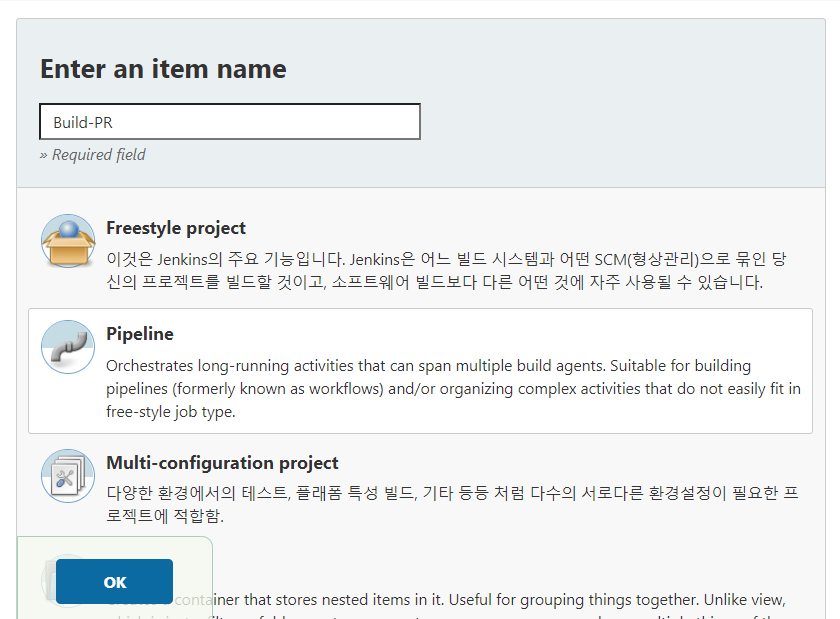
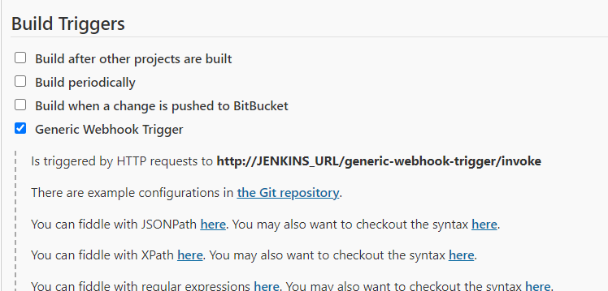
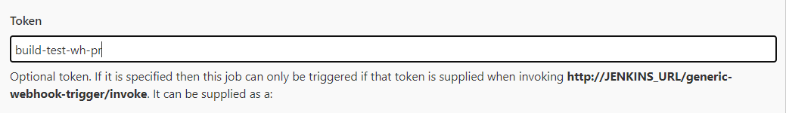
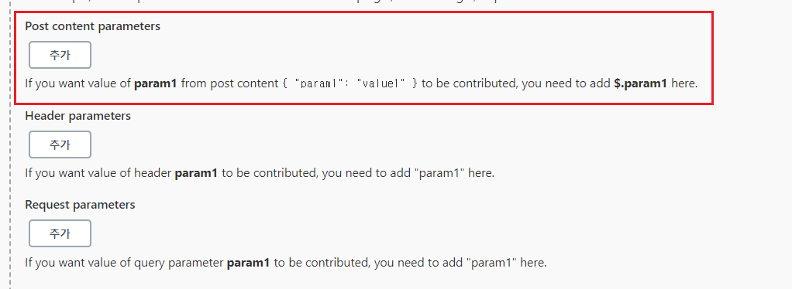
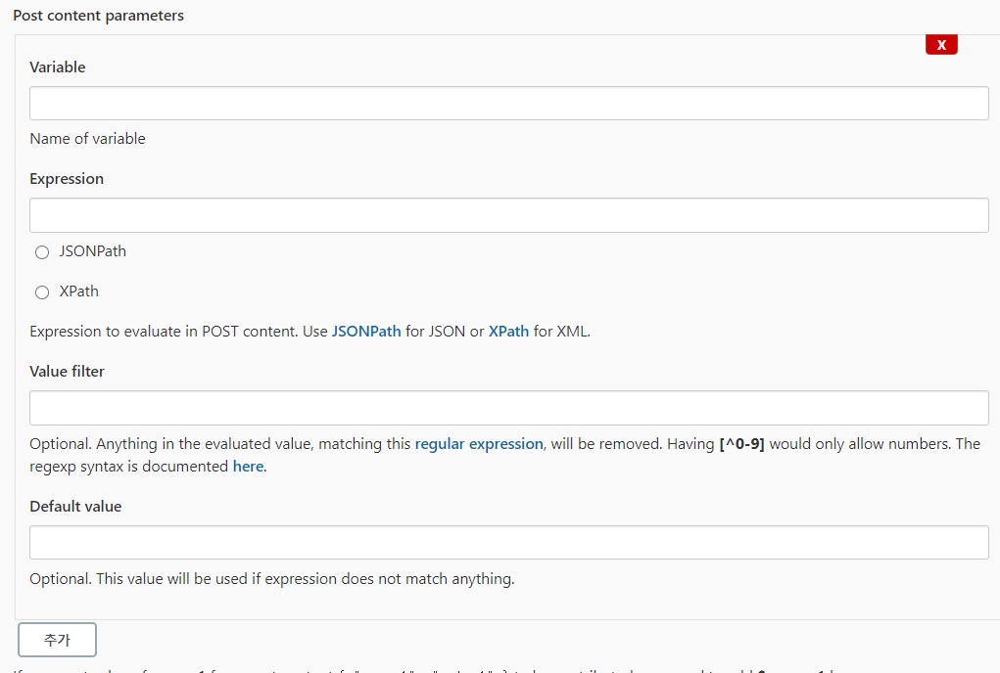
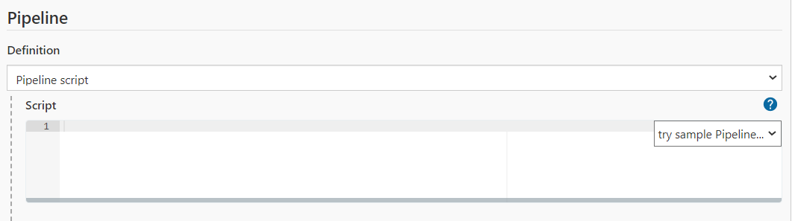

### #1. Jenkins Item 생성 (Pull Request)
- pipeline 선택


<br>

- Build Trigger에서 generic Webhook Trigger를 선택한다.



<br>

### #2. webhook token 설정
- BitBucket 에서 설정했던 token 값을 넣는다.


<br>

### #3. Parameters 정의
- request payload 에서 사용할 값들을 정의한다.
- bitbucket webhook 에 대한 각 이벤트 request payload는 [여기](https://support.atlassian.com/bitbucket-cloud/docs/event-payloads/) 에서 볼 수 있다. 근데.. 난 보기 불편하다.  

#### #3.1. 아래와 같이 paramters를 캐치할 수 있는 폼이 있는데, 해당 hook은 POST method 형식이므로 맨 첫번째를 선택한다.



<br>

#### #3.2. 사용할 변수들을 정의한다.  
- Variable : 변수로 사용할 이름  
- Expression : payload에서 사용 할 값  
- JSONPath : payload가 json으로 들어오므로 해당 값을 선택한다.
    


<br>

#### #3.3. 정의한 변수들
```  
1. SOURCE_BRANCH  
  -- PR 타켓 branch  
  -- expression: $.pullrequest.source.branch.name

2. COMMENT_URL
  -- pipeline에서 정의한 stage 수행 시 comment 기록를 위한 url  
  -- expression: $.pullrequest.links.comments.href

3. DECLINE_URL
  -- pipeline에서 정의한 stage 실패 시 PR decline을 위한 url  
  -- expression: $.pullrequest.links.decline.href

4. REPO_URL
  -- git repository url 
  -- expression: $.pullrequest.destination.repository.links.html.href
```

<br>

#### #4. Pipeline 작성
- 맨 아래 pipeline을 작성하는 폼이 있다.



<br>

- 아래와 같이 작성한다.

```
node {
    withCredentials([usernameColonPassword(credentialsId: 'bitbucket-auth-id-pw', variable: 'USER')]) {
        stage ('Clone') {
            sh'''
                echo SOURCE_BRANCH: $SOURCE_BRANCH
                echo REPO_URL : $REPO_URL
                echo DECLINE_URL: $DECLINE_URL
                echo COMMENT_URL: $COMMENT_URL
            '''
            
            try {
                
                git branch: '$SOURCE_BRANCH', credentialsId: 'bitbucket-auth-id-pw', url: '$REPO_URL'
            
            } catch(e) {
                sh '''
                    curl -X POST -u "$USER" $COMMENT_URL -d '{"content": {"raw": "[CLONE] FAIL"}}' -H 'Content-Type: application/json';
                    curl -X POST -u "$USER" $DECLINE_URL -d '{"content": {"raw": "[CLONE] FAIL"}}' -H 'Content-Type: application/json';
                    echo [CLONE] FAIL;
                    exit 1;
                '''
            }
        }
        
        stage ('Build') {
        
            sh '''
            {
                echo [BUILD - BACKEND]
                chmod +x ./gradlew
                ./gradlew clean build -x test \
                && curl -X POST -u "$USER" $COMMENT_URL -d '{"content": {"raw": "[BUILD] SUCCESS"}}' -H 'Content-Type: application/json' > /dev/null 2>&1 \
                && echo [BUILD] SUCCESS;
            }||\
            {
                curl -X POST -u "$USER" $COMMENT_URL -d '{"content": {"raw": "[BUILD] FAIL"}}' -H 'Content-Type: application/json';
                curl -X POST -u "$USER" $DECLINE_URL -d '{"content": {"raw": "[BUILD] FAIL"}}' -H 'Content-Type: application/json';
                echo [BUILD] FAIL;
                exit 1;
            }
            '''
        }
       
    }
}
```

<br>

##### #. 진행된 시나리오 확인
```
# PR 이벤트 시나리오
  #1. develop branch에 Pull Request 이벤트 발생
  #2. Bitbucket 에서 Webhook 발생 ( to jenkins )
  #3. Jenkins 에서 해당 Webhook Payload를 분석하여 정의된 Pipeline 실행
    # Pipeline
     #1.1. clone 타켓 branch  
       -. clone 실패 시 해당 PR에 comment 등록 (clone fail)
    
     #1.2. 테스트 없이 소스코드 빌드 ( 컴파일 오류 체크 )    
       -. 빌드 성공 시 해당 PR에 comment 등록 (build success)  
       -. 빌드 실패 시 
         -1.2.1. 해당 PR에 comment 등록 (build fail) 
         -1.2.2. PR decline 요청 
         -1.2.3. 파이프라인 종료  
```

[계속]


