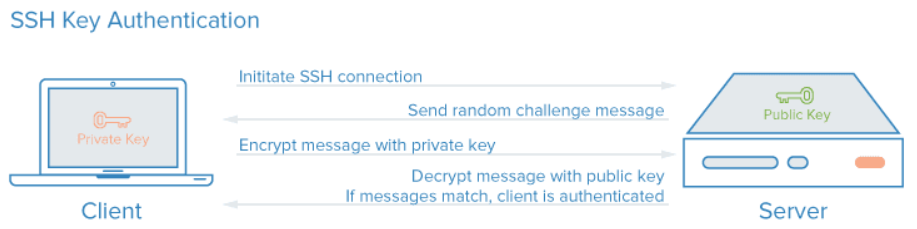

### #. SSH Key란?
- 서버에 접속 할 때 비밀번호 대신 key를 제출하는 방식이다. 

### #. 동작 방법
1. 클라이언트가 서버에 SSH 연결을 요청한다.
2. 서버는 랜덤 챌린지(랜덤 데이터 스트링)를 생성해 클라이언트에게 보낸다.
3. 클라이언트는 서버로 부터 받은 챌린지(C)를 자신이 가지고 있는 private 키로 암호화해서 암호화 된 메시지를 서버로 보낸다.
4. 서버는 클라이언트에서 받은 암호화 된 메시지를 public 키로 해석한 후 그 결과를 2단계에서 자신이 클라이언트에게 보낸 랜덤 챌린지와 일치하는지 확인한다. (public 키로 해석할 수 있는 메시지는 그 쌍이 되는 private 키를 가진 사람만이 만들 수 있기 때문) 일치하면 클라이언트가 인증된 것이다.



<br>

### #. 패스워드 없이 ssh 연결

#### #1. key pair 생성 [Client Side]
- default 로 생성 시 ~/.ssh/id_rsa , ~/.ssh/id_rsa.pub 로 생성됨

```cmd
$ ssh-keygen
``` 

- 파일 설명   

|파일명|설명|
|-----|----|
|id_rsa| private key, 서버에 패스워드 없이 접속할때 해당 key를 사용한다 |
|id_rsa.pub| public key, 접속하려는 서버의 authorized_key 에 등록하면 된다 |

#### #2. 접속하려는 서버에 public key 등록 [Server Side]

```
$ cat id_rsa.pub >> ~/.ssh/authorized_keys
```

#### #3. 접속확인 [Client Side]

```
$ scp -i ~/.ssh/id_rsa [타겟파일] [서버계정]@[서버HOST]:~/
```

<br>

##### #ps. 관련 디렉토리, 파일 퍼미션
```cmd
chmod 700 ~/.ssh
chmod 600 ~/.ssh/id_rsa
chmod 644 ~/.ssh/id_rsa.pub  
chmod 644 ~/.ssh/authorized_keys
chmod 644 ~/.ssh/known_hosts
```
