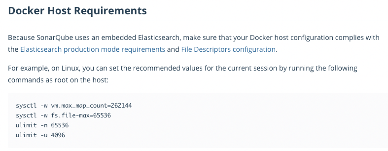
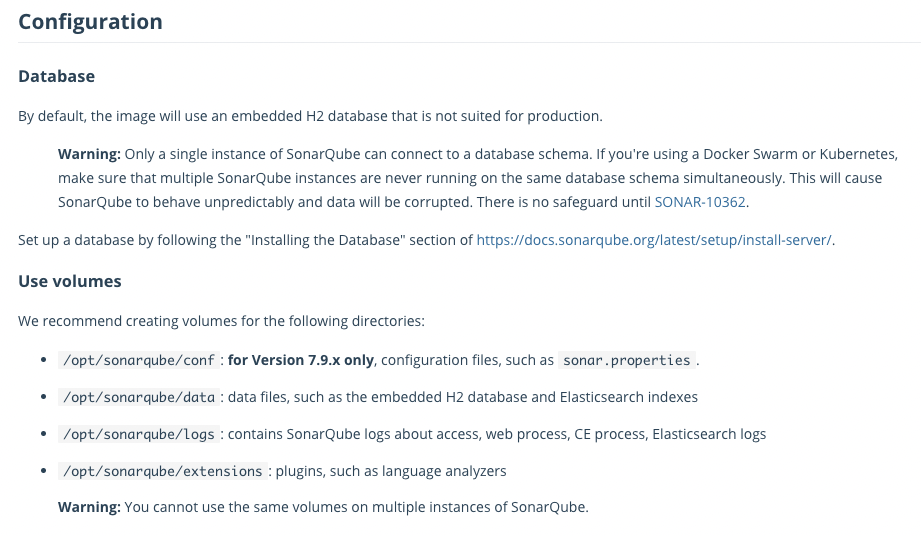

### #. Sonarqube ?
- 20개 이상의 프로그래밍 언어에서 버그, 코드 스멜, 보안 취약점을 발견할 목적으로 정적 코드 분석으로 자동 리뷰를 수행하기 위한 지속적인 코드 품질 검사용 오픈 소스 플랫폼 
- 중복 코드, 코딩 표준, 유닛 테스트, 코드 커버리지, 코드 복잡도, 주석, 버그 및 보안 취약점의 보고서를 제공.
- sonar scanner에게 정적 분석 관련 데이터 제공

<br>

### #. 정적분석을 위한 Sonarqube 설치
- https://hub.docker.com/_/sonarqube/

#### #1. host 설정
- sonarqube 내부에 Elasticsearch 를 사용하고 있기 때문에 필요 설정이 있다


```
# max_map_count :
# This file contains the maximum number of memory map areas a process may have. Memory map areas are used as a side-effect of calling malloc, directly by mmap and mprotect, and also when loading shared libraries.
# While most applications need less than a thousand maps, certain programs, particularly malloc debuggers, may consume lots of them, e.g., up to one or two maps per allocation.
# The default value is 65536.
$ sudo sysctl -w vm.max_map_count=262144


$ sudo sysctl -w fs.file-max=65536
$ ulimit -n 65536
$ ulimit -u 4096
```

<br>


#### #2. DB 및 Volumes 설정 내용 


#### #3. Compose 파일 작성
- sonarqube develop edition 버전 설치 (trial 라이센스 문의 함)
- embedded db : postgres 사용

```
version: "3.7"
services:
  db:
    image: postgres
    container_name: sonar-postgres
    restart: always
    environment:
      POSTGRES_USER: sonar
      PASTGRES_PASSWORD: sonar
      TZ: Asia/Seoul
      POSTGRES_HOST_AUTH_METHOD: trust
    volumes:
      - ~/docker-volumes/sonar-postgres/postgres:/var/lib/postgresql/data
  
  sonarqube:
    image: sonarqube:8.6.1-developer
    container_name: sonarqube
    restart: always
    environment:
      SONARQUBE_HOME: ./
      SONARQUBE_JDBC_USERNAME: sonar
      SONARQUBE_JDBC_PASSWORD: sonar
      SONARQUBE_JDBC_URL: jdbc:postgresql://db:5432/sonar
    depends_on:
      - db
    ports:
      - 10002:9000
    volumes:
      - ~/docker-volumes/sonar-postgres/sonarqube/data:/opt/sonarqube/data
      - ~/docker-volumes/sonar-postgres/sonarqube/extensions:/opt/sonarqube/extensions
      - ~/docker-volumes/sonar-postgres/sonarqube/logs:/opt/sonarqube/logs
      - ~/docker-volumes/sonar-postgres/temp:/opt/sonarqube/temp
```

#### #4. 서비스 기동
```
$ docker-compose -f sonarqube-compose.yml up -d
```

