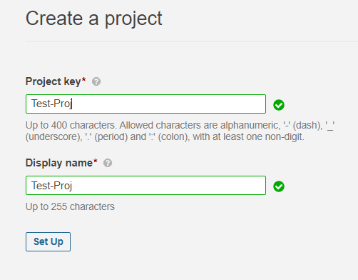
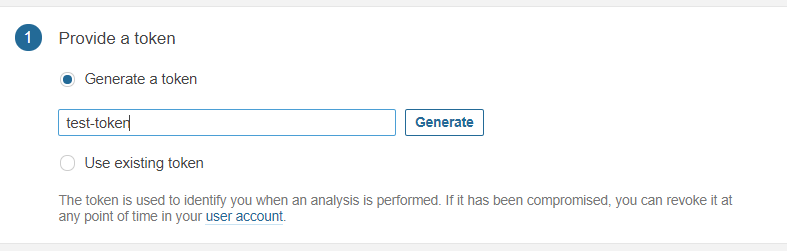
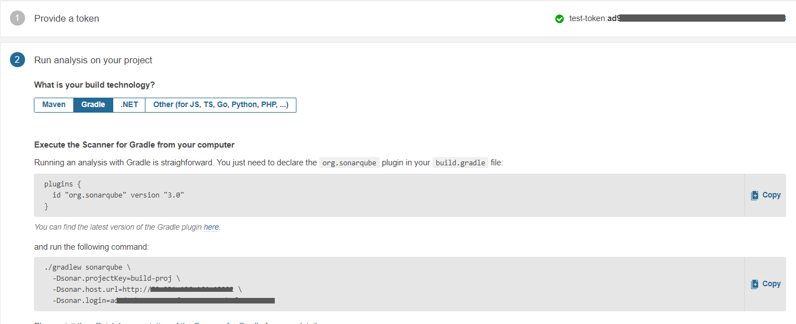
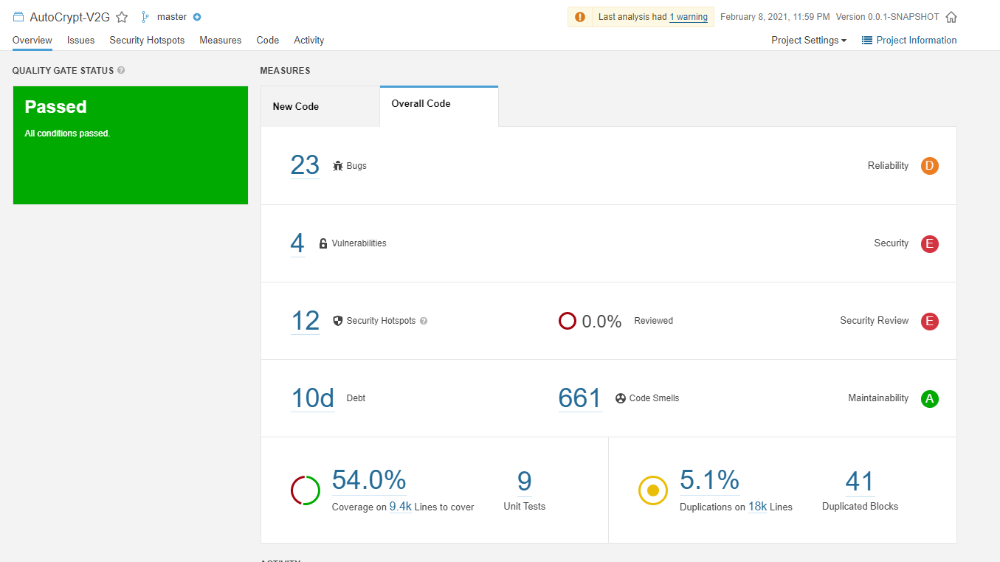

### #. Sonarqube ?
- 20개 이상의 프로그래밍 언어에서 버그, 코드 스멜, 보안 취약점을 발견할 목적으로 정적 코드 분석으로 자동 리뷰를 수행하기 위한 지속적인 코드 품질 검사용 오픈 소스 플랫폼 
- 중복 코드, 코딩 표준, 유닛 테스트, 코드 커버리지, 코드 복잡도, 주석, 버그 및 보안 취약점의 보고서를 제공.
- sonar scanner에게 정적 분석 관련 데이터 제공

<br>

### #. 정적분석을 위한 Sonarqube 설치
- https://hub.docker.com/_/sonarqube/

#### #1. host 설정
- sonarqube 내부에 Elasticsearch 를 사용하고 있기 때문에 필요 설정이 있다


```
# max_map_count ?
This file contains the maximum number of memory map areas a process may have. Memory map areas are used as a side-effect of calling malloc, directly by mmap and mprotect, and also when loading shared libraries.
While most applications need less than a thousand maps, certain programs, particularly malloc debuggers, may consume lots of them, e.g., up to one or two maps per allocation.
The default value is 65536.
```

<br>


#### #2. DB 및 Volumes 설정 내용 


<br>

#### #3. Compose 파일 작성
- sonarqube develop edition 버전 설치 (trial 라이센스 문의 함)
- embedded db : postgres 사용

```
version: "3.7"
services:
  db:
    image: postgres
    container_name: sonar-postgres
    restart: always
    environment:
      POSTGRES_USER: sonar
      PASTGRES_PASSWORD: sonar
      TZ: Asia/Seoul
      POSTGRES_HOST_AUTH_METHOD: trust
    volumes:
      - ~/docker-volumes/sonar-postgres/postgres:/var/lib/postgresql/data
  
  sonarqube:
    image: sonarqube:8.6.1-developer
    container_name: sonarqube
    restart: always
    environment:
      SONARQUBE_HOME: ./
      SONARQUBE_JDBC_USERNAME: sonar
      SONARQUBE_JDBC_PASSWORD: sonar
      SONARQUBE_JDBC_URL: jdbc:postgresql://db:5432/sonar
    depends_on:
      - db
    ports:
      - 10002:9000
    volumes:
      - ~/docker-volumes/sonar-postgres/sonarqube/data:/opt/sonarqube/data
      - ~/docker-volumes/sonar-postgres/sonarqube/extensions:/opt/sonarqube/extensions
      - ~/docker-volumes/sonar-postgres/sonarqube/logs:/opt/sonarqube/logs
      - ~/docker-volumes/sonar-postgres/temp:/opt/sonarqube/temp
```

#### #4. 서비스 기동
```
$ docker-compose -f sonarqube-compose.yml up -d
```

<br>

### #. 정적분석을 위한 Sonarqube 프로젝트 생성 및 

#### #1. Sonarqube 프로젝트 생성
- 10002 포트로 접속 후 로그인 & 프로젝트 생성

<br>

- 프로젝트 토큰 생성

<br>

- 을 하면 아래와 같이 sonar scanner 를 사용하기 위한 설정 방법이 나온다.


<br>

#### #2. Scanner 설정 및 실행
- build.gradle에 plugin 추가 후

```java
plugins {
  id "org.sonarqube" version "3.0"
}
```

- scanner 를 실행하면

```
./gradlew sonarqube \
  -Dsonar.projectKey=Test-Proj \
  -Dsonar.host.url=http://HOST:10002 \
  -Dsonar.login=***********************
```

- 정적분석 결과가 표시된다.


<br>


### #. Pipeline 작성
#### #1. Test Stage
- 코드 커버리지 측정 및 정적분석 진행 전 테스트 코드를 수행한다.
- 테스트 실패 시 파이프라인을 종료한다.

```
stage ('Test') {
    sh '''
    {
        ./gradlew test \
        && curl -X POST -u "$USER" $COMMENT_URL -d '{"content": {"raw": "[TEST] SUCCESS"}}' -H 'Content-Type: application/json' > /dev/null 2>&1 \
        && echo [TEST] SUCCESS;
    }||\
    {
        curl -X POST -u "$USER" $COMMENT_URL -d '{"content": {"raw": "[TEST] FAIL"}}' -H 'Content-Type: application/json' > /dev/null 2>&1;
        curl -X POST -u "$USER" $DECLINE_URL -d '{"content": {"raw": "[TEST] FAIL"}}' -H 'Content-Type: application/json' > /dev/null 2>&1;
        echo [TEST] FAIL;
        exit 1;
    }
    '''
}
```

<br>

#### #2. Jacoco & SonarQube Analysis & Quality Gate
- 테스트 성공 시 coverage 측정 및 정적분석 진행 후 Quality Gate 결과 확인

```
stage ('Jacoco & SonarQube Analysis & Quality Gate') {
    withSonarQubeEnv('sonarqube') {
        sh "./gradlew jacoco sonarqube"
    }
    
    def qg = waitForQualityGate()
    if (qg.status != 'OK') {
        sh '''
            curl -X POST -u "$USER" $COMMENT_URL -d '{"content": {"raw": "[QualityGate] FAIL"}}' -H 'Content-Type: application/json' > /dev/null 2>&1;
            curl -X POST -u "$USER" $DECLINE_URL -d '{"content": {"raw": "[QualityGate] FAIL"}}' -H 'Content-Type: application/json' > /dev/null 2>&1;
            echo [TEST] FAIL;
            exit 1;
        '''
    } else {
        sh '''
            curl -X POST -u "$USER" $COMMENT_URL -d '{"content": {"raw": "[QualityGate] SUCCESS"}}' -H 'Content-Type: application/json' > /dev/null 2>&1;
        '''
    }
}
```

<br>

#### #3. Approve PullRequest
- Quality Gate 패스 후 해당 PR에 대한 승인 API 발생 후 파이프라인 종료

```
stage ('Approve PR') {
    timeout(time: 1, unit: 'MINUTES') {
        sh '''
            curl -X POST -u "$USER" $APPROVE_URL;
            echo Approve PullRequest;
        '''
    }
}
```
