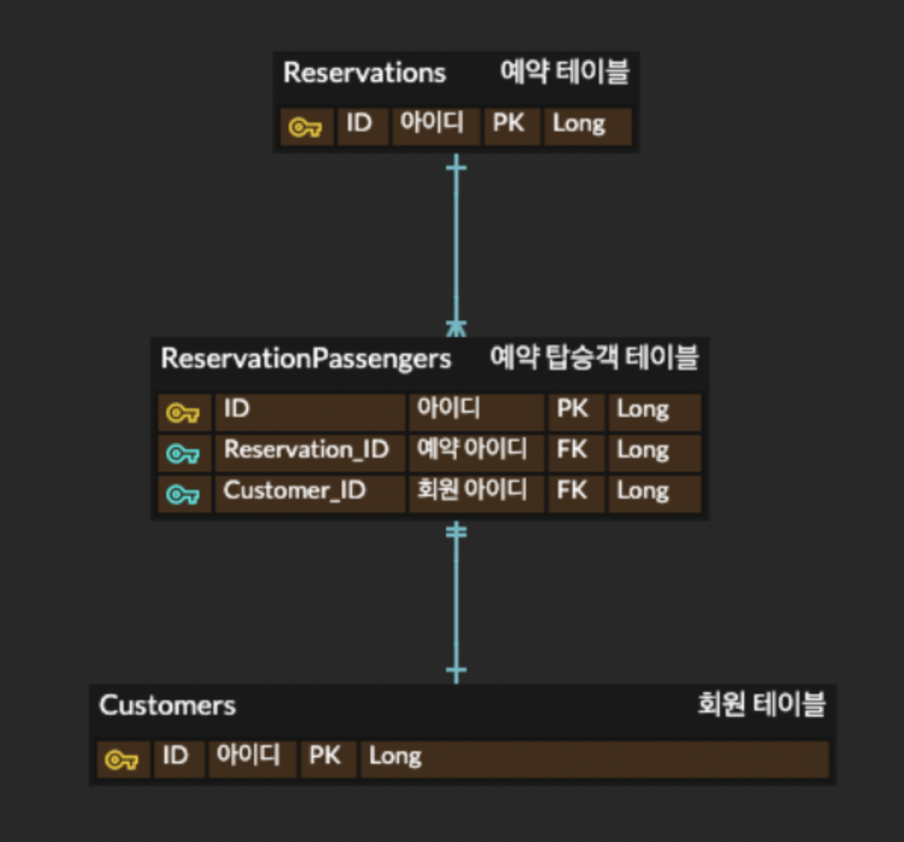

요즘 FMS 프로젝트에 대한 리펙터링을 열심히 진행하고 있다.  
그 중 가장 초점을 맞추고 있는 작업은 Request/Response 객체로 사용되고 있는 Entity를 Dto로 바꾸는 것이다.  
그래서 Dto to Entity, Entity to Dto 의 편리성을 위해 Mapstruct 를 도입하였고, 큰 문제가 없이 수월한 작업을 예상했는데  
역시나.. 모든 리펙토링은 많은 고민이 필요하구나를 다시한번 느끼게 된다.  

오늘 고민한 내용은 다음과 같다.  
연관관계(FK)가 많은 Entity를 생성할때 모든 FK 객체는 어떻게 채울 것인가?  
DTO가 가지고 있는 각 매핑 ID로 모두 조회를 해야하나?  

<br>

일단, 간단하게 요구사항을 설명하자면,
- 한 예약에 한명 이상의 탑승객이 존재한다.
- 탑승객은 회원 테이블에서 선택한다.
- Request Dto에는 예약 정보와 각 탑승객들의 상세 정보, 그리고 상세 정보 안에는 회원 ID가 포함되어 있다.



<br>

- 이를 ReservationPassenger Entity로 생성하기 위해서는
- 모든 탑승객들의 회원 ID를 뽑아 DB에서 select 한 후, 각 매핑하여 ReservationPassenger 객체를 생성한다.

<br>

- 비즈니스 로직

```java
List<String> customerIds = req.getPassengerList().stream()
    .map(ReservationDto.PassengerDto::getCustomerId)
    .collect(Collectors.toList());
```

```java
List<Customer> customers = customerRepository.getCustomersFromIds(customerIds);

if(customers.size() != customerIds.size()) {
    throw new BadRequestException("예약자 또는 동승자를 찾을 수 없습니다.");
}

Map<String, Customer> customersMap = new HashMap<>();
for(Customer customer : customers) {
    customersMap.put(customer.getId(), customer);
}
```

```java
List<ReservationPassenger> passengerList =
    ReservationDto.PassengerDto.toEntityList(req.getPassengerList(), customersMap, newReservationId);

passengerList = reservationPassengerRepository.saveAll(passengerList);

```

<br>

- toEntityList 메소드

```java
public static List<ReservationPassenger> toEntityList(List<PassengerDto> passengerDtoList, Map<String, Customer> customersMap, String reservationId){
    List<ReservationPassenger> reservationPassengerList=new ArrayList<>(passengerDtoList.size());
    for(PassengerDto dto:passengerDtoList){
        ReservationPassenger reservationPassenger=ReservationDtoMapper.INSTANCE.toReservationPassengerEntity(dto,reservationId);
        // 요렇게 매핑한다.
        reservationPassenger.setCustomer(customersMap.get(dto.getCustomerId()));
        ///
        reservationPassengerList.add(reservationPassenger);
    }

    return reservationPassengerList;
}
```

<br>

그래.. 이게 정석이겠지,  
그런데 Entity의 연관관계가 많으면? 저렇게 객체를 가져와서 매핑해야 하나?   
실질적으로는 ID만 필요로 할 뿐인데?  

어? 그럼 ID만 넣어서 객체 생성 후 넣어주면 어떻게 되지?

```java
reservationPassenger.setCustomer(new Customer(dto.getCustomerId()));
```

<br>

헉! DB에는 문제없이 잘 매핑이 된다!  
그럼 존재하지 않는 ID를 넣으면 어떻게 되지?

<br>

오~ 역시  
could not execute statement; SQL [n/a]; constraint 오류가 발생한다.  
똑똑하구로..  

```cmd
org.h2.jdbc.JdbcSQLIntegrityConstraintViolationException: 
Referential integrity constraint violation: "FKT1K88T0M3HKQGVYFI365S5KV8: 
PUBLIC.RESERVATION_PASSENGER FOREIGN KEY(CUSTOMER_ID) REFERENCES PUBLIC.CUSTOMER(ID) (2)"; SQL statement:
```

<br>

물론 매핑 ID의 검증을 위해 첫번째 방법이 당연하다는건 알지만,  
매핑 ID의 검증이 필요 없는 경우는 두번째 방법을 써도 되지 않을까?  

좀 더 나은 방법이 없는지 더 고민 해봐야 겠다.
