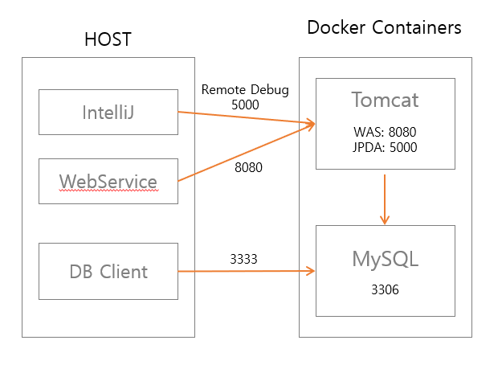

### #. 작업 구성



### 작업 내용
- [git repository 이동](https://github.com/eunyoung-autocrypt/docker-practice.git) 

#### #1. WAS Dockerfile

```
FROM openjdk:8-jdk

# 환경 변수 및 작업 경로 설정
ENV WCA_LIB /usr/local/wca_libs
ENV CATALINA_HOME /usr/local/tomcat
ENV PATH $WCA_LIB:$CATALINA_HOME/bin:$PATH
ENV LD_LIBRARY_PATH $WCA_LIB:$LD_LIBRARY

COPY docker/lib/lib.tar.gz $WCA_LIB/
RUN tar -zxf $WCA_LIB/lib.tar.gz -C $WCA_LIB/
RUN mkdir -p "$CATALINA_HOME"
WORKDIR ${CATALINA_HOME}

# 패키지 설치 wget은 톰캣 설치 파일 다운로드 위한
RUN apt-get update;
RUN apt-get install -y --no-install-recommends
RUN apt-get install -y gnupg dirmngr
RUN apt-get install -y wget ca-certificates

# 톰캣 바이너리 다운로드 및 압축해제
ENV TOMCAT_VERSION 8.5.61
RUN wget http://apache.mirror.cdnetworks.com/tomcat/tomcat-8/v${TOMCAT_VERSION}/bin/apache-tomcat-${TOMCAT_VERSION}.tar.gz;
RUN tar -xf apache-tomcat-$TOMCAT_VERSION.tar.gz  --strip-components=1;

# 불필요 파일 삭제 후 webapps 디렉토리 새로 생성
RUN find . -name "*.bat" -exec rm -rf {} \;
RUN rm -rf *tomcat*.tar.gz;
RUN mv webapps webapps.org
RUN mkdir webapps

# war 파일 복사
COPY build/libs/ROOT.war $CATALINA_HOME/webapps

# tomcat conf 파일 복사
COPY docker/tomcat-conf/* $CATALINA_HOME/conf/

# 컨테이너에서 사용할 포트 (서비스 포트, remote debugging 포트)
EXPOSE 8080 5000

# debugging 모드 시 필요 환경 변수
ENV JPDA_ADDRESS=5000
ENV JPDA_TRANSPORT=dt_socket

# 설정 완료 후 실행
#CMD ["catalina.sh", "run"]
CMD ["catalina.sh", "jpda", "run"]
```

<br>

#### 2. DB Dockerfile
```
FROM mysql:5.7.32
#FROM mariadb:10.4.10

# my.cnf 파일 복사
ADD ./mysql-conf/my.cnf /etc/mysql/conf.d/my.cnf
```

<br>

#### 3. docker-compose.yml 
[Docker-Compose 내용 정리](/history/posts/2021-01-06--001) 

<br>

#### 4. IntelliJ 원격 디버깅 설정 
[IntelliJ 설정 확인](/works/posts/2020-12-29--001)
