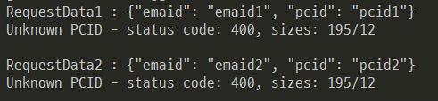

### 시나리오
- test-csv.csv 파일 한줄 씩 리드
- "," 로 split 
- API POST 데이터 생성
- API 요청 
- 결과

#### #. test-csv.csv
```
emaid1,pcid1
emaid2,pcid2
```

#### #. Script File
```shell script
#!/bin/bash

COUNT=0
while read LINE;
do
    # IFS 는 입력필드 구분자
    # ${vStr[0]} , ${vStr[1]} 로 사용
    IFS=',' read -ra vStr <<< $LINE

    COUNT=$(($COUNT + 1))
    DATA="{\"emaid\": \"${vStr[0]}\", \"pcid\": \"${vStr[1]}\"}"

    echo RequestData${COUNT} : ${DATA}

    curl -H "Content-Type: application/json" \
            -d "${DATA}" \
            -w " - status code: %{http_code}, sizes: %{size_request}/%{size_download}\n\n" \
            -X POST http://192.168.250.79:15000/api/v2/mo/contractById

done < test-csv.csv
```

#### #. 결과


